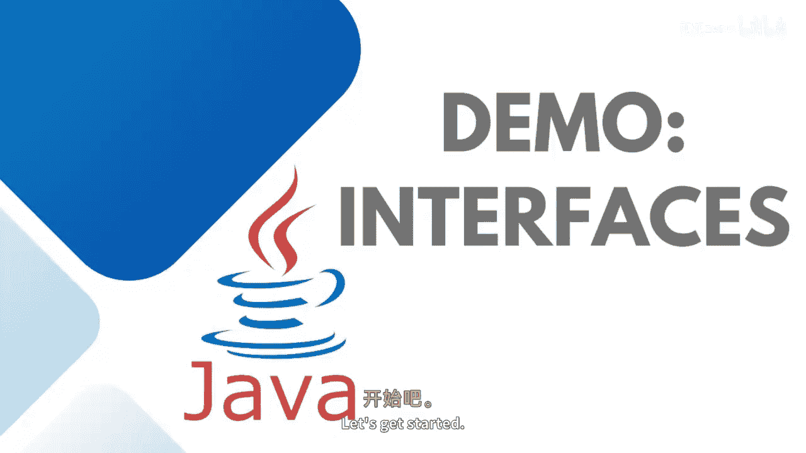

# 【Java全栈开发 专项课程（上）】Board Infinity—中英字幕 p70 p69_05_demo-interfaces -BV1tAygYoEj5_p70-

Hey guys， it's a high time to implement interfaces and comparing interface with abstract classes practically。

 So let's get started。😊。

Here I'm going to create a class。Not class interface。

I will be comparing it with abstract classes name this Is I bank account。

You can see that I will just write return type and the name of the method。

 I will not write abstract and public by default methods at。Abstract and public in interfaces。 Vo。

 withdraw。And balance。The moment I will be creating concrete class and just writing saving。

Implementing the I bank account。You can see that I'm getting the error。

 so what I need to do is I need to go to the sews， override the abstract methods。

 you can see that a is written here， it means methods are abstract， we need to override them。

Here I need to write down the definition as you know what definition I will be writing。

 I will be writing deposit in saving account。Withdraw from saving account。Balance in saving account。

Same thing that you can do with the current account。 I'm just doing with one class as of now。

 creating a saving account class object。And calling my method respectively， saving dot deposit。

Saving dot withdraw。And saving do balance。Here you can see that I'm going to create an interface here。

I。ABC bank。Here we have two methods void。Open account。Vid close account。

I can directly write here I bank account and IAVC bank as I was not able to do this syntax in the case of abstract classes。

 but a class can inherit more than one interfaces or in one class multiple interfaces at the one given point of time and this concept is known as multiple inheritance。

So here we have open account。Upen account。And then。炉子干。

So this is how interfaces also helps in doing the multiple。Inheritance。

Along with you cannot create the object of the interface。

 let me show it to you if you try to create this way。The interface cannot be instantiated。

Just like the abstract class。Now， most of the time people generally ask。

 can we have non abstract method in the interface？So guys。

 the moment you will come across with the interface and you try to give a definition to any of the message。

Any of the method， you can see that。It's giving a prompt error to you。

 Welcome to ABC Banki right here。So， it's giving a prompt that。

Abstract class do not specify a body because by default methods are abstract。

If I try to create this method as default。There is a specific default method if you would like to give a definition to this method。

 and this can be accessed with the chart class object， saving dot。Message or welcome hope to。

So this is how interfaces are different from abstract classes。

 abstract classes are leased to strict contract as compared to the interfaces。

I hope the concept is pretty clear to all of you。You can use this in your real time in the larger application most of the time。

 repository pattern or3 tier architecture needs to be implemented with a data access layer。

 and that's what we use interfaces to create those contracts。

So see you in the next session until next time。 Stay tuned。 Thank you。

