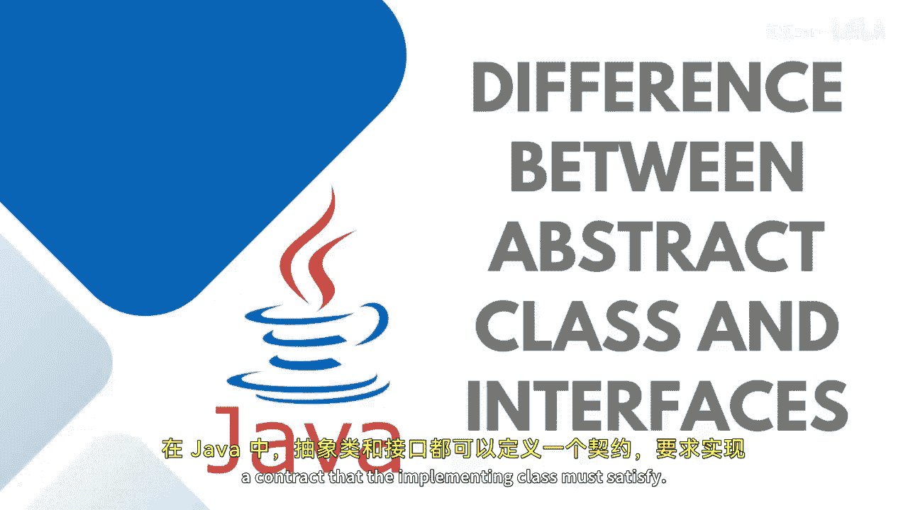
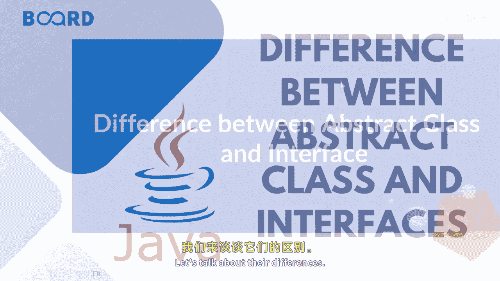

# Java全栈开发：06：抽象类与接口的区别 🧩

在本节课中，我们将要学习Java中抽象类与接口的核心区别。理解这两者的不同是掌握面向对象设计的关键一步。


---

## 概述

在Java中，抽象类和接口都可以用来声明一个“契约”，实现类必须满足这个契约。它们都用于定义一组方法，但具体的使用场景和特性有所不同。接下来，我们将详细探讨它们之间的差异。



---



## 核心差异详解

上一节我们介绍了抽象类和接口的共同点，本节中我们来看看它们的具体区别。

### 1. 方法定义

抽象类可以包含抽象方法和非抽象方法（即具体实现的方法）。而接口在默认情况下，其所有方法都是抽象的（在Java 8之后，接口也可以包含默认方法和静态方法，但核心区别依然存在）。

**抽象类示例**：
```java
abstract class Animal {
    abstract void makeSound(); // 抽象方法
    void sleep() { // 非抽象方法
        System.out.println("Sleeping...");
    }
}
```

**接口示例**：
```java
interface Animal {
    void makeSound(); // 默认是抽象方法
}
```

### 2. 变量定义

抽象类可以拥有静态变量、非静态变量、`final`变量和非`final`变量。相比之下，接口中声明的变量默认是`final`和`static`的，即常量。

**抽象类变量**：
```java
abstract class Example {
    int normalVar; // 非静态、非final
    final int finalVar = 10; // final变量
    static int staticVar; // 静态变量
}
```

**接口变量**：
```java
interface Example {
    int CONSTANT = 10; // 默认是 public static final
}
```

### 3. 继承与实现

一个类在某一时刻只能继承一个抽象类，这意味着**抽象类不支持多重继承**。然而，一个类可以实现多个接口，因此**接口支持多重继承**。

**继承抽象类**：
```java
class Dog extends Animal { // 只能继承一个抽象类
    // ...
}
```

**实现接口**：
```java
class Dog implements Animal, Pet { // 可以实现多个接口
    // ...
}
```

### 4. 关键字与成员访问权限

使用`extends`关键字来继承一个抽象类，而使用`implements`关键字来实现一个接口。

抽象类可以拥有类成员，例如`private`和`protected`修饰的成员。而接口的成员默认都是`public`的。

**抽象类成员**：
```java
abstract class MyClass {
    private int privateVar;
    protected int protectedVar;
}
```

**接口成员**：
```java
interface MyInterface {
    void myMethod(); // 默认是 public
}
```

---

## 使用场景对比

以下是抽象类和接口各自适用的典型场景：

*   **抽象类**：当多个相同类型的实现共享共同的行为时使用。此外，如果你需要一个包含部分实现的基类，抽象类是合适的选择。
*   **接口**：当各种实现仅共享方法签名（即行为规范）时使用。当你的类需要从多个来源获得额外行为或依赖时，接口是一个很好的选择。

---

## 总结


本节课中我们一起学习了抽象类与接口在Java中的核心区别。我们了解到，抽象类更侧重于为相关类提供一个包含部分共同实现的模板，而接口则专注于定义一套纯粹的行为规范，并支持多重继承。理解这些差异有助于你在实际开发中做出更合适的设计选择。