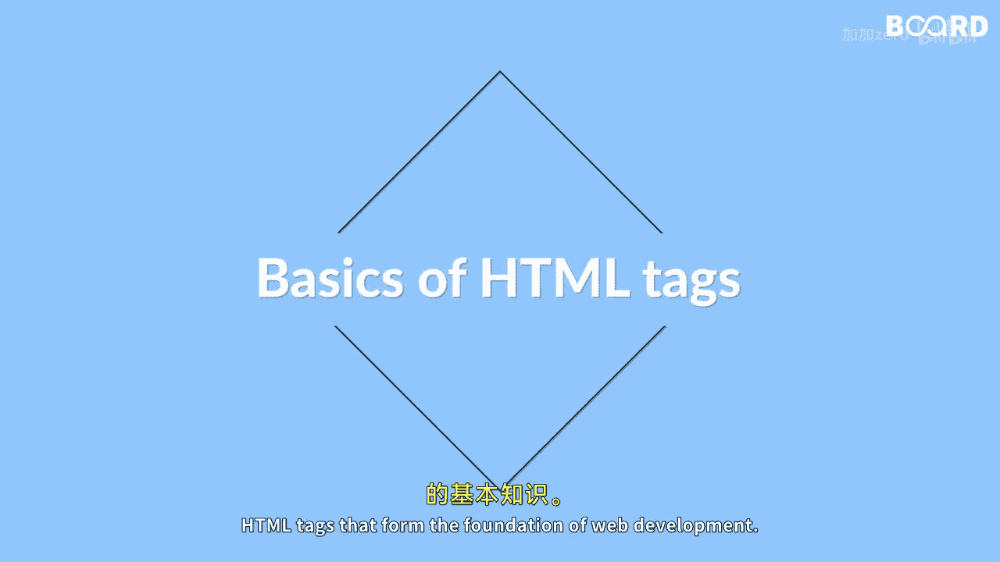

# 【Java全栈开发 专项课程（上）】Board Infinity—中英字幕 p73 p1_01_what-you-will-learn-in-this-lesson -BV1tAygYoEj5_p73-

🎼Hi there In this lesson， you will learn the basics of HTMLtM tag that form the foundation of web development。

 You will explore formatting tags such as heading paragraphs and line breaks and learn how to use them to structure webage。

 You will also learn about form input tags that allows you to create interactive web pages and the frame tags that enables you to divide web pages into separate sections。

 Furthermore， you will learn how to use image tags to display pictures and svg tags to create scalable vector graphics。

 you will also learn about audio and video tags that allow you to embed multimedia content into web pages。

 In addition， you learn about list of tags that allow you to create ordered and unordered list and table tags that enable you to display tabular data。

 Finally， you will learn about semantic and non-cemantic tags which plays a critical role in designing web pages that is accessible easily understood and optimize to search engines you will also learn about head and meta tags which enables you to provide metadata and other information about your web page Sound a lot right。

 Be ready。😊。

🎼For a Power session ahead， See you in the next video。

