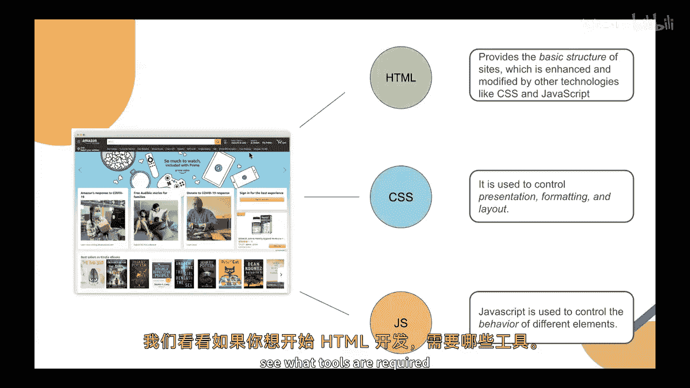
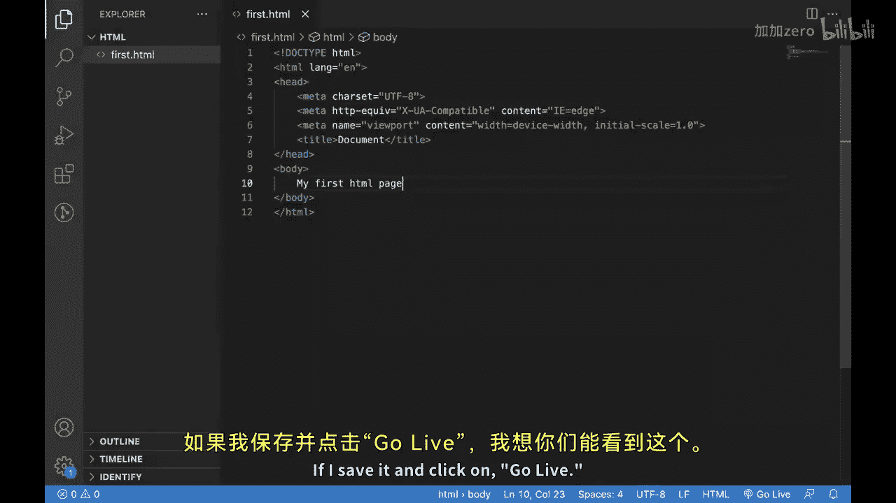
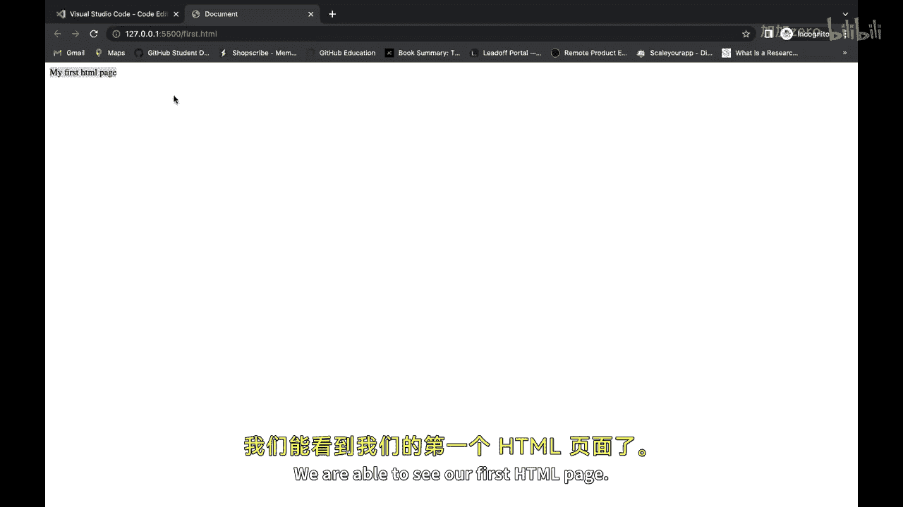
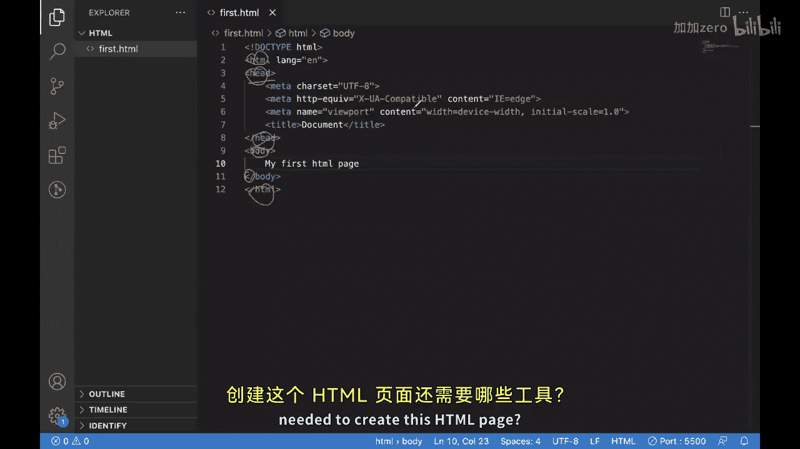
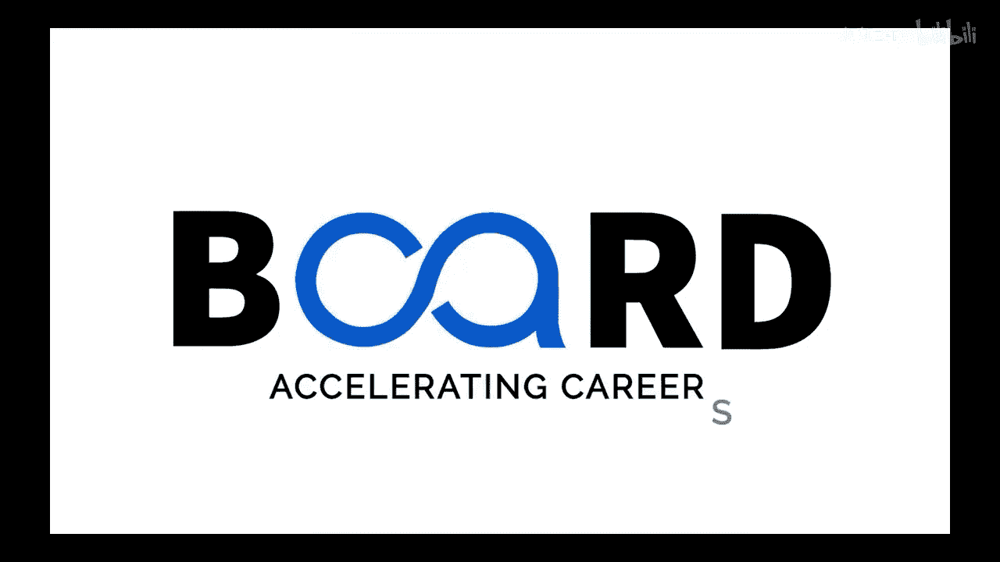

# Java全栈开发 专项课程（上）：P2_02：Web开发入门 🚀

在本节课中，我们将学习Web开发的基础知识，特别是前端开发的核心组成部分。我们将从HTML开始，了解它是如何构建网页结构的，并介绍创建第一个HTML页面所需的工具。

在上一节中，我们介绍了Web开发的概念。本节中，我们来看看前端开发。

对于前端开发，我们首先需要了解其构建模块，其中之一就是HTML。

如今，任何现代网站都直接或间接地使用HTML。进一步了解HTML，我们知道它代表超文本标记语言，由蒂姆·伯纳斯-李于1993年提出。

可以说，HTML与互联网本身一样古老。

它是与互联网一同发展起来的初始语言之一，用于在互联网上提供可供消费的内容。它是一种标准的标记语言，用于设计在Web浏览器中显示的文档。

HTML是一种标记语言，而不是编程语言。

这意味着它用于管理文档的内容，决定其应如何结构化以及应如何呈现。当我们的Web浏览器消费这些HTML文档时，它就能知道应如何在屏幕上呈现文档中的项目。

目前我们使用的是HTML5版本。

从HTML1到HTML5，我们看到了巨大的进步。为了举例说明，让我展示一些内容。

如果我们查看这个页面，这是亚马逊早期的页面之一。你可以看到它的样子。如果将其与当前的亚马逊网站进行比较，变化是巨大的。你可以看到技术的进步以及它如何发展。

它如何帮助一个特定的网站改变自身。谈到任何现代网站，我们可以说它主要由三种技术构成。

以下是构成现代网站的三种核心技术：

1.  **HTML**：用于管理结构。
2.  **CSS**：用于设计。
3.  **JavaScript**：主要用于为网站提供额外的功能。

因此，可以说HTML提供了基本结构，而CSS和JavaScript等技术则对其进行增强和修改。CSS主要控制呈现、格式和布局，即事物在网页上应如何显示。而JavaScript则提供不同元素的行为。

如果你想举个例子，假设你将鼠标悬停在某个菜单项上，它会默认显示该菜单项下可用的特定项目列表。这之所以发生，是因为JavaScript。因为你触发了一个称为“悬停”的事件，该事件为你的操作提供了某种输出。

现在我们已经了解了很多关于普通网页的知识，接下来看看需要哪些工具。

如果你想开始HTML开发，最初需要的工具之一是一个简单的文本编辑器。

我使用的是Visual Studio Code，它是互联网上可用的主流IDE之一。你也可以将其用于你的开发。

但这并非必须使用，取决于你。

HTML开发所需的第二样东西是一个Web浏览器。我使用的是Chrome，你可以选择任何你喜欢的浏览器。

这是一个典型的VS Code屏幕的样子。

我建议你也下载一个特定的插件，因为它会对你有所帮助。

这个插件或扩展叫做“Live Server”。我已经安装了它，安装后在这里看起来是这样的。

现在，你可以返回并为自己创建一个新的HTML页面。

我将使用 `Ctrl + N`，然后选择语言，在我的场景中是HTML。现在我使用一个快捷方式，它会为我编写一个模板。

这是我的初始模板或初始HTML模板。让我保存它。我可以将其命名为 `first.html`。

让我在这里写点东西：“我的第一个HTML页面”。如果我保存它并点击“Go Live”，我想你们可以看到这个。我们能够看到我们的第一个HTML页面。

如果我们进一步讨论这个特定的屏幕，你们可以看到这个页面主要由多个项目或HTML标签构成。

它们大多数都有开始和结束标签。你可以看到这是一个特定的标签，它在这里结束。这是另一个特定的标签，它在这里结束。这些标签被称为HTML标签。

通常总有一个开始标签和一个结束标签。

你可以在其中放置项目或内容。你也可以有嵌套的标签。

不同的标签有不同的含义。我们今天不会深入讨论标签。如果这对你来说听起来像天书，不用担心，我们将在以后深入讨论它们。

目前，请专注于我们如何创建一个普通的HTML页面，以及创建这个HTML页面需要哪些工具。

在本节课中，我们一起学习了Web开发的基础，特别是前端开发的起点——HTML。我们了解了HTML的历史、作用及其与CSS、JavaScript的关系。我们还实践了如何设置开发环境（使用VS Code和浏览器）并创建了第一个HTML页面。记住，HTML负责网页的结构，是构建一切网页内容的基石。