# Java全栈开发 专项课程（上）：4.05：HTML标签详解 🏷️

在本节课中，我们将要学习HTML文档中的核心组成部分——标签。我们将详细解析上节课编写的HTML文档中出现的各种标签，并学习如何在文档主体中使用标题和段落标签来组织内容。

---

## 文档结构标签

上一节我们介绍了HTML的基本概念和工具，本节中我们来看看构成HTML文档骨架的核心标签。

首先，我们回顾上节课编写的HTML文档及其在浏览器中的输出效果。文档中包含多个标签，我们将逐一进行解析。

从文档顶部开始，我们首先看到的是 `<!DOCTYPE html>` 声明。这个标签是在HTML5中引入的，用于标识文档类型。它告知浏览器当前文档是一个HTML文档，以便浏览器能正确地渲染它。

接下来是 `<html>` 标签。这是HTML中最基础的标签之一，用于标识HTML文档的开始与结束。如你所见，文档以 `<html>` 开始，以 `</html>` 结束，分别代表文档的开端和结尾。

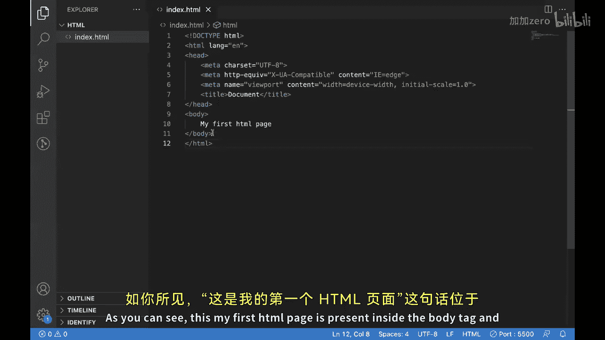

在 `<html>` 标签内部，还有两个重要的标签用于定义文档的头部和主体：
*   `<head>` 标签：用于提供关于文档的信息，例如文档的标题和一些元数据（如描述和关键词）。
*   `<body>` 标签：定义了文档中可见的内容。

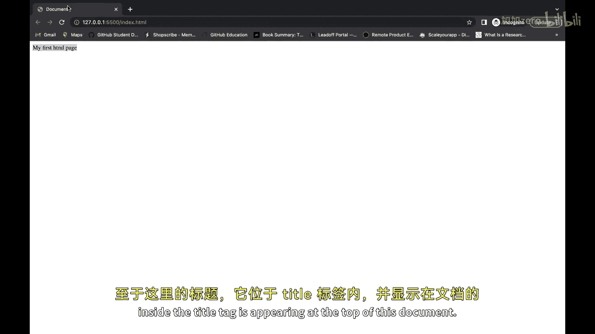

我们可以通过浏览器来验证这一点。例如，之前写在 `<body>` 标签内的“My first HTML page”文本，确实显示在了浏览器窗口中。而写在 `<head>` 内 `<title>` 标签中的内容（例如“My first document”），则会显示在浏览器标签页的顶部。关于 `<meta>` 标签，我们将在本系列课程后续部分详细讨论。

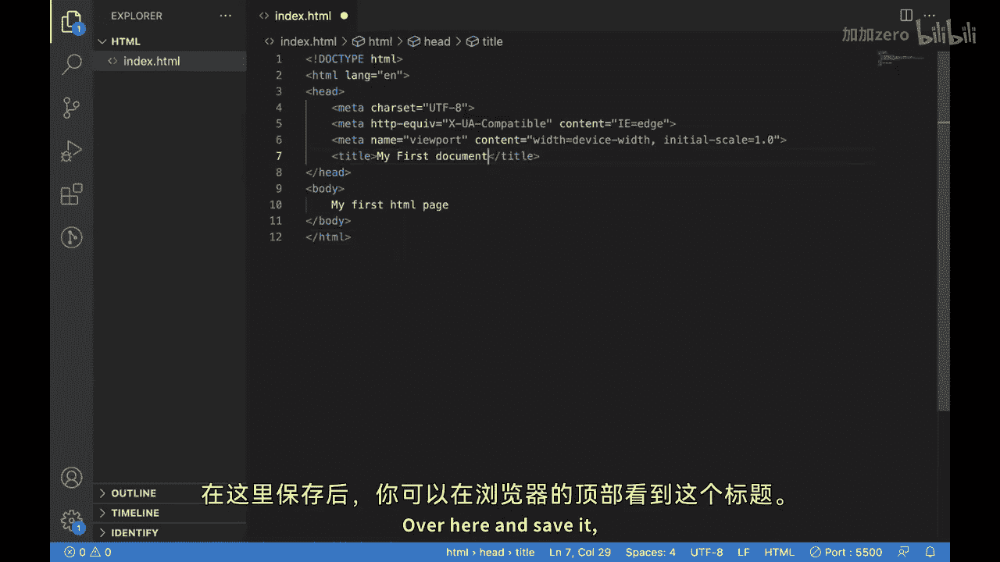

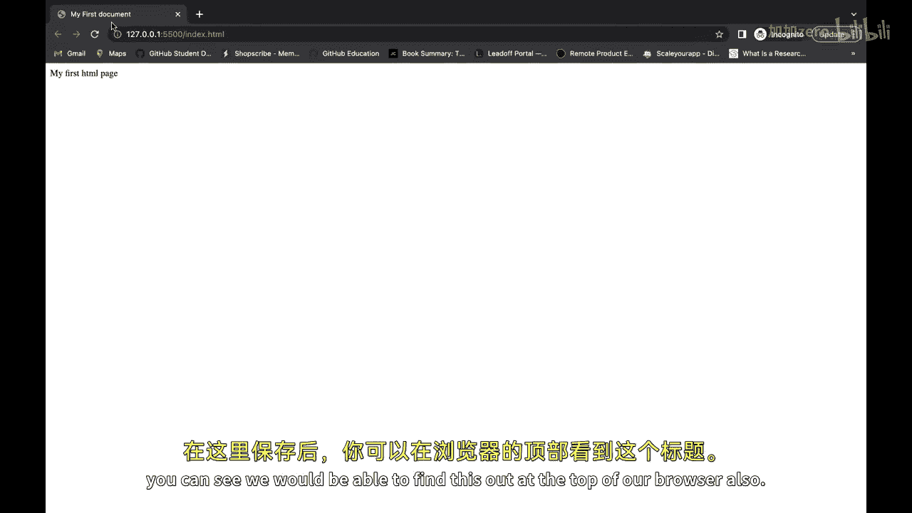

现在，你应该对HTML标签有了基本了解，并且知道所有在 `<body>` 标签内编写的内容都会呈现在HTML页面上。

---

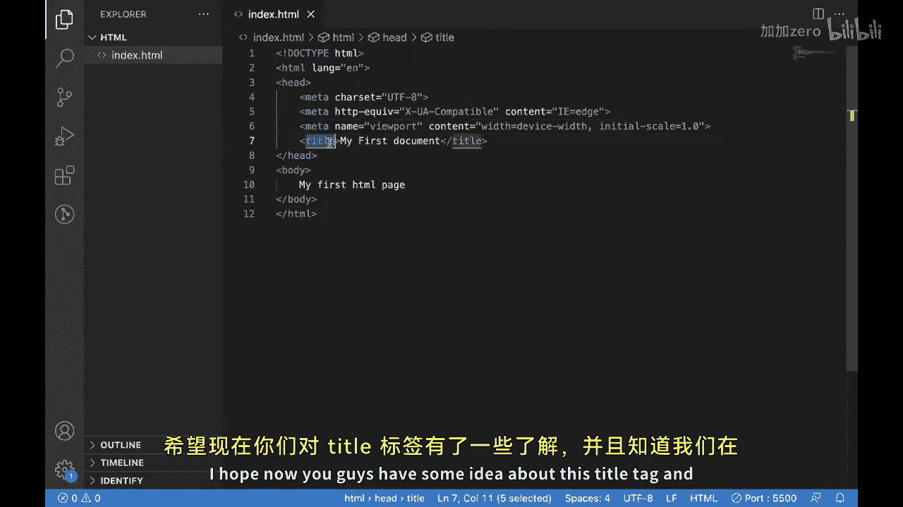

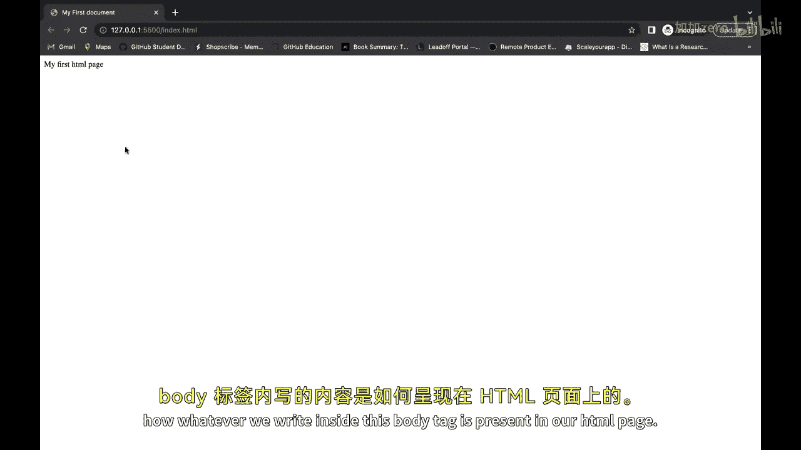

## 内容组织标签

理解了文档的基本结构后，现在让我们看看如何在 `<body>` 标签内使用更多HTML标签，使我们的文档在视觉上更具吸引力。

以下是两个最常用的内容组织标签：

### 标题标签

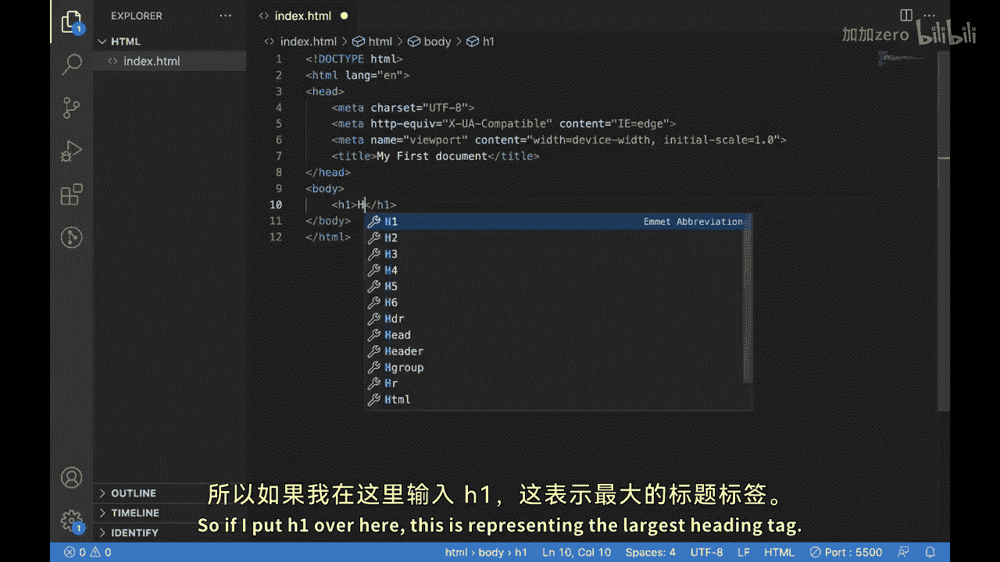

标题标签通常用于定义网页的标题和副标题。HTML提供了六个级别的标题标签，从 `<h1>` 到 `<h6>`，其中 `<h1>` 是最大的标题，`<h6>` 是最小的。

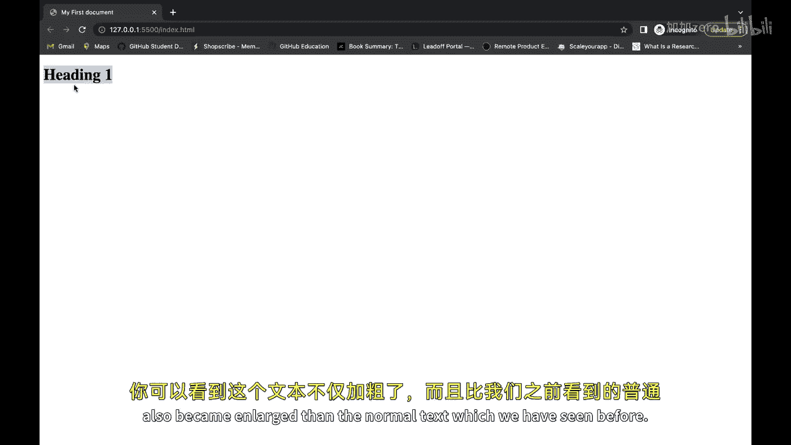

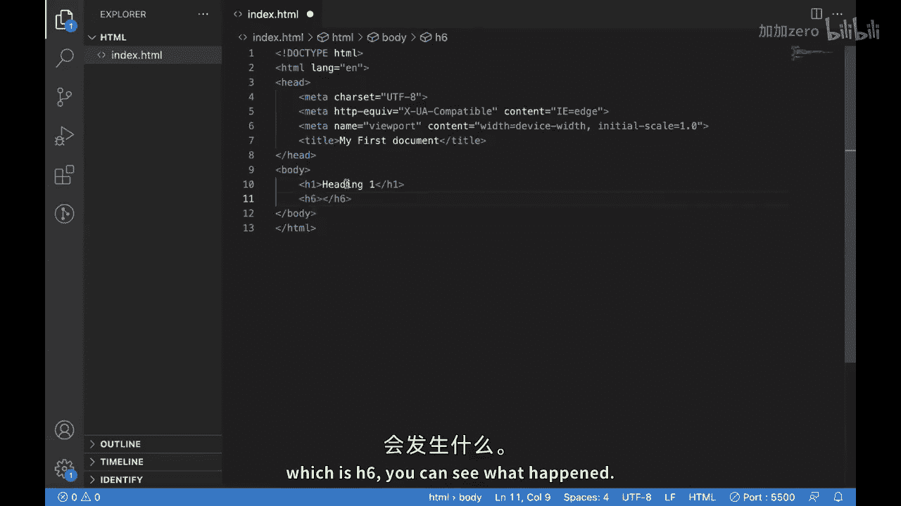

例如，使用 `<h1>` 标签可以创建最大的标题。在浏览器中，`<h1>` 标签内的文本会变得**粗体**并且**字号更大**。你可以尝试使用从 `<h1>` 到 `<h6>` 的所有标题标签来观察它们的不同。

### 段落标签

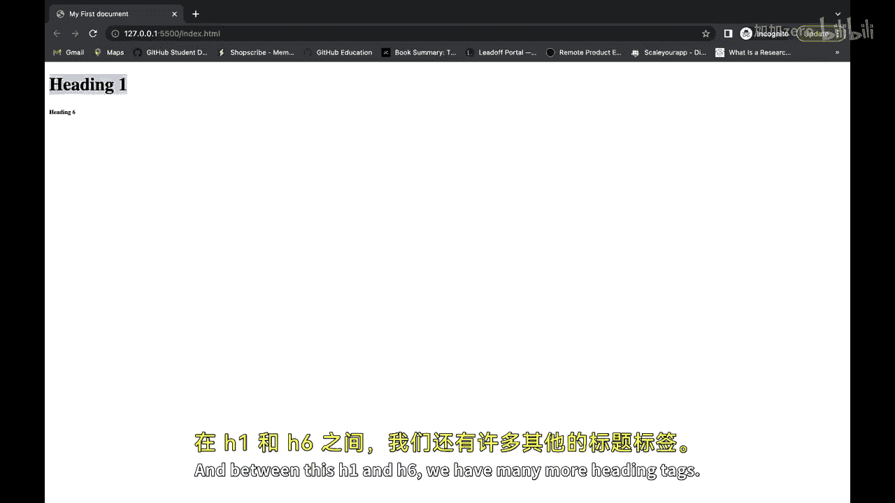

段落标签用于在HTML文档中定义文本段落。这个标签通常用于博客文章、新闻或其他需要大段文本的内容。

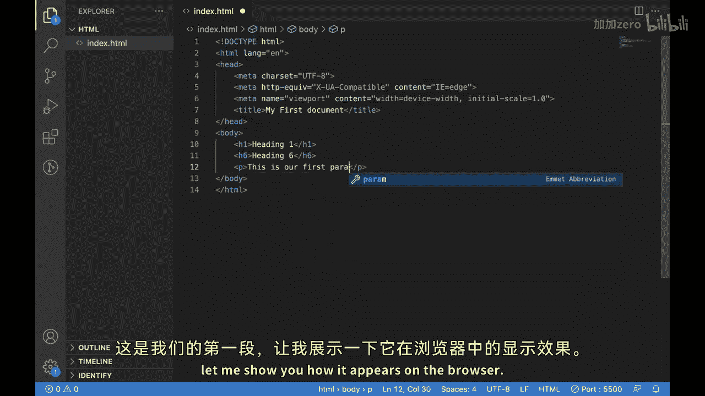

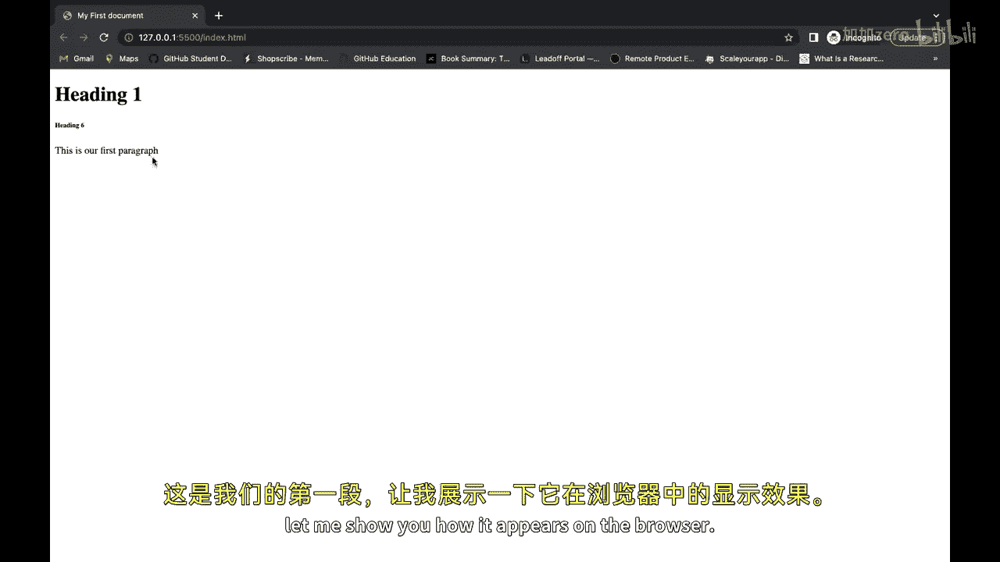

在HTML中，我们使用 `
` 标签来创建段落。只需将你的文本内容放在 `
` 和 `
` 之间即可。在浏览器中，每个段落通常会独占一块区域，并自动换行。

如果你想在文档中添加另一个段落并让它从新的一行开始，只需创建另一个 `
` 标签并将内容放入其中即可。

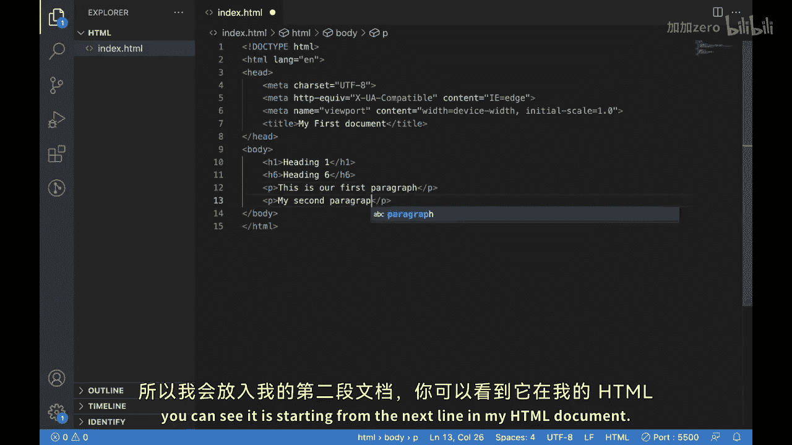

---

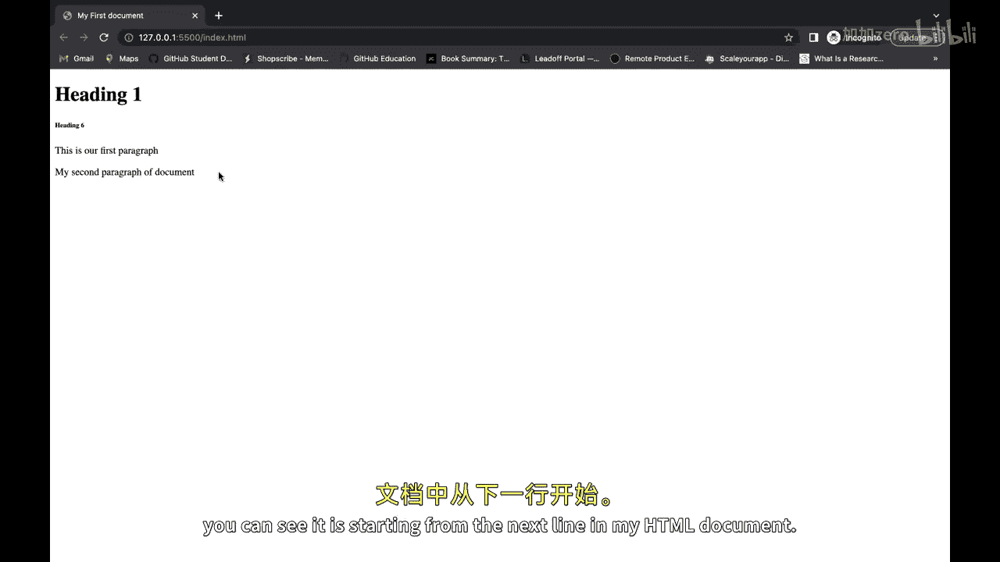

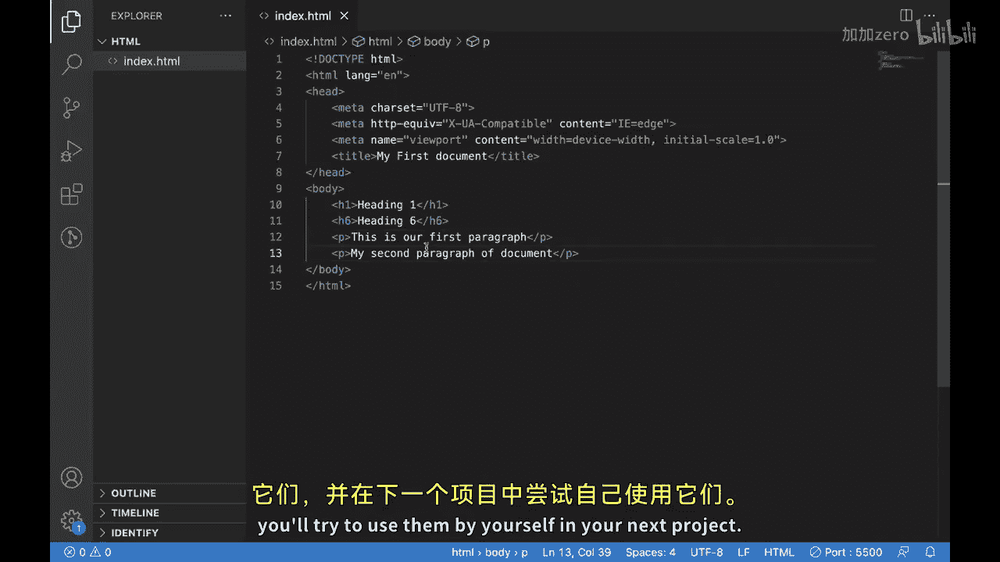

本节课中我们一起学习了HTML文档的核心结构标签（`<!DOCTYPE>`、`<html>`、`<head>`、`<body>`、`<title>`）以及用于组织页面内容的标题标签（`<h1>` - `<h6>`）和段落标签（`
`）。这些是构建任何网页的基础，希望你能够在自己的下一个项目中尝试使用它们。