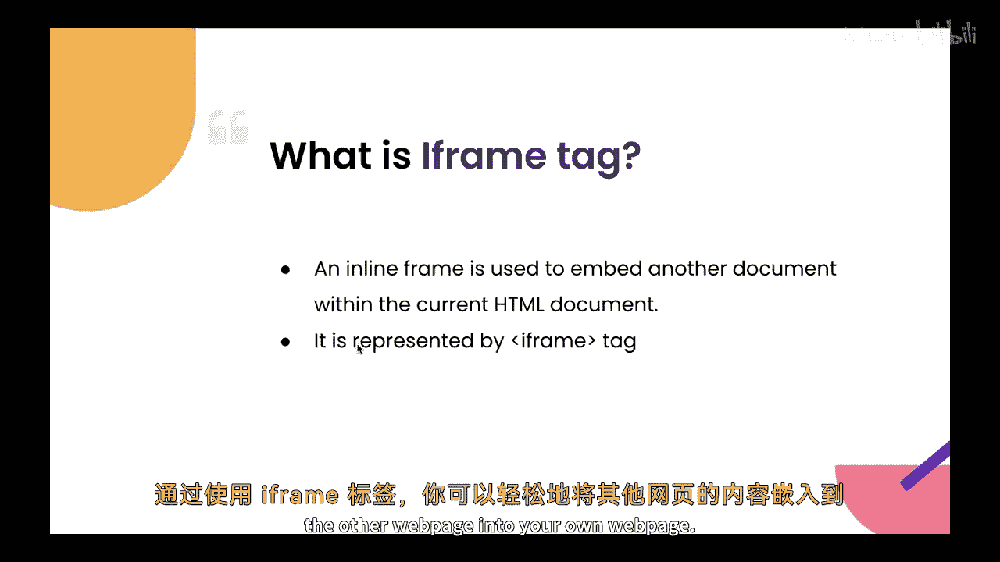
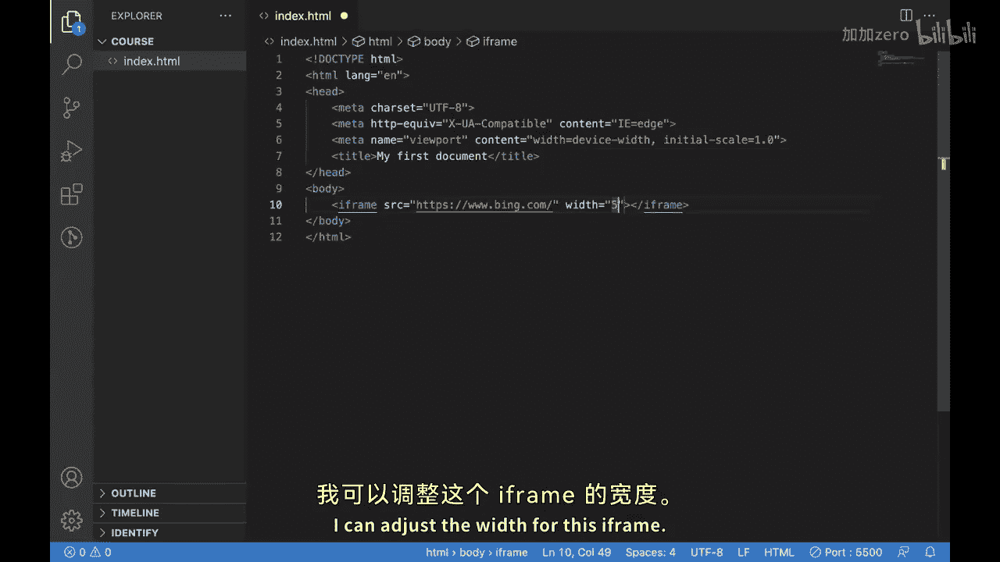
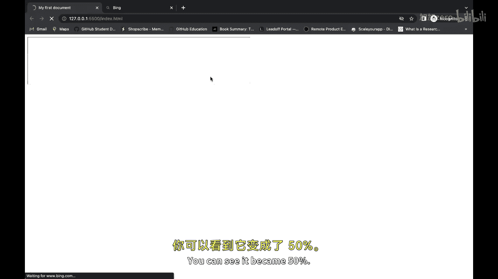
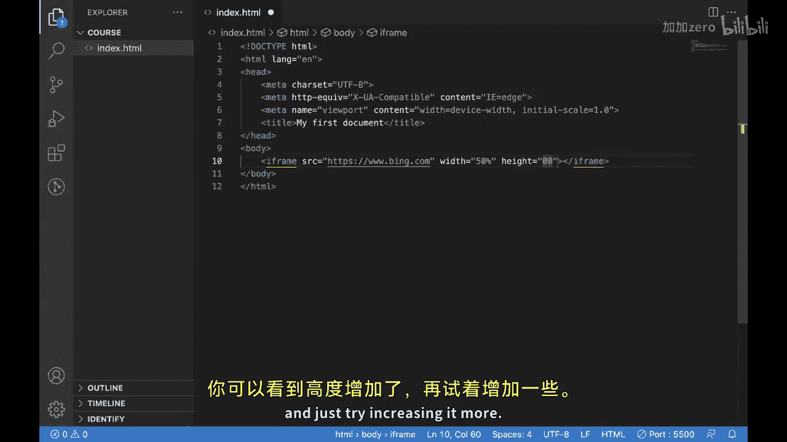
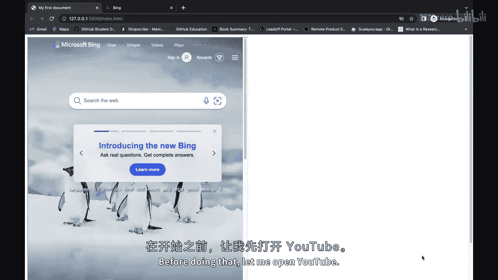
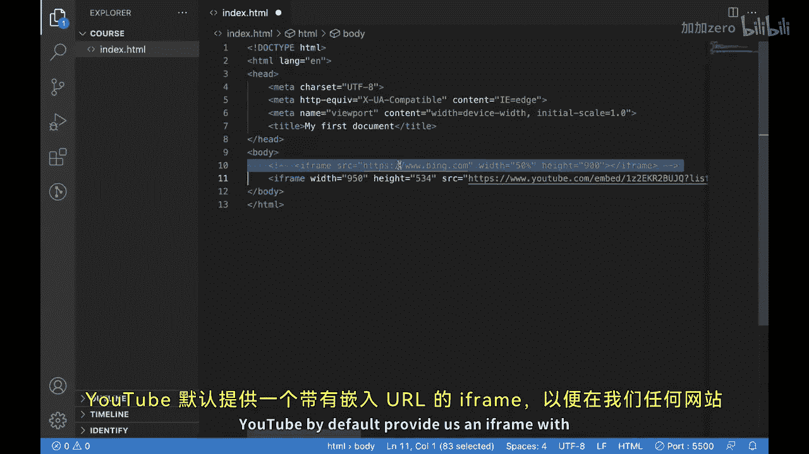
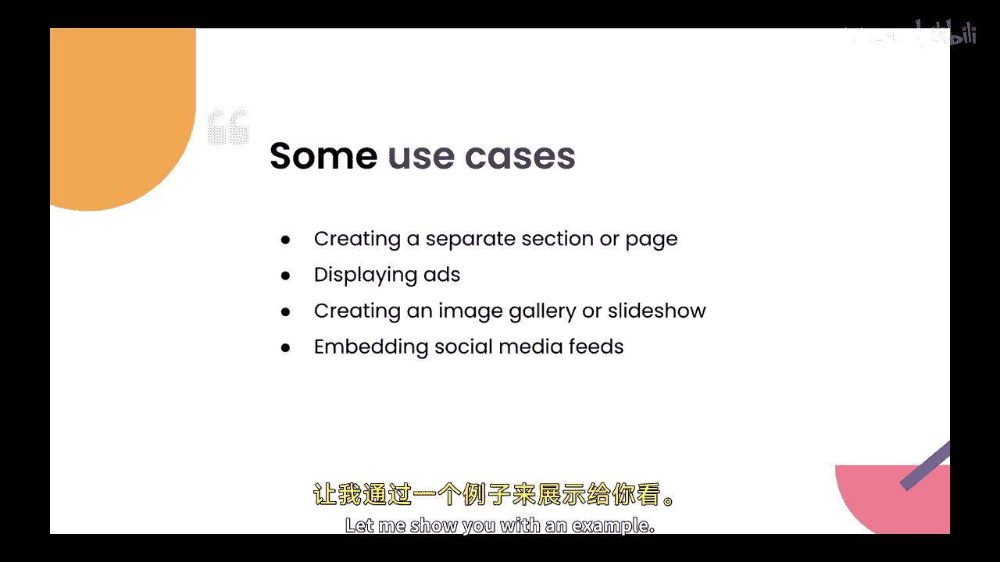
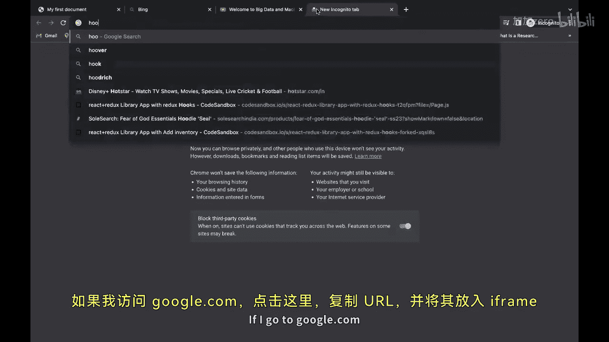
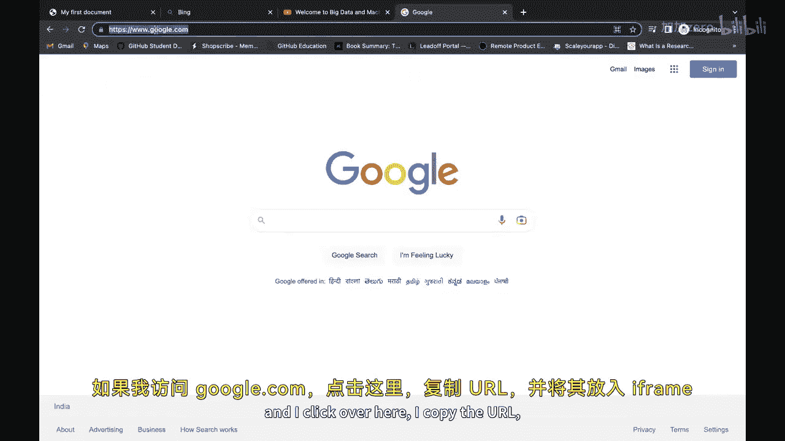
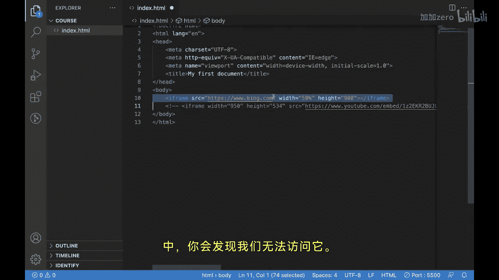

# Java全栈开发 专项课程（上）：7.08：iframe标签详解 🖼️

在本节课中，我们将要学习HTML中的`<iframe>`标签。上一节我们介绍了不同的输入类型，本节中我们来看看如何使用`<iframe>`标签在网页中嵌入其他网页或内容。

`<iframe>`标签是一个强大的工具，用于将来自另一个网页或网站的内容嵌入到你自己的网页中。在本视频中，你将探索`<iframe>`的各种用途，以及它如何使你的网站受益。

## 什么是 `<iframe>` 标签？

让我们从讨论`<iframe>`标签是什么以及它如何工作开始。

`<iframe>`标签代表内联框架，用于在网页内创建一个窗口或容器，该容器可以显示来自另一个来源的内容。`<iframe>`标签有几个属性，包括`src`属性，该属性用于指定要在`<iframe>`内显示的内容的URL。



`<iframe>`标签的主要用途是将一个网站的内容嵌入到你自己的网站中。例如，你可能希望将YouTube视频或Google地图嵌入到你的网站中。通过使用`<iframe>`标签，你可以轻松地将其他网页的内容嵌入到你自己的网页中。

## 如何创建和使用 `<iframe>`

让我向你展示如何做到这一点。

以下是创建`<iframe>`的基本代码结构：



```html
<iframe src="URL"></iframe>
```



现在，我们有了代码编辑器，我将向你们展示如何创建一个`<iframe>`。要创建一个`<iframe>`，我们只需要放置`<iframe>`标签。如果我现在保存并在这里显示输出，这就是我们的`<iframe>`。

为了在这个`<iframe>`中打开一个网站，我们需要使用`src`属性。我们可以在这个`src`属性中放入一个URL，该URL将显示在这里。



例如，我复制了URL `https://www.bing.com` 并粘贴到`src`属性中。现在你们可以看到，我们能够在当前网页中打开它。



我们还有一个名为`width`的属性，我可以调整`<iframe>`的宽度。例如，设置`width="50%"`。你可以看到它变成了50%的宽度。



现在我们已经增加了宽度，我们也可以为`<iframe>`增加高度。我们可以通过放置`height`属性来实现。你可以看到高度增加了。让我们尝试增加更多。

## 嵌入视频示例

这里我们已经使用了`<iframe>`。让我也展示一下如何使用`<iframe>`嵌入视频。

为了做到这一点，让我打开YouTube。这是一个YouTube视频。我可以点击“分享”，然后选择“嵌入”。YouTube默认会为我们提供一个带有其嵌入URL的`<iframe>`代码，以便在我们的任何网站上显示。

如果我把这段代码复制粘贴到这里，你可以看到我们能够在这里观看这个视频。

## `<iframe>` 的常见用例

现在，我们已经看到了如何使用`<iframe>`标签，让我们看看它的一些用例。

以下是`<iframe>`标签的一些用例：

*   **创建独立区域或页面**：你可以使用`<iframe>`标签在你自己的网站内创建一个独立的区域或页面。如果你想创建一个专门针对特定主题的页面，或者想创建一个为特定受众设计的页面，这会很有帮助。
*   **展示广告**：你可以使用`<iframe>`来展示来自第三方广告网络的广告。
*   **创建图片库或幻灯片**：你可以使用`<iframe>`在你自己的网页内创建图片库或幻灯片。这是展示你的产品或服务，或为用户创建交互式演示的好方法。
*   **嵌入社交媒体动态**：你可以使用`<iframe>`嵌入来自不同社交媒体平台（如Twitter、Facebook或Instagram）的动态。这是在你的网站上展示社交媒体存在的好方法。

## `<iframe>` 的潜在问题与安全考量





现在我们已经看到了一些用例，但`<iframe>`也存在一些潜在问题。出于安全原因，一些公司可能会选择在其网站上禁用`<iframe>`。





`<iframe>`可用于显示来自其他域的内容，这可能会带来安全风险。通过禁用`<iframe>`，公司可以降低安全漏洞的风险，并确保其网站上有更好的用户体验。

让我用一个例子来展示。如果我访问`https://www.google.com`，复制URL，并将其放入`<iframe>`的`src`属性中，那么你将能够看到我们无法访问它。这就是为什么一些公司已禁用从其网站通过`<iframe>`访问的原因。

在本系列课程的后面，我们将学习如何在我们自己的网站上实现同样的限制。

## 总结


本节课中我们一起学习了`<iframe>`标签。在本视频中，我们看了一些关于如何使用`<iframe>`的例子以及它的一些潜在风险。凭借其多功能性和灵活性，有无数种方法可以使用`<iframe>`标签来增强你网站的功能和用户体验。希望你能尝试在你自己的HTML代码中使用它们。