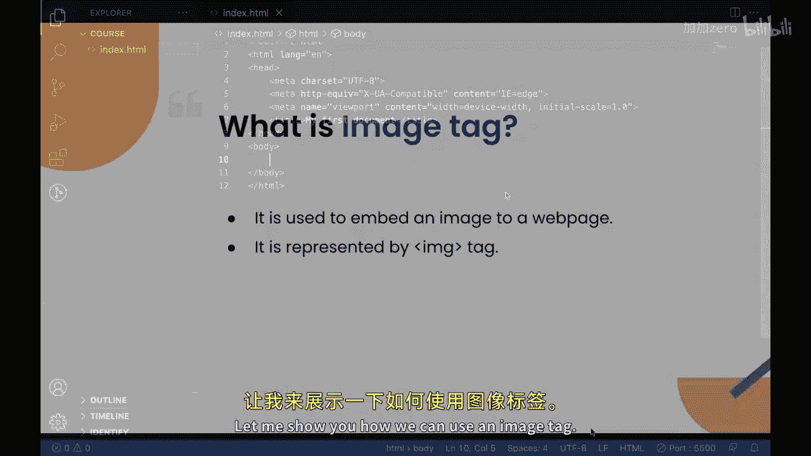
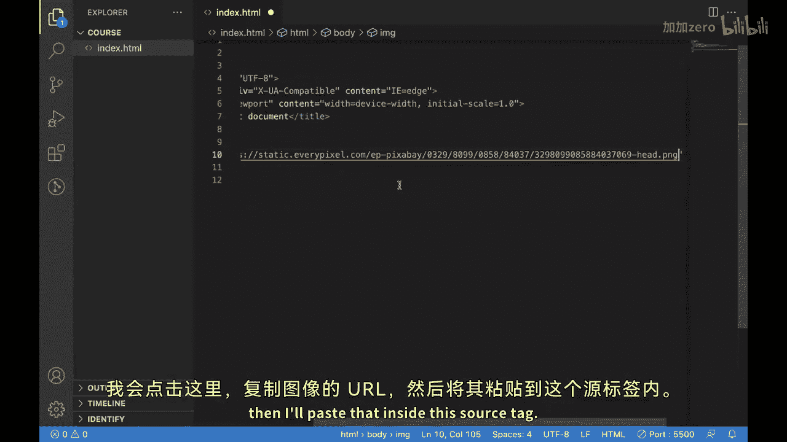
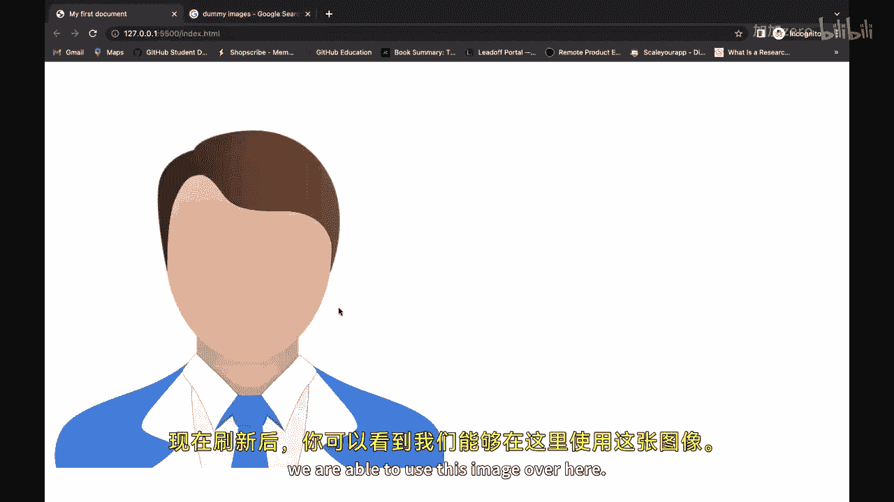
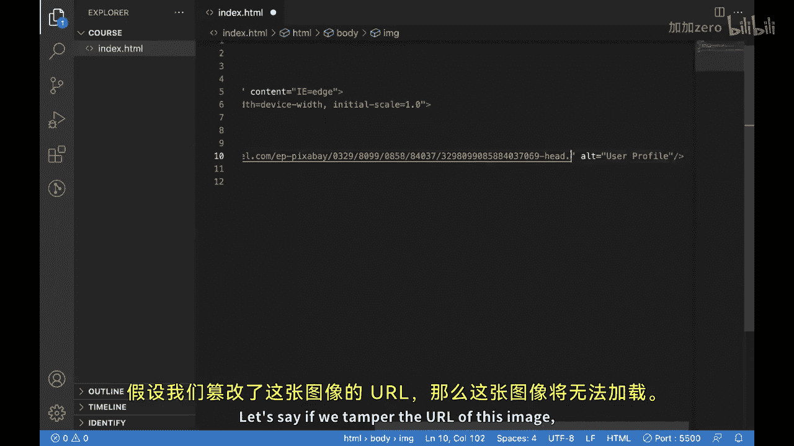
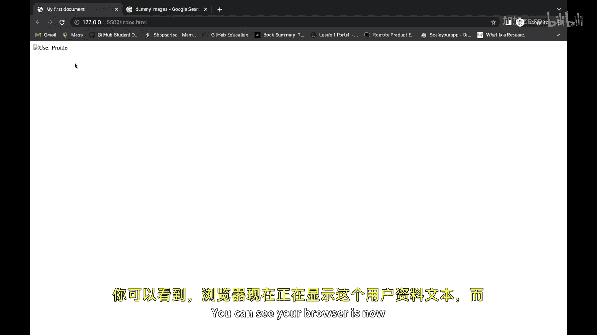
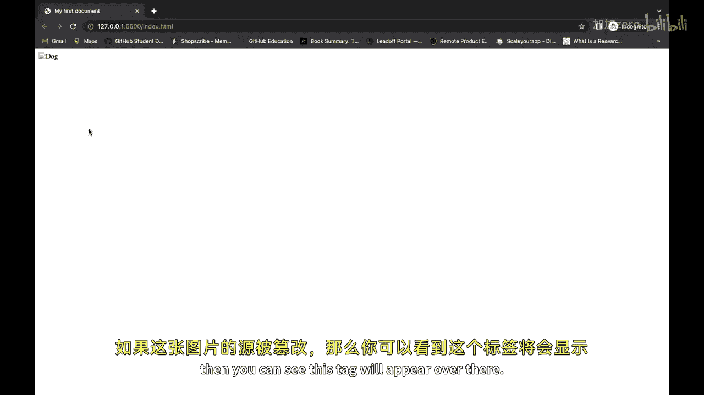

# 【Java全栈开发 专项课程（上）】Board Infinity—中英字幕 p80 p8_09_images-tag -BV1tAygYoEj5_p80-

Hi there In previous video we learned about iframeme and today we will learn about image tag。

The image tag is an essential part of any website as it allow you to display visual content to your users。

In this video， we will explore the different ways in which the image tag can be used and how it can benefit your website。

Let's start by discussing what image tag is。The image tag also known as the IG tag is used to embed images into a web page。

 the image tag has several attributes include source attribute which is used to specify the URL of image and alt tag which is used to provide a description of the image。

From the primary uses of image tag is to display product image or photos。

On an ecommercemerce website by using the image tag。

 you can easily display high quality images of your products。

Which can help increase sales and improve the user experience Let me show you how we can use an image tag。

So for embedding an image into our web page， we use IMG tag。It is a self closing tag。

Now let's see how we can embed an image with image tag in our webpage。So for doing that。

We need to use the image tag， which is IMG。It is a self losing tag。

And it has an attribute called source。Tamme like we have seen on iPhoneing。This source。

 take the source of an image which needed to be displayed on your web page。

So let's just select an image。Here is this dummy image which I want to display on my web page。

 so I click over it。And I'll copy the image URL。And then I'll paste that inside this so stack。

And now， you can see。After refreshing it， we are able to use this image over here。

Apart source tag。Apart source attribute， there is one more attribute called。

AT this is used to put the alternative text in your image， so let me put it like。User profile。

So this alternative text would be used when your image won't be able to load， so lets say。

If we temper the URL of this image then this image won't be able to load so you can see your browser is now presenting this user profile text instead of this image just to tell the user that this particular image is of user profile。

We can also load images from our local system itself， rather than loading it from sub website online。

Let me show you how we can do that。So for loading an image from your device。

What we need to do is let me just commend this one and let me create another image tag。

Which will be helping us in loading the image from our。P theedil。If you guys can see。

 I have an image over here。And if I want to load this image， then inside the source attribute。

 I will put dot， which means the current directory because my image is present over here。

And I'll put slash。And then the name of the image which is talk dot JPG and if I save this。

You guys can see the image is available over here。We have some more attributes like width。

 which will help us。In adjusting the width of this image， we also have height。

And we can put it like this。And we also have the alternative tag over here。

And we also have alternative attribute over here。There we can put dog。And if。The source of this。

And if the source of this image gets tempered。Then you can see the dog will appear over there。

So this is how we can use It。I hope you guys are able to understand。The use cases of you tag。

 and you will try to use it by yourself in your next project。

🎼。

