# Java全栈开发 专项课程（上）：10：HTML视频标签详解 🎬

在本节课中，我们将要学习HTML中的`<video>`标签。这是一个用于在网页中嵌入视频内容的强大工具。我们将探讨它的基本语法、核心属性以及如何从不同来源加载视频。

上一节我们介绍了如何使用``标签嵌入图片，本节中我们来看看如何在网页中嵌入和控制视频播放。

## 什么是视频标签？

`<video>`标签，也称为视频元素，用于将视频内容嵌入到网页中。它拥有多个属性，可以控制视频的播放、尺寸和交互方式。

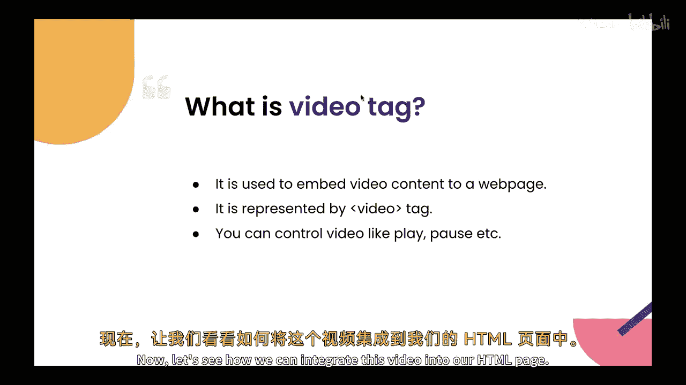

## 视频标签的核心属性

以下是`<video>`标签的一些关键属性及其作用：

*   **`src`**：此属性用于指定视频文件的URL。它通常用在嵌套的`<source>`标签内。
*   **`controls`**：此属性用于在视频下方显示播放控制条，包括播放/暂停按钮、音量控制和进度条。
*   **`width` 与 `height`**：这两个属性用于设置视频播放器的宽度和高度。其值可以是像素值（如`300`）或百分比（如`50%`）。
*   **`loop`**：此属性使视频在播放结束后自动重新开始播放。
*   **`muted`**：此属性设置视频在加载时默认处于静音状态。
*   **`autoplay`**：此属性使视频在页面加载后自动开始播放（注意：许多现代浏览器会阻止带声音的自动播放）。

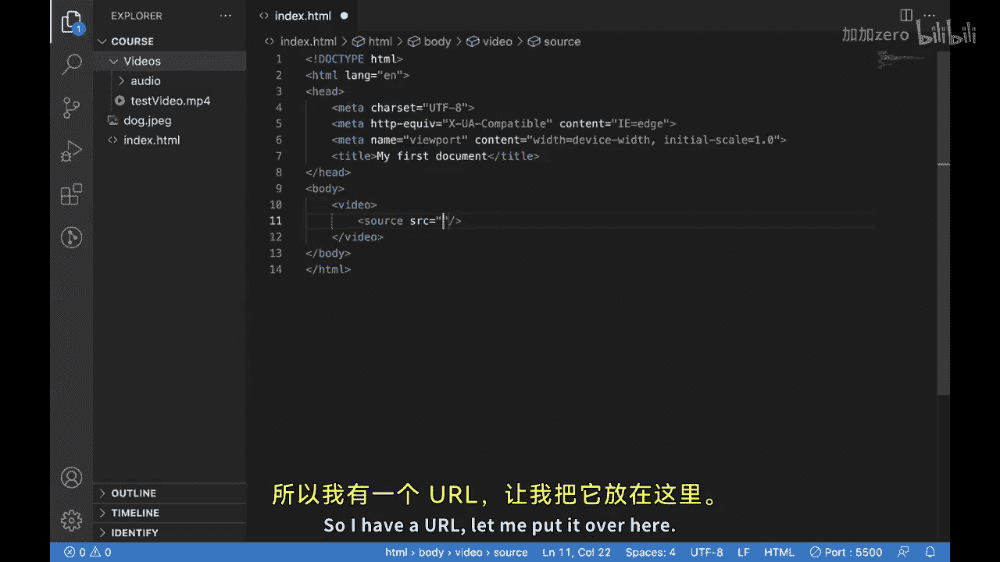

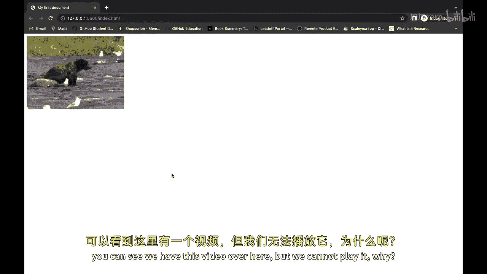

## 在HTML页面中集成视频

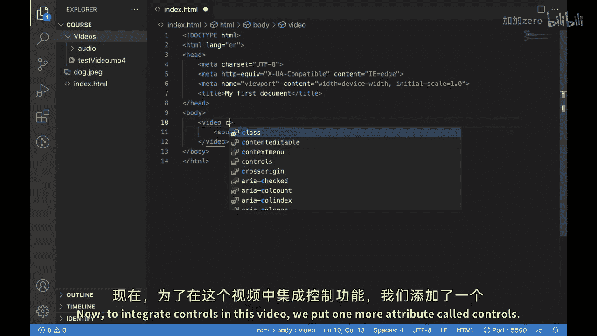

现在，让我们看看如何将视频集成到我们的HTML页面中。

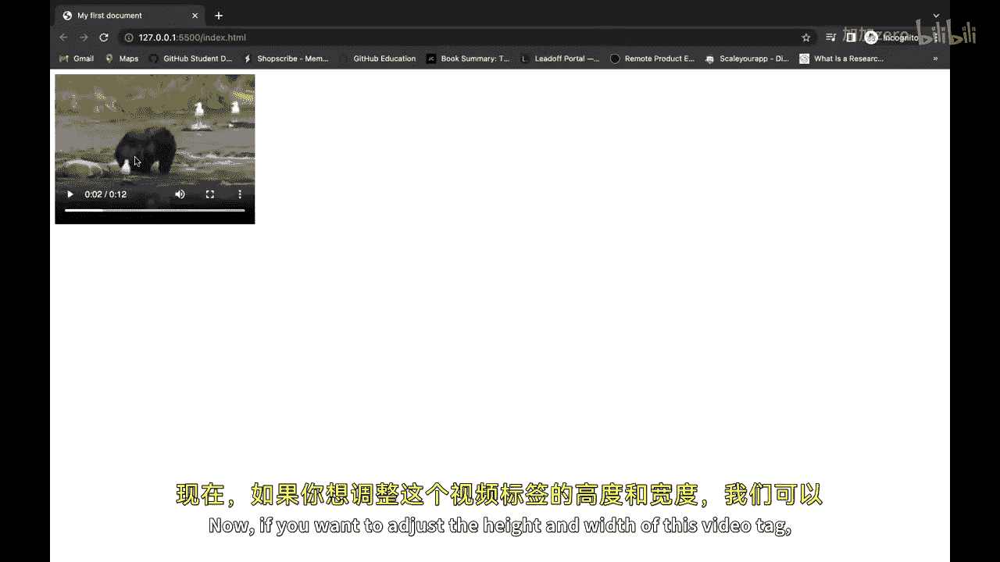

首先，我们使用`<video>`标签。在这个标签内部，我们通常放置一个`<source>`标签来指定视频源。

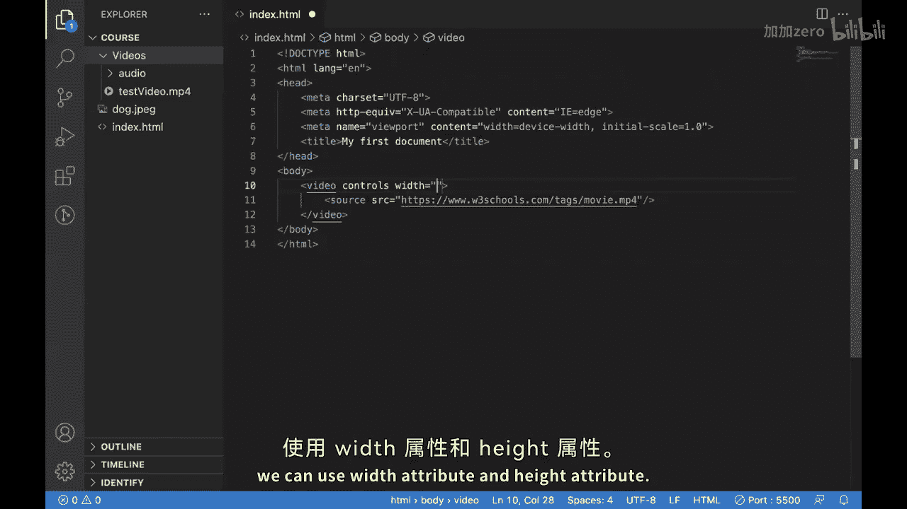

**基础代码结构如下：**
```html
<video controls>
  <source src="视频文件的URL或路径" type="video/mp4">
</video>
```

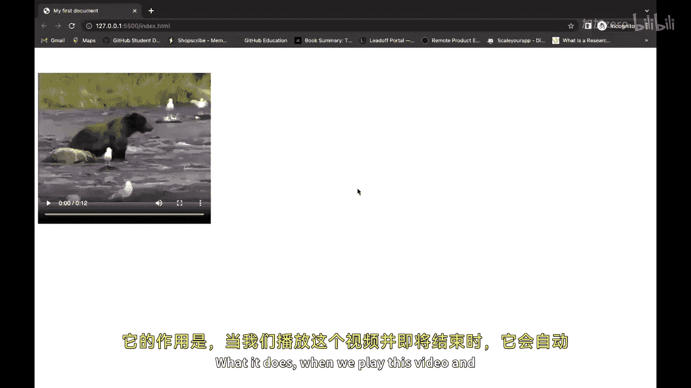

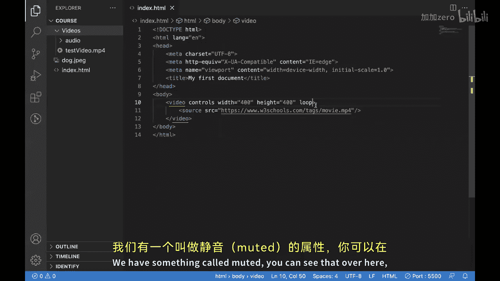

### 示例1：嵌入网络视频

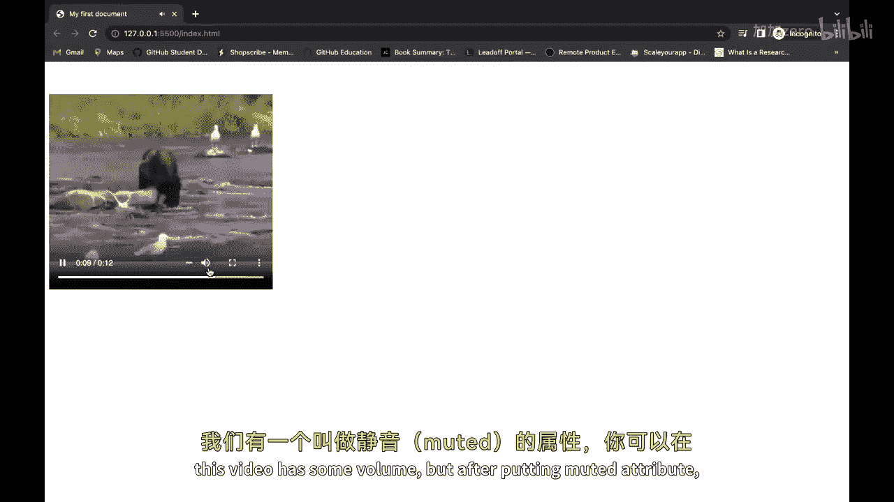

假设我们有一个在线视频的URL，可以按以下方式嵌入：

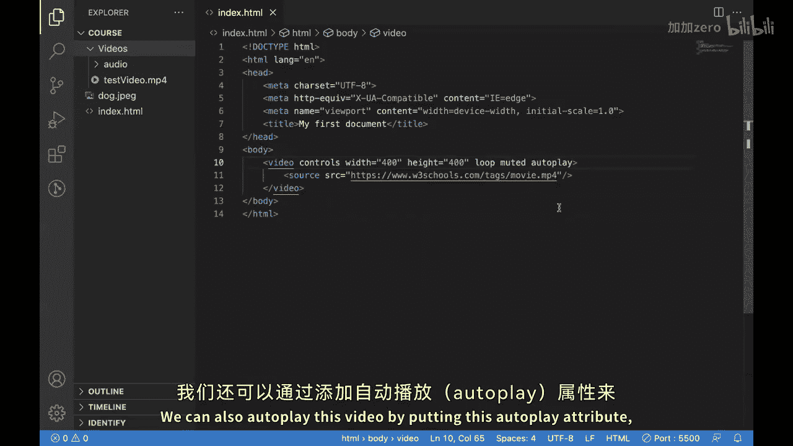

```html
<video controls width="600">
  <source src="https://example.com/path/to/your-video.mp4" type="video/mp4">
</video>
```
添加`controls`属性后，页面上将显示视频播放器，用户可以进行播放、暂停、调整音量等操作。

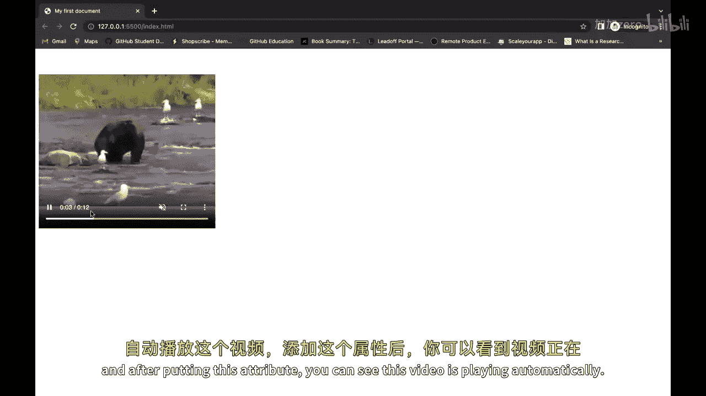

### 示例2：嵌入本地视频

如果视频文件存储在本地项目文件夹中，我们可以使用相对路径来引用它。

假设项目结构如下：
```
你的项目文件夹/
├── index.html
└── videos/
    └── test-video.mp4
```

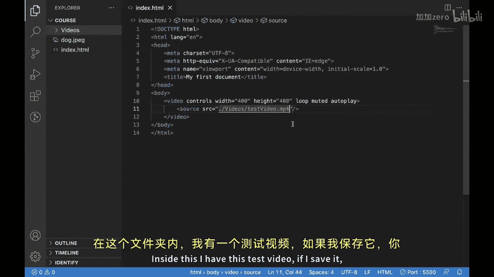

在`index.html`中，可以这样嵌入本地视频：
```html
<video controls width="600" height="400">
  <source src="./videos/test-video.mp4" type="video/mp4">
</video>
```
这里的`./`代表当前文件夹（即`index.html`所在的目录），`./videos/test-video.mp4`则指向具体的视频文件。

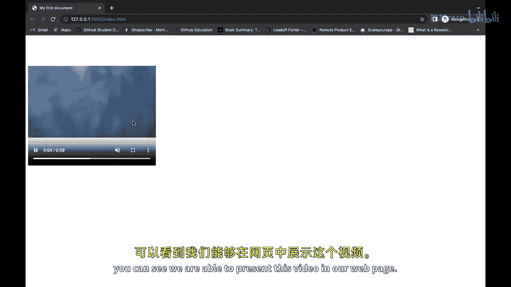

### 使用其他属性

我们可以组合使用上述属性来增强视频体验。例如，创建一个自动播放、循环播放且默认静音的视频背景：
```html
<video autoplay loop muted width="100%">
  <source src="./videos/background-loop.mp4" type="video/mp4">
</video>
```

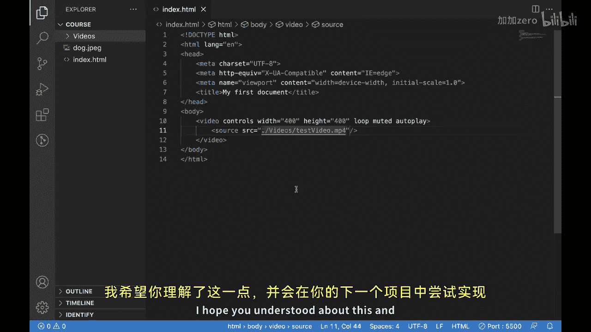


本节课中我们一起学习了HTML `<video>`标签的用法。`<video>`标签是网页开发者和设计师的强大工具，它允许你将视频内容无缝集成到网站中。通过有效地使用`controls`、`loop`、`autoplay`等属性，你可以为用户创造更具吸引力、沉浸感更强的视觉体验，从而有效提升用户参与度和网站的整体表现。