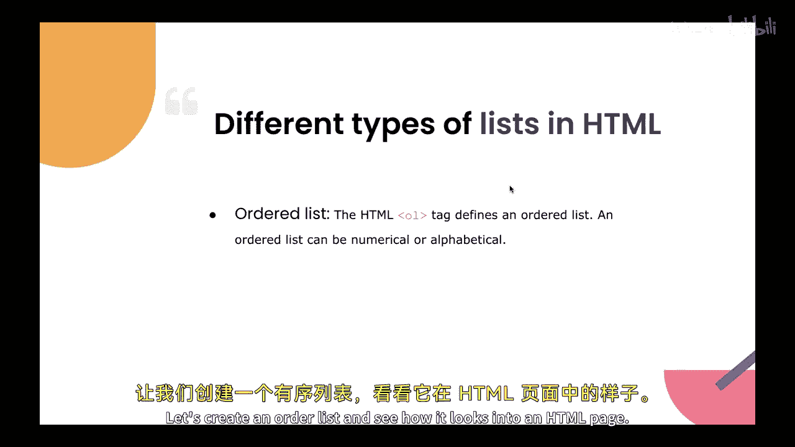
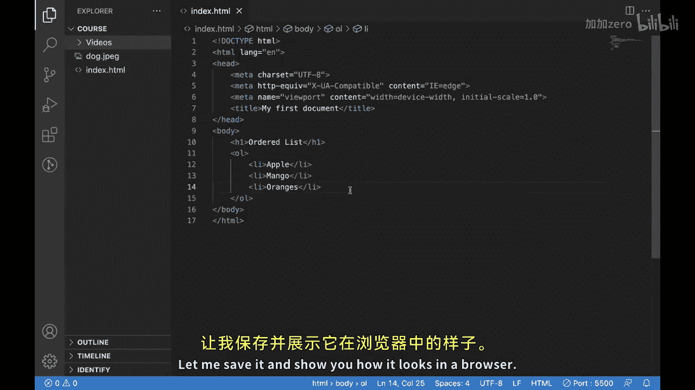
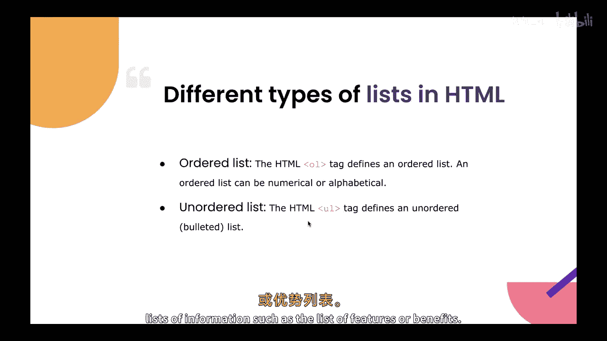
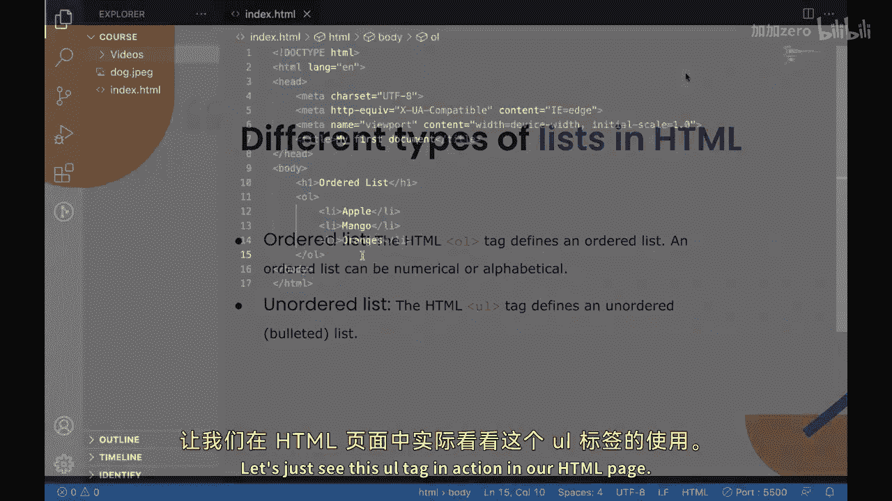
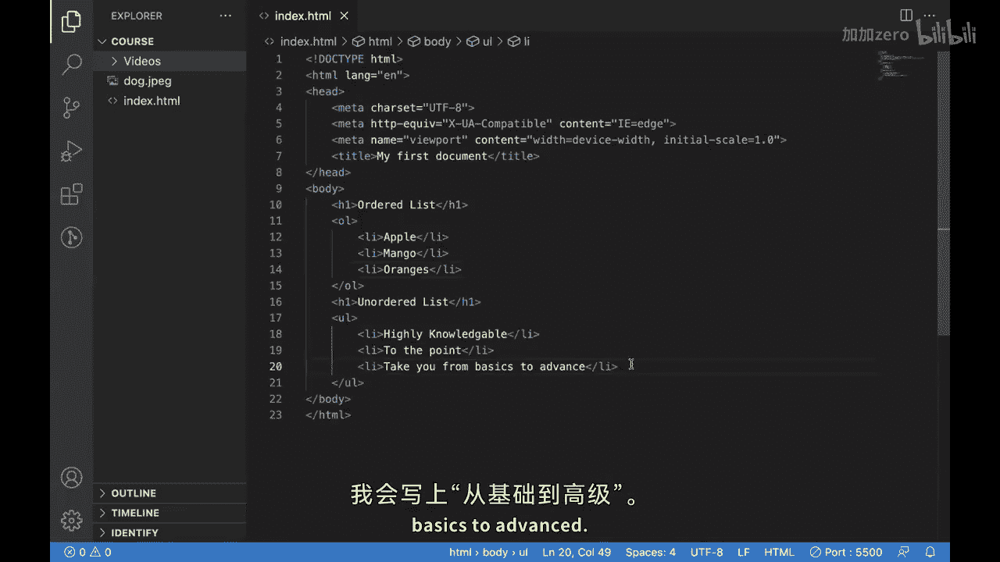

# 【Java全栈开发 专项课程（上）】Board Infinity—中英字幕 p83 p11_12_list-tag -BV1tAygYoEj5_p83-

Hi there。 Today， we will learn about list tag。In the previous video。

 we have seen what audio tag is and how we can embed it into our HTML page。😊。

The list tag is a powerful tool that allows you to organize and present information in a structured and visually appealing way in this video。

 we will explore the different attributes and features of the list tag and how it can benefit your website。

😊，Let's start by discussing what the list tag is and how it works。

The list tag also known as the list element is used to create lists of items on a web page。

 the list tag has several attributes including the type attribute which is used to define the type of the list ordered or unaued and the start attribute which is used to define starting number of an ordered list。

One of the primary uses of the list tag is to create lists of items on a web page such as the list of products。

 services or features。😊，By using the list tag， you can create a structured and visually appealing list that can help you to improve the user experience and engagement。

 There are different types of list tags that we can create in HTML。 Lets look into them one by one。

 The first type of list is ordered list or we can call it OL element。

This type of list is used to create a list of items that are specific and are in order or sequence the order list tag is often used to create numbered list of information such as step by step guide or tutorial let's create an order list and see how it looks into an HTMLl page。

This is our HTML document and for creating an order list over here what we can do is。I just。

Add heading first for order list。And under this heading。

 I will create an order disc by creating an OL tag this O over here stands for audit list。

So inside this soil， we have to put our list items， which we can put with the help of alliteiteac。

 which stands for list item。So every list， whether it is ordered or ordered。So every list。

 whether it is ordered or unored has the list items so I add。So I add some list items over here。

An output。Let's say Apple。mango。Are not in。And this is my list of fruits。

Let me save it and show you how it looks in a browser so this is our list。

And as we can see， this is an order list so we can see a sequence of numbers，1，2，3。😊。

So this is it about order list now lets see the unordered list。Now。

 the second type of list tag is an ordered list， the unored list or I can call it the UL element。

 this type of list is used to create a list of items that are not in a specific order or sequence。

The unau list tag is often used to create bullet point lists of information such as the list of features or benefits。

Let's just see this U tag in action in our HTML page。

So in our HTML document， just below this order list。We will create an order list。Let just。

Put a headinging for an order list first。And we can use the UL tag。For creating an unored list。

And similarly， like order list， we will have the list items inside this Ul tag。

Which we can create with the help of LT。I'll create the three list items。

And I'll put some features over here。Let's say I'll put the features of this course。

I would put highly knowledgeable。I put。To the point。I put。Thank you。Fromm。Basics to advance。

Now， if I show this in browser， you guys can see。

