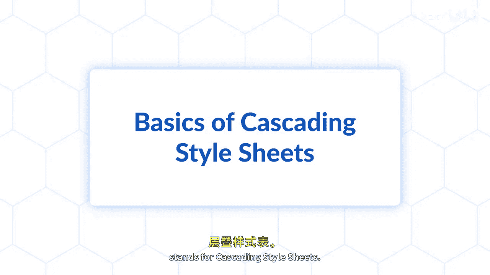

# Java全栈开发 专项课程（上）：P86：CSS基础入门

在本节课中，我们将要学习CSS的基础知识。CSS全称为层叠样式表，用于为HTML文档添加样式和格式，使其更具视觉吸引力且更易于阅读。我们将了解CSS是什么、它如何工作以及其基本语法。课程还将涵盖CSS选择器，这些选择器用于定位特定的HTML元素并对其应用样式。我们将学习基于元素类型、类和ID进行选择的简单选择器，以及基于元素间关系进行选择的组合选择器。

## 什么是CSS？

CSS代表层叠样式表。它是一种样式表语言，用于描述HTML或XML文档的呈现方式，包括颜色、布局和字体等。CSS旨在将文档的内容与其表现形式分离，从而提高内容的可访问性，并提供更多的灵活性和控制力。

## CSS如何工作？

CSS通过规则集来工作。每个规则集由一个选择器和一个声明块组成。选择器指定规则将应用于哪些HTML元素。声明块包含一个或多个用分号分隔的声明。每个声明包括一个CSS属性和一个值，用冒号分隔。

**基本语法示例：**
```css
选择器 {
    属性: 值;
}
```

## CSS选择器

选择器是CSS的基石，用于“选择”你想要样式化的HTML元素。以下是主要的选择器类型。

### 简单选择器

简单选择器基于元素的名称、ID或类直接选择元素。

*   **元素选择器**：根据元素名称选择HTML元素。
    *   例如：`p { color: blue; }` 会选择所有 `<p>` 段落元素并将其文本颜色设置为蓝色。
*   **ID选择器**：使用HTML元素的`id`属性来选择特定元素。ID在一个页面中应是唯一的。
    *   例如：`#header { background-color: gray; }` 会选择 `id="header"` 的元素。
*   **类选择器**：选择具有特定`class`属性的元素。类可以被多个元素共享。
    *   例如：`.center { text-align: center; }` 会选择所有 `class="center"` 的元素。

### 组合选择器

组合选择器用于基于元素之间的特定关系来选择元素，提供了更精确的控制。

*   **后代选择器（空格）**：选择位于指定元素内部的所有后代元素。
    *   例如：`div p { background-color: yellow; }` 会选择所有在 `<div>` 元素内部的 `<p>` 元素。
*   **子元素选择器（`>`）**：选择作为指定元素直接子元素的所有元素。
    *   例如：`div > p { background-color: yellow; }` 只会选择作为 `<div>` 直接子元素的 `<p>` 元素。
*   **相邻兄弟选择器（`+`）**：选择紧接在另一指定元素后的元素，且二者有相同的父元素。
    *   例如：`h1 + p { font-weight: bold; }` 会选择紧跟在 `<h1>` 元素后的第一个 `<p>` 元素。
*   **通用兄弟选择器（`~`）**：选择指定元素之后的所有兄弟元素。
    *   例如：`h1 ~ p { color: red; }` 会选择所有在 `<h1>` 元素之后且与其同级的 `<p>` 元素。



## 应用CSS到HTML

要将样式应用到HTML文档，主要有三种方法：

1.  **内联样式**：直接在HTML元素的`style`属性中定义样式。此方法优先级最高，但不利于维护和复用。
    *   示例：`<p style="color: red;">这是一段红色文字。</p>`
2.  **内部样式表**：在HTML文档的`<head>`部分使用`<style>`标签定义样式。适用于单个页面。
    *   示例：
        ```html
        <head>
            <style>
                body { background-color: lightblue; }
                h1 { color: navy; }
            </style>
        </head>
        ```
3.  **外部样式表**：将CSS规则保存在一个独立的`.css`文件中，然后在HTML文档中通过`<link>`标签链接。这是最推荐的方法，可以实现样式与结构的完全分离，并方便多个页面共享样式。
    *   在`styles.css`文件中：`p { font-family: Arial; }`
    *   在HTML文件中链接：`<link rel="stylesheet" href="styles.css">`

## 总结

本节课中，我们一起学习了CSS的基础知识。我们了解了CSS是一种用于美化HTML文档的样式表语言。我们掌握了CSS的基本语法结构，即由选择器和声明块组成的规则集。我们重点学习了两种核心选择器：用于直接选择元素的**简单选择器**（元素、ID、类选择器），以及用于根据元素关系进行选择的**组合选择器**（后代、子元素、相邻兄弟、通用兄弟选择器）。最后，我们了解了将CSS应用到HTML的三种主要方式。现在，你已经能够使用CSS选择器为你的HTML文档应用简单的样式了。