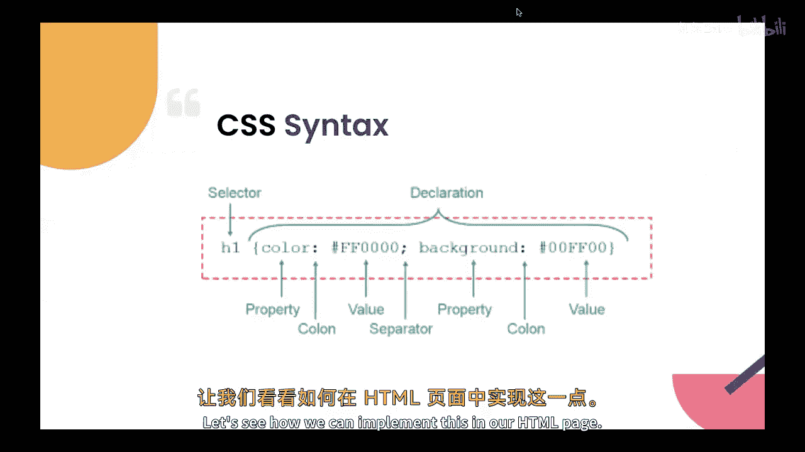
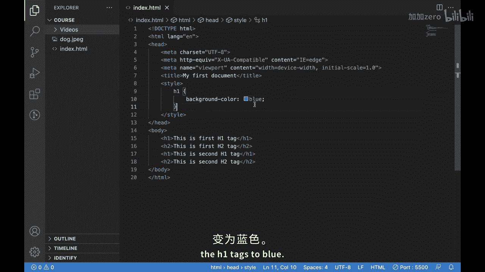

# 【Java全栈开发 专项课程（上）】Board Infinity—中英字幕 p88 p16_03_css-syntax -BV1tAygYoEj5_p88-

H there。In our previous video， we talked about what CSS is and its importance in web development。

Today， well dive deeper into CSS and discuss its syntax。

CSS uses a simple syntax to define tiles for HTMLl elements it consists of a selector。Property。

And value the selector identifies the HTML element that the style should be applied to while the property defines the style attribute such as font size or color。

 and the value defines。The specific setting for the property CSS supports a variety of selectors。

 including element selector， class selectors and I selectors。

Element selectors apply styles to all elements of a specific type。

 such as all paragraph tags class selectors apply styles to all elements with a specific class。😊。

While ID selectors apply single element。While ID selector apply styles to a single element which that ID is associated with。

There is one more selector called attribute selector。

 which applies styles to elements with specific attribute such as all the anchor tags which have the target attribute we learn all about these different different selectors later on in this series。

CSS supports a wide range of properties also， including font size， color， background color。

 margin and padding。Each property has a specific value such as a specific font size or color code lets implement what we have learned about CSS for example。

 lets say we want to apply a blue background color to all at elements。😊。

Let's see how we can implement this in our HTMLlP。

So this is our HTML page and here we have some Hin tags。And some acrots。And if I showed this。

On browser， it appears like this。Now， as we know that what we want to do is you know we want to change the background color for these adent tags。

Let me show you how we can do that with CSS。But for doing that。Will add attack or style over here。No。

The syntax that we have learned will apply it over here。We need to first use the selector。

So as we know， we want to change the background color for the aron tags so we can use this aan as a selector。

Then inside these braces， we can write a property called background color and then we can write the value for this property which is blue。

what we are doing over here is we have put our selector。

 we have write down these bases and inside these bases we can write down the property and values for this selector。

Like what we have done over here， we have used the property background color。

 which will change the background color for the aent tax。To blue。

Let's see this。So as you can see， we are able to do this。

And hope you are able to get the idea about how to write CSs for your HTMLtl。

And with the example we have seen， you have also tried to implement various CSS properties in your HTMLl page。

I hope you will try it by yourself。See you your next video。

