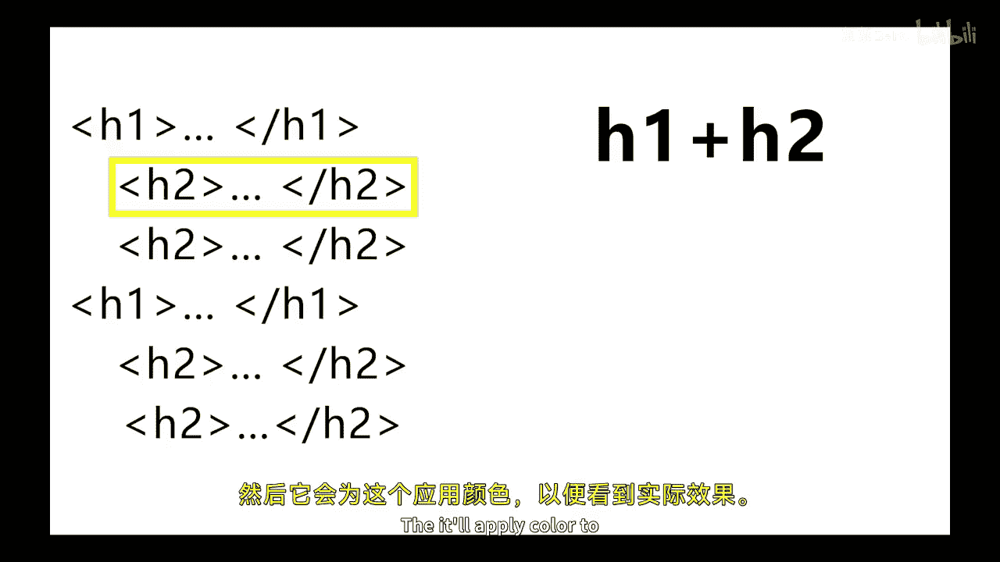
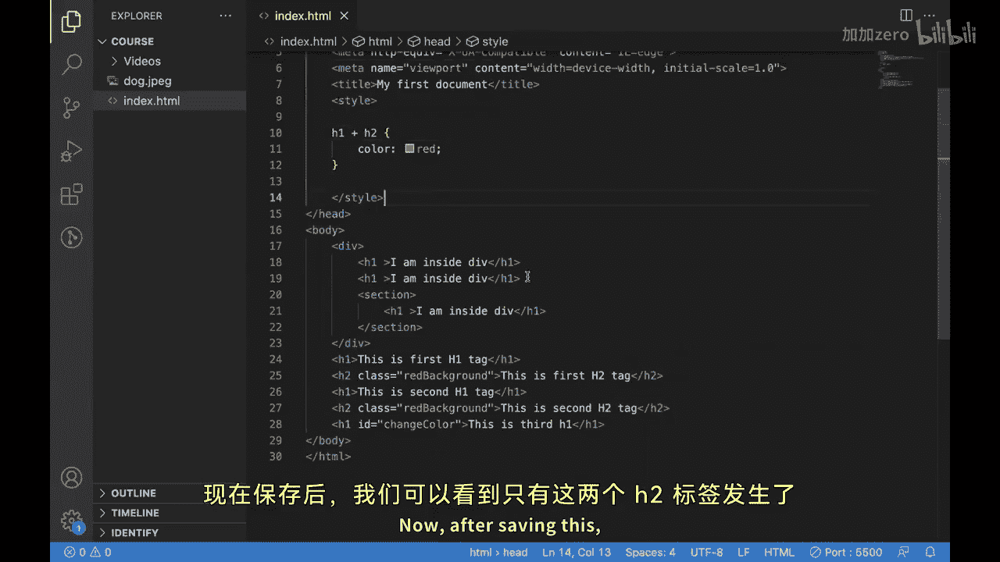
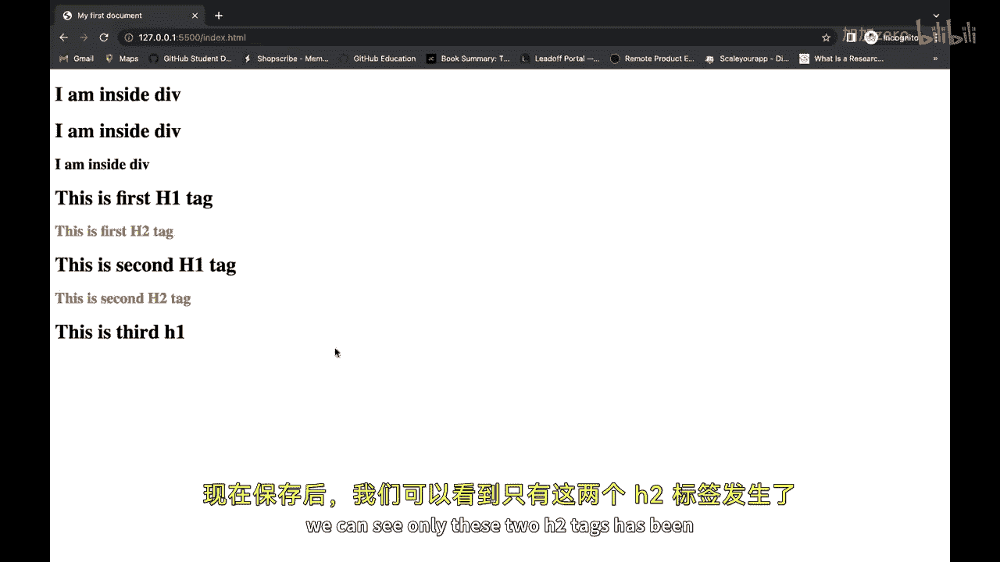
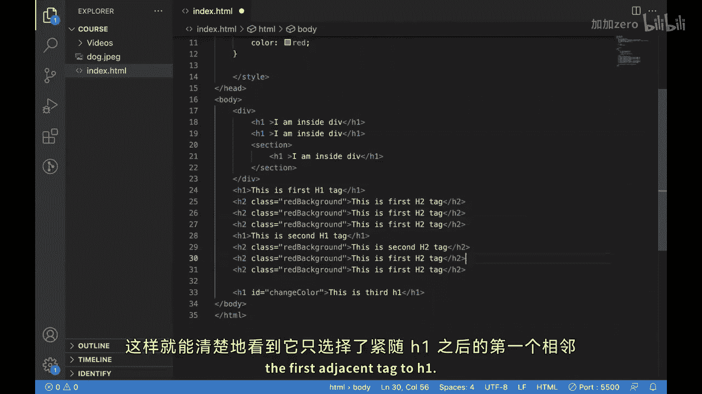
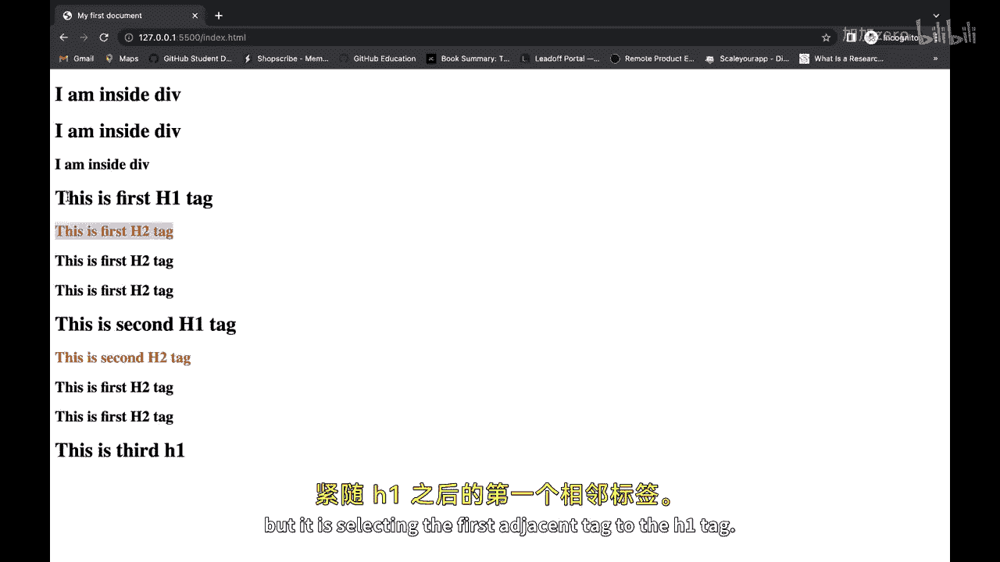
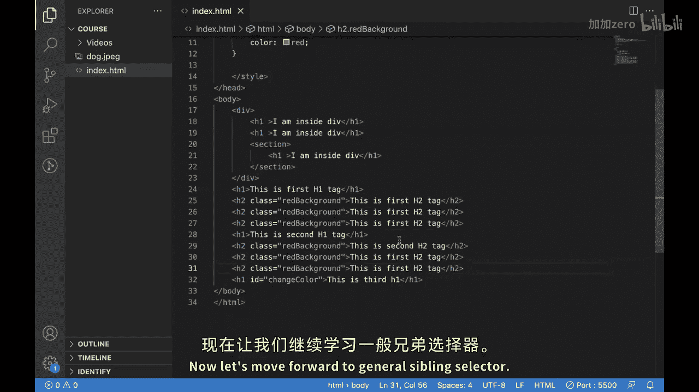
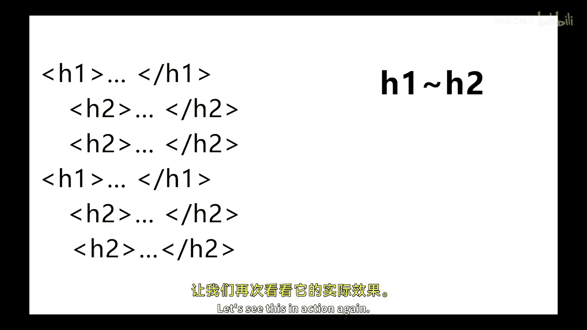
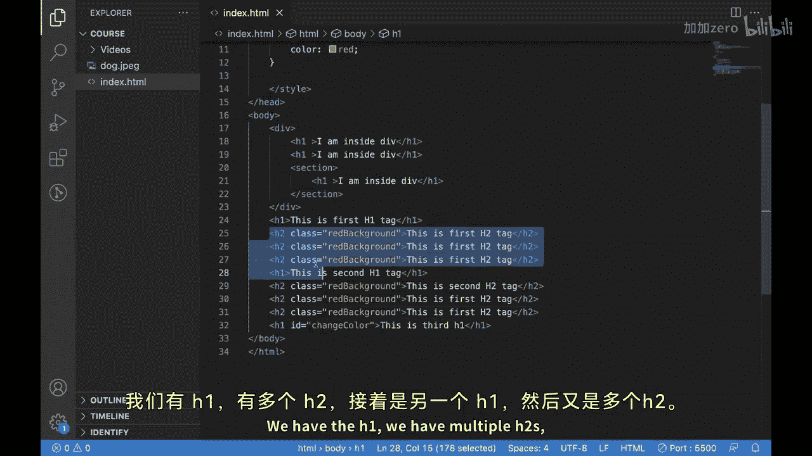
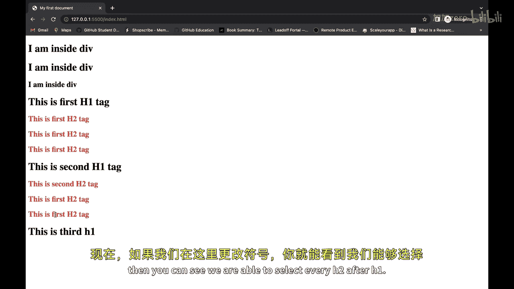
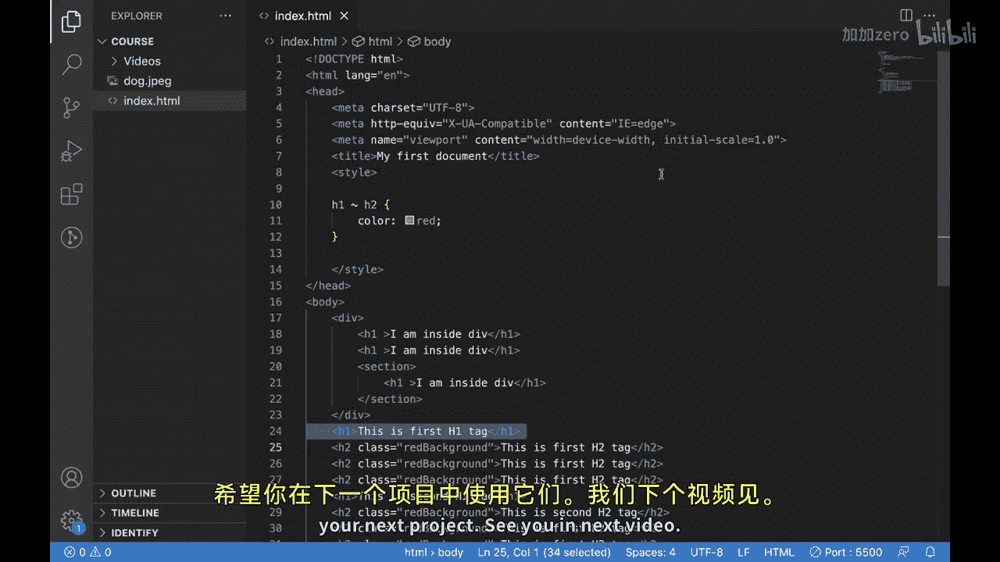

# Java全栈开发 专项课程（上）：19.06：CSS组合选择器（第二部分）👨‍💻

在本节课中，我们将要学习CSS中另外两种组合选择器：相邻兄弟选择器和通用兄弟选择器。我们将通过实例来理解它们的工作原理和应用场景。

在上一节中，我们介绍了什么是组合选择器，并学习了后代选择器和子选择器。本节中，我们来看看另外两种基于兄弟元素关系的选择器。

## 相邻兄弟选择器

相邻兄弟选择器用于选择紧接在另一个元素之后的同级元素。其语法是：第一个选择器 + 第二个选择器。它只会选择第一个选择器之后**紧接着**出现的那个匹配第二个选择器的兄弟元素。



以下是其工作原理的代码描述：
```css
h1 + h2 {
    color: red;
}
```
这段代码的意思是：选择所有紧跟在 `h1` 元素之后的 `h2` 元素，并将它们的文字颜色设置为红色。





让我们通过一个例子来理解。假设我们的HTML结构如下：
```html
<h1>标题1</h1>
<h2>标题2-1</h2>
<h2>标题2-2</h2>
<h1>另一个标题1</h1>
<h2>标题2-3</h2>
<h2>标题2-4</h2>
```
应用 `h1 + h2 { color: red; }` 规则后，只有“标题2-1”和“标题2-3”会变成红色，因为它们是各自紧跟在 `h1` 后面的第一个 `h2` 元素。



## 通用兄弟选择器





通用兄弟选择器用于选择某个元素之后的所有同级元素。其语法是：第一个选择器 ~ 第二个选择器。它会选择第一个选择器之后**所有**匹配第二个选择器的兄弟元素。

以下是其工作原理的代码描述：
```css
h1 ~ h2 {
    color: blue;
}
```
这段代码的意思是：选择所有在 `h1` 元素之后出现的 `h2` 兄弟元素，并将它们的文字颜色设置为蓝色。

使用与上面相同的HTML结构，应用 `h1 ~ h2 { color: blue; }` 规则后，“标题2-1”、“标题2-2”、“标题2-3”和“标题2-4”都会变成蓝色。因为它选择了每个 `h1` 之后的所有 `h2` 兄弟元素。



以下是两种选择器的核心区别总结：
*   **相邻兄弟选择器 (`+`)**：只选择**紧邻的、下一个**匹配的兄弟元素。
*   **通用兄弟选择器 (`~`)**：选择**之后所有**匹配的兄弟元素。





## 总结

本节课中我们一起学习了CSS组合选择器的另外两个重要成员。我们探讨了相邻兄弟选择器，它用于精确选择紧跟在特定元素后的第一个兄弟元素；也学习了通用兄弟选择器，它可以选择特定元素之后的所有指定兄弟元素。




通过组合使用后代选择器、子选择器、相邻兄弟选择器和通用兄弟选择器，开发者可以创建出高度精准、易于维护的网页样式。希望你能在下一个项目中灵活运用它们。