# 【Java全栈开发 专项课程（上）】Board Infinity—中英字幕 p93 p21_02_pseudo-class-selectors-part-1 -BV1tAygYoEj5_p93-

快点。In previous video， we have seen what simple selectors and combined selectors are。In this video。

 we'll be looking into CSS pseudo class electives。So what exactly are pseudo class elects well in simple terms they are used to select and style specific element based on their current state or condition for instance you can style links based on whether they have been visited or not or style input elements based on whether they are being hover over or not。

Tuddo class selectors are preceded by a colon and can be added to any element selector。

There are many so glasss selectors in CSS， but some of the most commonly used ones are over here。

Let's look into them one by one。The first one is hover。

 the hover So class is used to style an element when the user hovers over it with their mouse。

This can be used to create interactive effects such as changing the color or increasing the font size lets look into this on HTML。

😊。

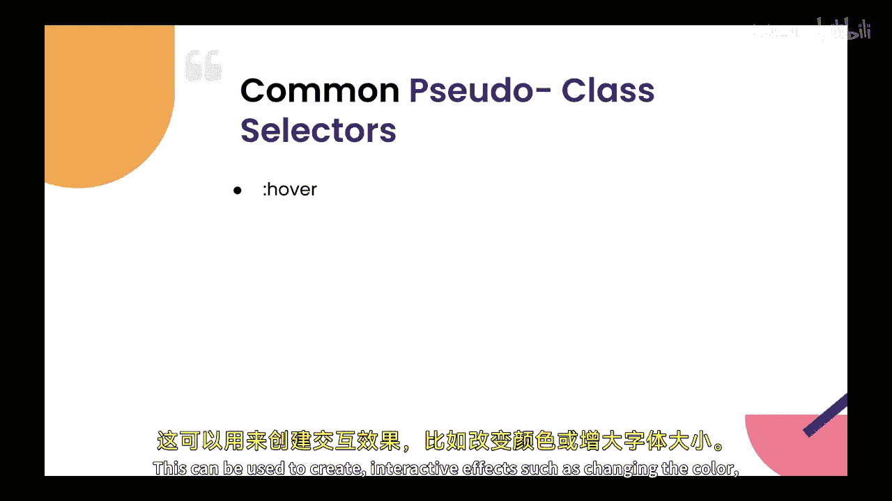

Now， this is our HTML page。And let's create a button tag over here。Will put。

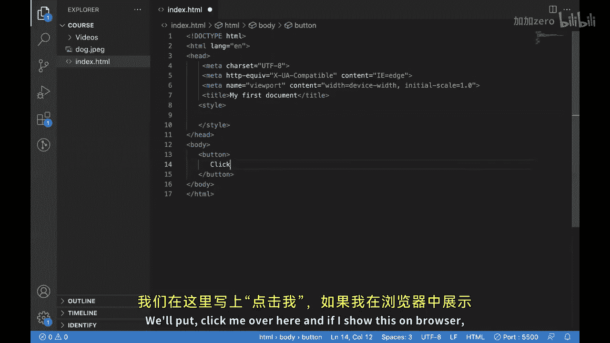

Pick me over here and if I show this on browser， it looks like this currently now when I hover over this。

You're going see。Nothing is happening。But now what I want。

 I want the background color of this button to change when I hover on it。

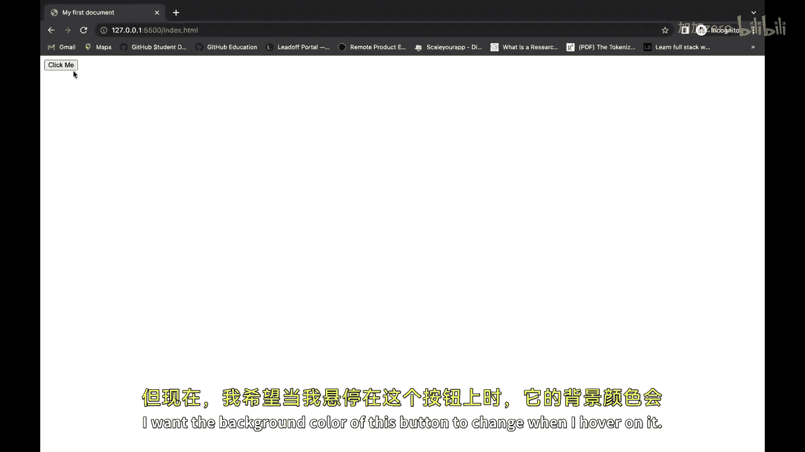

Let's see how we can do that， so we'll be using a selector。Button， I'm using a tag name as selector。

And we can write the background color。Nexts it。And hello。Anyway。

Now for adding the pseudo class element， what we need to do， we need to put this column。And then。

 we need to put。Over and now we have applied the pseudo class。

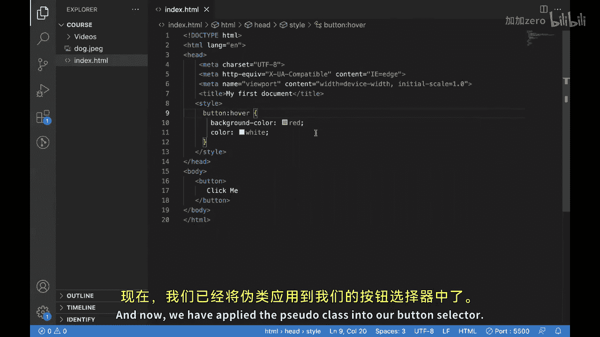

Into our button selector then if I save this。And we hover over with this button。

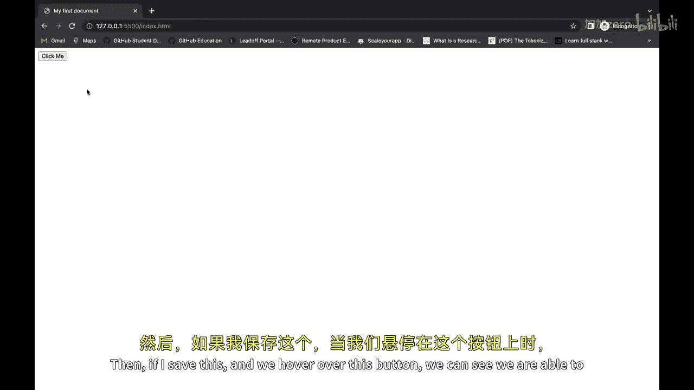

We can see we are able to change the background color as well as the color of the text。

 This is how the hover works。 Let's look into the second。😊。

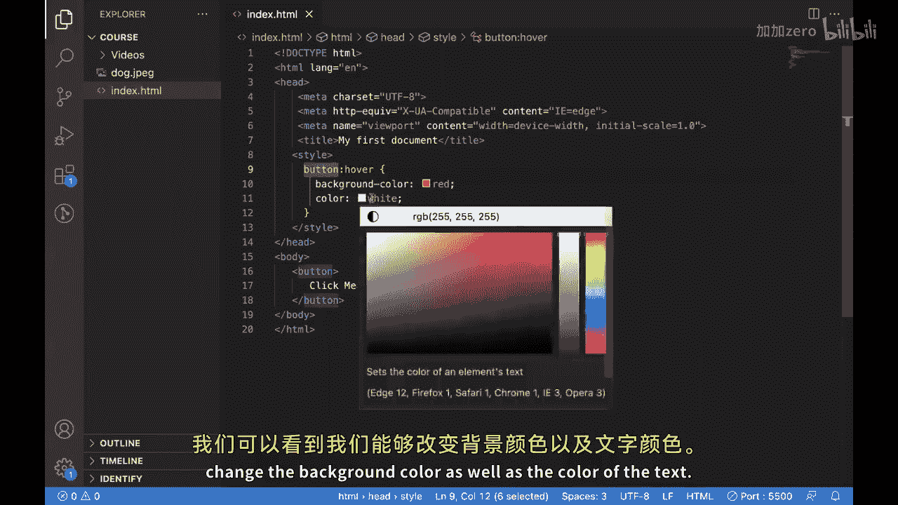

Solass now after Hoover， we have active。The active pseudo class is used to styler element when it is being activated。

Such as when a user clicks on a button or link this can be used to create a visual feedback for the user that you see this in our HTMLl page so over here we have our button。

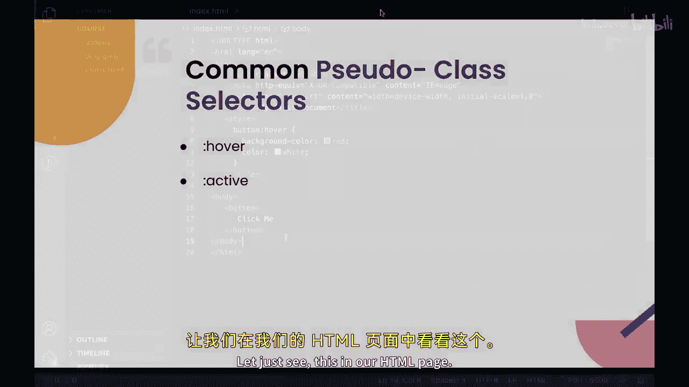

And we have applied hover on it。And it is working like this。What we will do now。

Will again use the select button， and we will put。Active pseudo class over here and what we will do。

 we want to change the background color。To blue when this button gets activated。

 so we have applied our changes now when we go over here。

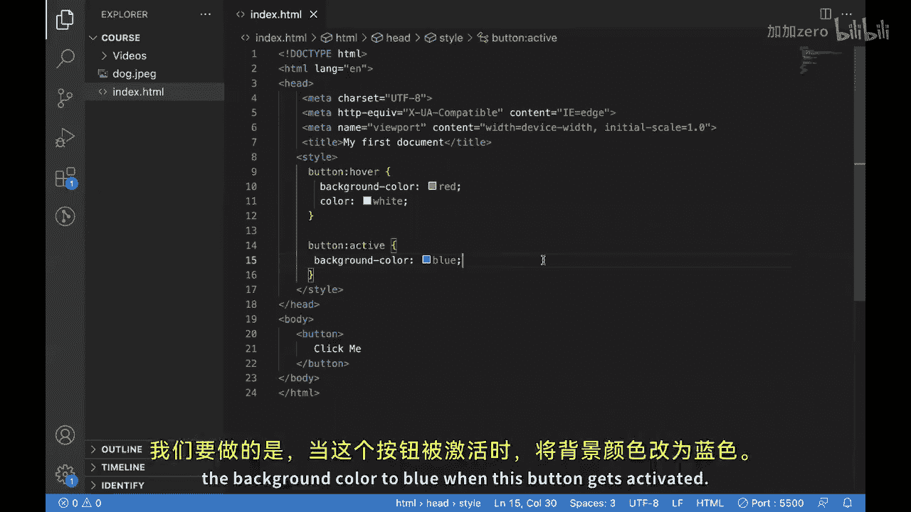

We have hovered over this button and we can see the color is red now when we click this。😊。

This button gets activated。And then our CSF get applied。

Which means now the background color becomes blue， this is what active to classes。

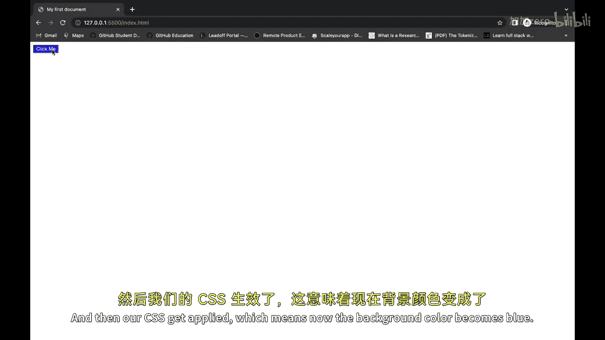

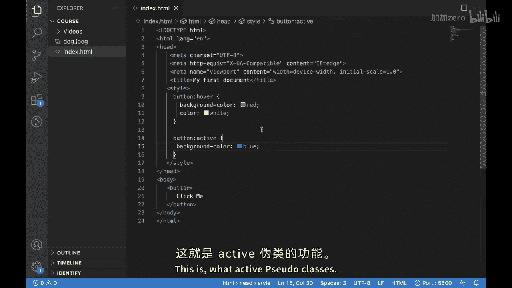

Now lets move forward to our third pseudo class， which is visited the visited pseudo class is used to style links that have already been visited by the user。

This can be used to indicate which pages the user has already visited。

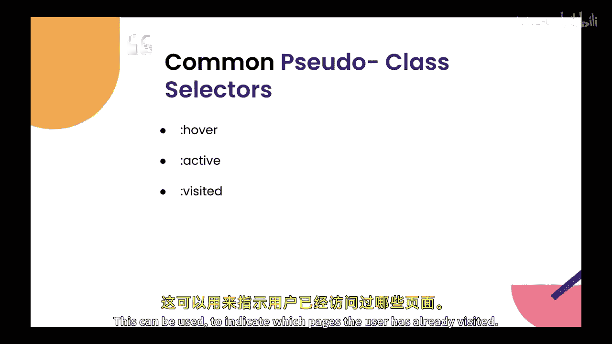

Next slide is in action。In our HTML， you can see we have this button and we applied over an activelast one。

Now what well be doing for using visitor will be using an anchor tag because we know that anchor tag is used for navigating between the pages in STM inside anchor tag I'll put。

力 here啊。系。Start an HRRf， and I'll just put these hashtags over here。And now I'll write CSS for it。

Well right。Anchor tag and selector。Then I'll put visit it。And then I'll put my CSS， which is。

I want to change the color to green。When this particular。

Tag or location is visited so if we save this。

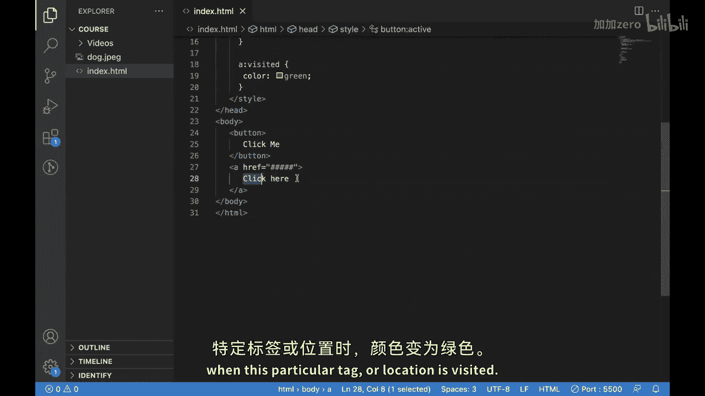

We are able to see just click here。And after clicking it。

 we can see it became green by because now it means that the location has been visited。

 so this is what visited pseudo classess。Now let's move to our next little class。

So our next pseudo classes is focus。The focus U classs is used to style elements that currently have focus such as input elements or button。

That are being selected using the keyboard。

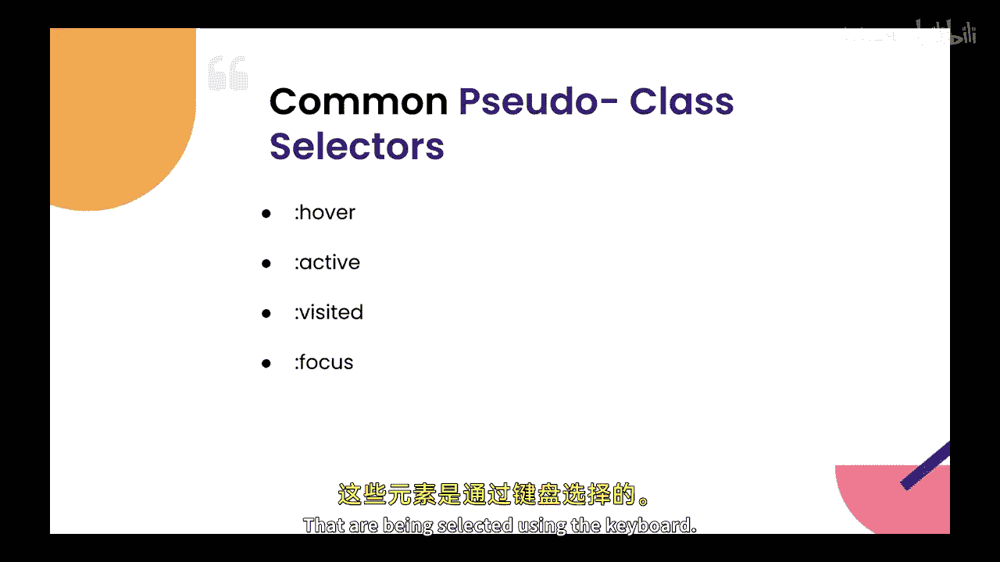

Let's see， focus in action。So this is our HTML and for applying focus。We'll be adding an input box。

 I'll put type。As x。And now we will apply。This pseudo class on our input box Ill put input as a selector。

 then well put focus。And we want to change the background color on focus。So we'll make it yellow。

And we'll also change color。We'll make it， let's say， black。

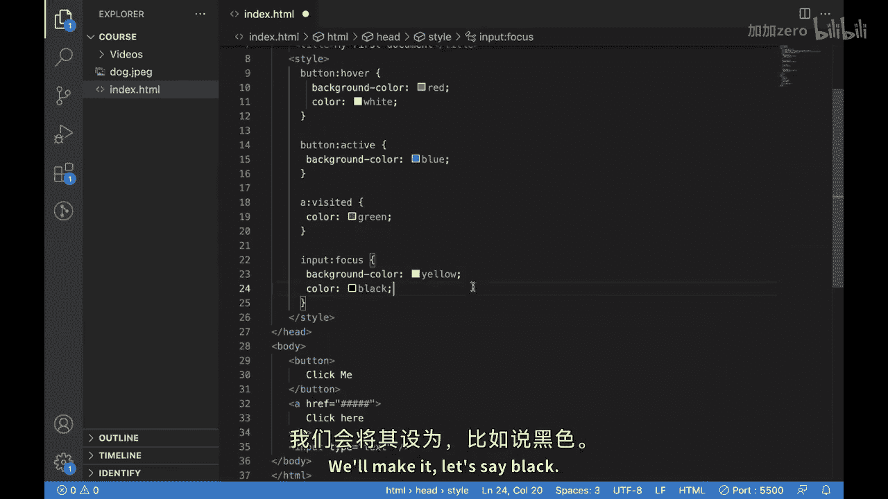

Actually it is why default black， so we'll make it green。So this is our。Input tag。

And let's see what happens when we focus on it。You can see it became yellow and if I start typing something。

The color that we have over here。Is green。So these are some of the pseudo classes。

And I hope you are able to understand them in this session I'm assuming you'll try to use them in your next project see you in next video。

🎼。

