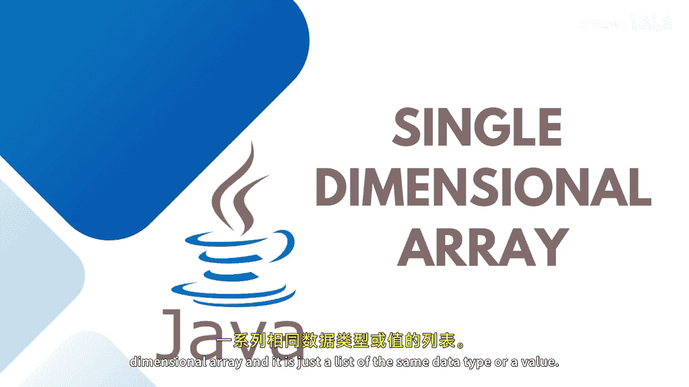
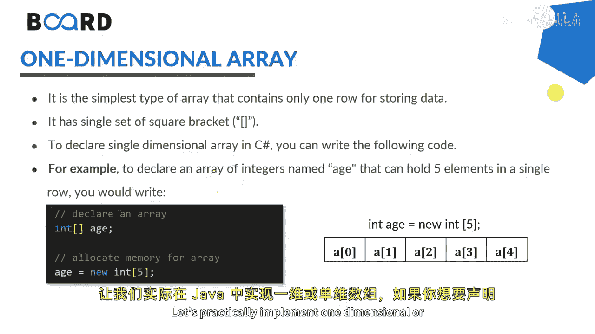

# 【Java全栈开发 专项课程（下）】Board Infinity—中英字幕 p03 p2_02_single-dimensional-array-in-java -BV1fryaYgEqb_p3-

Hi there。 Today in this session， Im going to talk about single dimensional array。😊。

An array that has only one subscript or one dimension is known as a single dimensional array and it is just a list of the same data type or a value。

We use single dimensional array。 We also on it as a one dimensional array can be either。

Having a one row and multiple columns or multiple rows and one column。For instance。

 a student's marks in five subject indicates a single dimensional array we use a square bracket to indicate the size and the dimension of the array。

We can also define a onedial array by first declaring an array and performing memory location using the new keyword letter choice is completely yours This is how we declare an array by putting a square and allocate the size later by giving the size let's say 5 or you can also initialize the value at the same time if you don't want to give the size As I said each element will be access with the index that starts from0 and goes till n minus-1 that is4。

Let's practically implement one dimensional or single dimensional array in Java。

 If you would like to declare the array， declaring an array。

Let's say I want to declare the array marks。I would like to assign or give a memory later， I can say。

Marks equals to new integer， and you can give a size。

You can combine these two statements together into one line this way。Marks equals to new integer 5。

Later on， you can also assign。Iitialize the value at the time of declaring the well array。

 that's called initializing an array。That is。Indeeddija。Markax equals to new in teacher。

 You can give a size or not choice yours if you are giving the values just right here。1020，30。

40 and 50。V。Allocating the values， you can skip giving the size。

If you just want to declare an assign， declare an assign by your own one by one。

That is what you can do first， declare your marks area。

Give a size and then one by one allocate the value marks at index 0。Hundred。Mars at。Index 1。60。

Marks at index 2。Equals to 78。Marks at index 3 equals to 80。And marks at index 4， thats equals2。98。

So you can see that as I told you， index element starts from 0 and goes till n minus1 where n is the size 5 and minus1 is the4。

Now， you can iterate this。Araray with the help of either the traditional forward loop。

 where you say that starts from the I which is0。 we always starts the I creative variable from 0。

 If we are working on index or any array go still less than max do length。

 So if the max do length is5 it will go from 0 to 4。

 every time it gets plus plus and we want to print the element that is recsiding at marks at index I so this will be executing five times。

And one more thing I wanted to tell you here， I introduce for each loop with you all。

 you can also use for each loop to print your array elements。Just go for for each loop。是。嗯。4。

 you can say in teacher。Mark or value。Call on， take up from the marks array and one by one print the value。

 I have already demonstrated you the differences between4 and for each loop。

 just here to run your programme， It will print marks two times one with the help of traditional loop and one with the help of for each loop。

So you can see that here at the values is getting printed。

So stay tuned to learn more about multidimenional array and the array methods in the upcoming sessions。

 See you in the next session。🎼。

