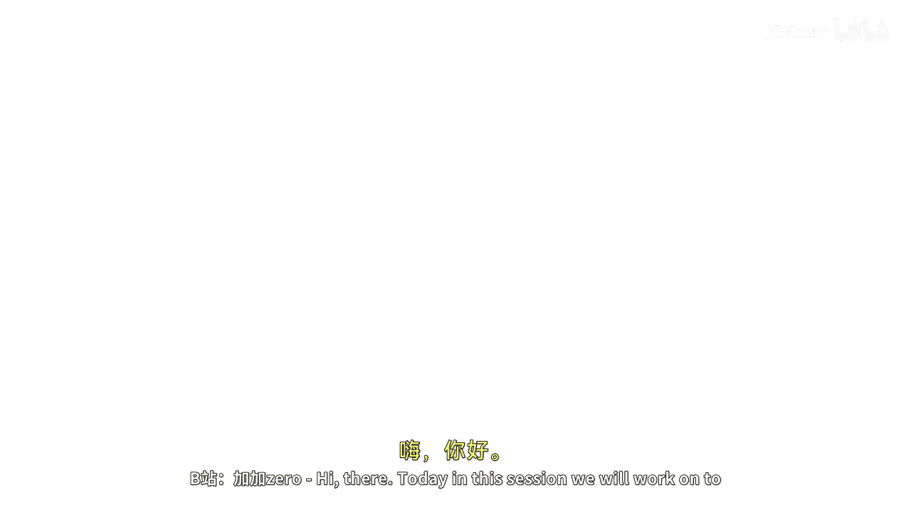

# 【Java全栈开发 专项课程（下）】Board Infinity—中英字幕 p05 p4_01_string-in-java -BV1fryaYgEqb_p5-

Hi there。 Today， in this session， we will work on to the most important part that strengths in Java。

😊。

Basically strengths are an integral part of programming and in Java we have a string class for creating and manipulating strength。

😊，String is nothing but an object that represents a sequence of characters。

 although internally strings towards the character array， but as I discussed in my previous session。

 it is a most common data type to be used very frequently。

 That's what its syntax moreover looks like a primitive type， but it is a reference type。

String class is part of the core library and provides several methods for working with strings I will demonstrate it to you。

Strings are immutable， which means once an object is created for the strength。

 its value cannot be changed because when you will change its value， it creates a new string for you。

You can create new strings by performing various operations on existing strings as well by using these string methods。

This is how string is initialized， but internally it will create my string as an array of care type where the first character would be edge。

 second would be E and so on。There are two ways to define the strings in Java。

 One is using string lital， and another is using string object。When we say string lital。

 a lital is a notation used for representing a value。

So you can directly assign a value inside the string and one with the help of new keyword when you say new keyword。

You just instantiate or create an object of a string and pass the string as in constructized value passing into the string class constructor。

So that the string gets initialized， we can also create the string with the help of copying it。

 I will talk about it later。All the string objects created with the helpe of new keyword are allocated space in the heap memory。

 irrespective of whether the same value strings are already present in the heap memory or not。

 because the size or memory is different。There are two types of strings。

 one is a immutable string and one is a mutable string， as I said， immutable means can't be changed。

 That's a normal string you can create with the helper。New keyword or string lital。

 and another is a mutable string string builder classes there。

If you would not don want to create new string every time when a frequent change is required。

 you can go for a string builder class， I will demonstrate you both in my practical implementations。

So see you in the next session until next time， Stay tuned。

🎼。

