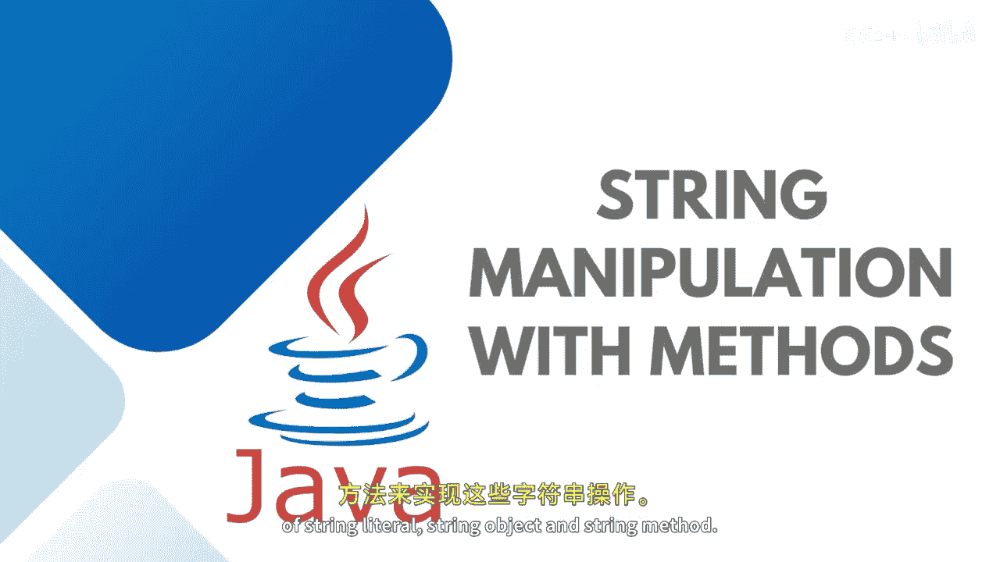
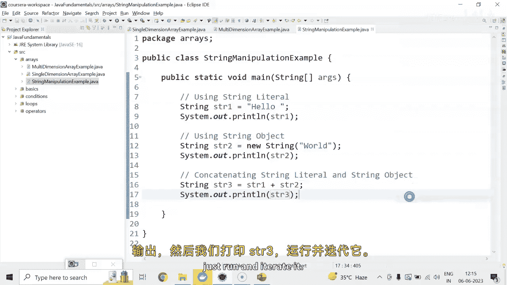
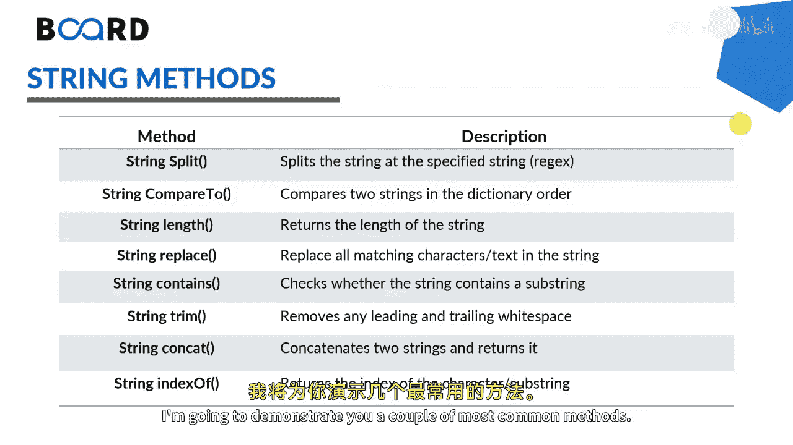

# 【Java全栈开发 专项课程（下）】Board Infinity—中英字幕 p06 p5_02_string-manipulation -BV1fryaYgEqb_p6-

He there。So we are about to start implementing these strings with the help of string lital。

 string object and string methods， so let's get started。

So what we are supposed to do is， first of all， I am going to tell you how to declare the array with the help of string lital and string object。

String STR 1 equals 2。Hello。This is the string lateral， if you will branch。Simply just try test R1。

And this is the string object。 I say SR 2 equals to new string。Wall。Sis out。Here we say， Estiato。

In case you wanted to concatenate the string lital and string object， you can also do that。

Strangely true。Yeah。And there is a string object。嗯嗯。On canating。String leader。And string object。Okay。

Here we are declaring string STR 3 equals to saying STR 1 plus STR2。Ss out。

 And here we are printing SR 3。Just run and itate it。

Next I' am going to tell you about the string methods。

 these are the most common methods to split these string into multiple substrs compared to to compare two or more strings to calculate the length of the string replace a specific character or a group of characters contains will check the string whether a string contains any substr or a group of specific character or not。

Trim is to crncate or trail the white spaces from the string。

 Concat is to concatet or merge two or more strings and the index of is to find out the index of a particular string from the existing string I am going to demonstrate you a couple of most common methods so let's get started in case you wanted to cal the length of string。

 Let's say I have SDR 3。 I just write STR3 dot length So length is a method string method which helps in calculating the length of string it also count the space or a white space that exists in between of the string。

If you would like to。Find get the specific character from a specific index from this string。

 you can see STR3 dot。Care at I just wanted to get the first character that is there at index 0。

 so it will return hello word is the strings。 It will return H to me。The another one is a concat。

 as I already told you， you can just concatet the string with the help of plus。

 but we do have a string method for that。 you can simply write STR 1 dot concat STR 2。

That's how you can cont your two strings。 The left string。

 which is the SR1 gets con with the right string in case you want wanted to get the substr so you can go for Ss out and say SR 3。

Dot。Substr。You wanted to get the sub string from0 f index and you wanted to get H E LL O5 characters according to me。

 it should return ho。If you have two strings， you can compare whether two strings are equal or not。

 if it would be equal， it will return to otherwise false STR 1 dot equals。S T are2 or not。嗯。

So you can compare two string this way you can check whether a particular string contains a particular group of characters or not。

 I just wanted to check whether my S3 contains hello inside it or not if it contains it will return。

Te， otherwise， it will return falses。That's how the most common spring methods are here。

 and you can use them in your practical implementation。

You can also convert your specific strings into two lower case or two uppercase。

 those methods we also have here SR 3 dot2 uppercase。That's how your spring is hydrtrated。

If you have any white spaces from your string， you can easily truncate them by writingR SR 3 dottrim。

And remove the white spaces right here。I hope the concept is clear to all of you。

 Let me just run this programme。 I， I trade。To see the output of all these methods right here。

So you can see that first one is printing the length 11 cart index 0。

 That is edge concatetnating first 10 second string that is hollowo word substr to get five First five characters that is hello。

 Two strings are equal or not， its saying false contains hello。 Yes。

 converting the entire string into the lower case， converting the entire string to the uppercase。

 If any white spaces are there to reduce or eliminate the white spaces and printing the string right here。

 This is how string methods needs to be used。 See even the next session until next time， stay tuned。

 Thank you。

。

