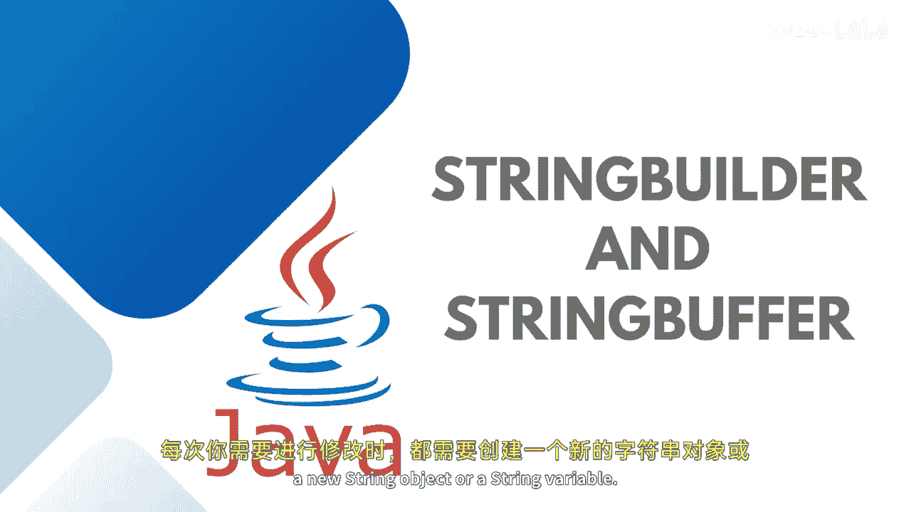

# Java全栈开发：07：StringBuffer与StringBuilder详解 🔧


在本节课中，我们将要学习Java中两个重要的类：`StringBuffer`和`StringBuilder`。我们将探讨它们与普通`String`类的区别，理解“可变性”的概念，并通过代码示例比较它们的性能与线程安全性。

## 概述



在之前的课程中，我们讨论了`String`类及其方法。我们了解到，`String`对象是**不可变的**。这意味着一旦创建，其内容就无法被更改或修改。每次需要修改字符串时，都需要创建一个新的`String`对象。

## StringBuffer：线程安全的可变字符串

上一节我们介绍了不可变的`String`，本节中我们来看看`StringBuffer`。`StringBuffer`是一个**可变的**字符串类，这意味着你可以轻松地修改其内部的字符串值。它提供了一种在Java中使字符串可变的方法。这些字符串可以安全地被多个线程同时使用，多个线程也可以修改它。

为了提供这种线程安全的优势，`StringBuffer`的实现相对较重。它提供了诸如`append`（追加）、`insert`（插入）、`delete`（删除）和`reverse`（反转）等方法，这些方法允许字符串被修改。

以下是`StringBuffer`的基本使用方法：

```java
// 实例化StringBuffer
StringBuffer buffer = new StringBuffer("Hello");
// 使用append方法追加字符串
buffer.append(" World");
// 打印结果
System.out.println(buffer.toString());
```

你还可以检查`StringBuffer`的初始容量。如果初始化一个空的`StringBuffer`，其默认容量为16个字符。

```java
StringBuffer buffer = new StringBuffer();
System.out.println(buffer.capacity()); // 输出：16
```

当你添加内容时，容量会根据需要自动增加。

## StringBuilder：非线程安全的可变字符串

接下来，我们将`StringBuffer`与`StringBuilder`进行比较。`StringBuilder`也是一个提供可变字符串功能的类，但它**缺乏线程安全性**，因此不能被多个线程同时使用。这是它与`StringBuffer`的主要区别。

`StringBuilder`的使用方法与`StringBuffer`非常相似：

```java
// 实例化StringBuilder
StringBuilder builder = new StringBuilder("Hello");
// 使用append方法追加字符串
builder.append(" World");
// 打印结果
System.out.println(builder.toString());
```

## 性能比较：StringBuffer vs. StringBuilder

为了理解性能差异，我们可以通过一个循环追加操作来测试两者所花费的时间。

以下是测试代码示例：

```java
// 测试StringBuffer性能
long startTimeBuffer = System.currentTimeMillis();
StringBuffer buffer = new StringBuffer("Hello");
for (int i = 0; i < 10000; i++) {
    buffer.append("World");
}
long timeTakenByBuffer = System.currentTimeMillis() - startTimeBuffer;
System.out.println("Time taken by StringBuffer: " + timeTakenByBuffer + " ms");

// 测试StringBuilder性能
long startTimeBuilder = System.currentTimeMillis();
StringBuilder builder = new StringBuilder("Hello");
for (int i = 0; i < 10000; i++) {
    builder.append("World");
}
long timeTakenByBuilder = System.currentTimeMillis() - startTimeBuilder;
System.out.println("Time taken by StringBuilder: " + timeTakenByBuilder + " ms");
```

运行此代码后，你会发现`StringBuilder`所花费的时间通常少于`StringBuffer`。

这是因为`StringBuilder`虽然不适合多线程环境，但由于它不需要处理线程同步的开销，因此在单线程环境下是所有可变字符串类中**速度最快**的。而`StringBuffer`为了保证线程安全，允许同时进行多个线程操作，因此速度相对较慢。

## 总结

本节课中我们一起学习了`StringBuffer`和`StringBuilder`这两个关键的Java类。我们明确了以下核心概念：

*   **`String`** 是**不可变**的。
*   **`StringBuffer`** 是**可变且线程安全**的，适用于多线程环境，但性能开销较大。
*   **`StringBuilder`** 是**可变但非线程安全**的，适用于单线程环境，是三者中**性能最高**的。


选择使用哪个类取决于你的具体需求：如果需要线程安全，请使用`StringBuffer`；如果追求单线程下的最高性能，请使用`StringBuilder`。