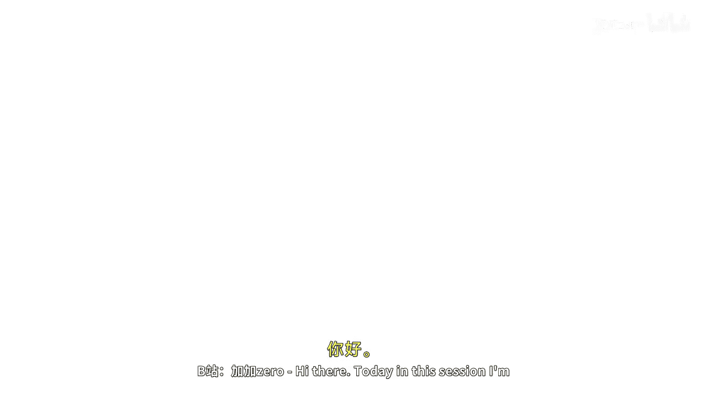
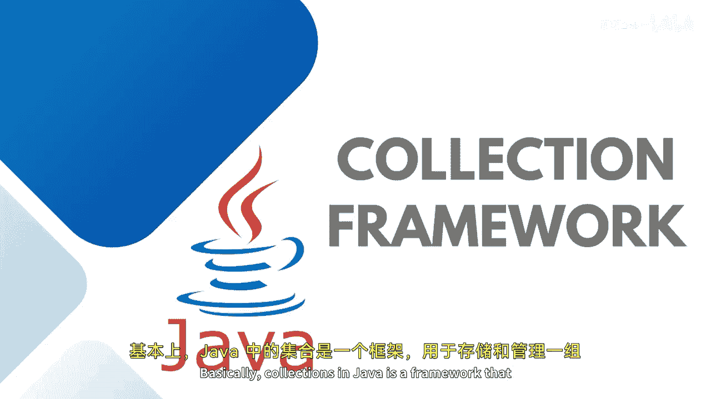
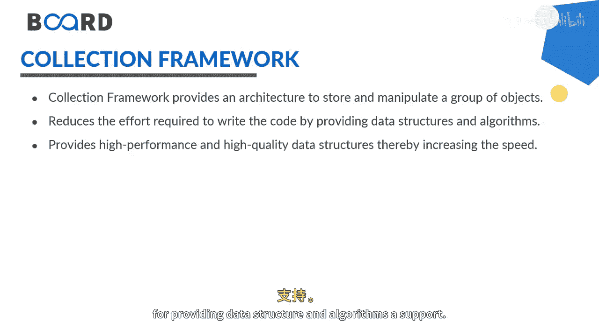
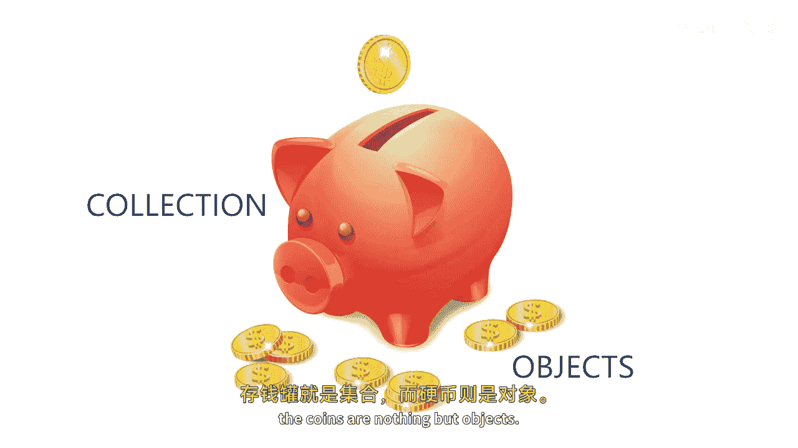
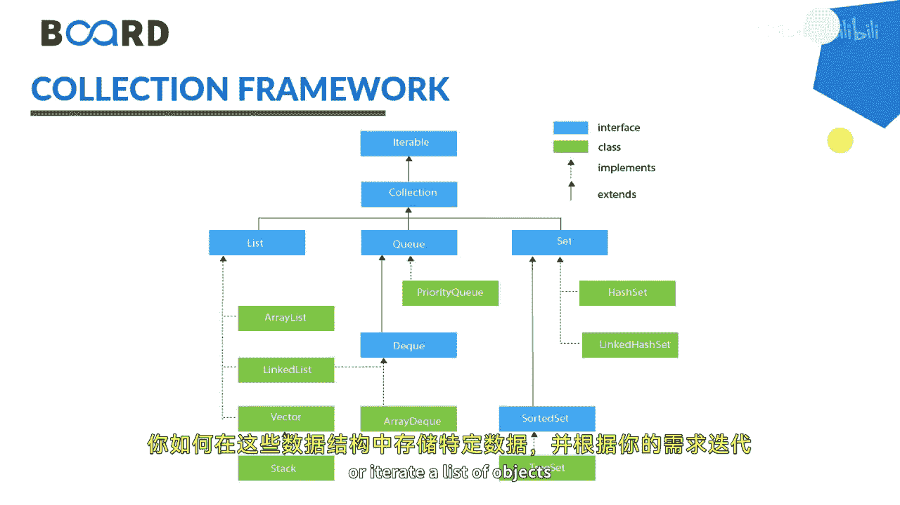
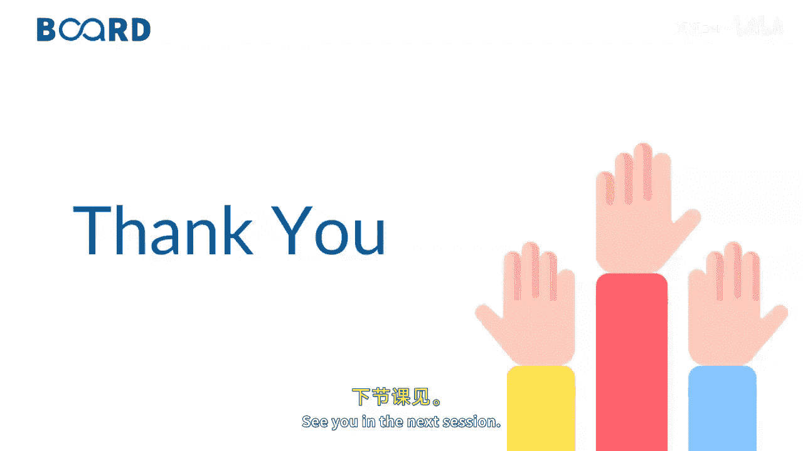
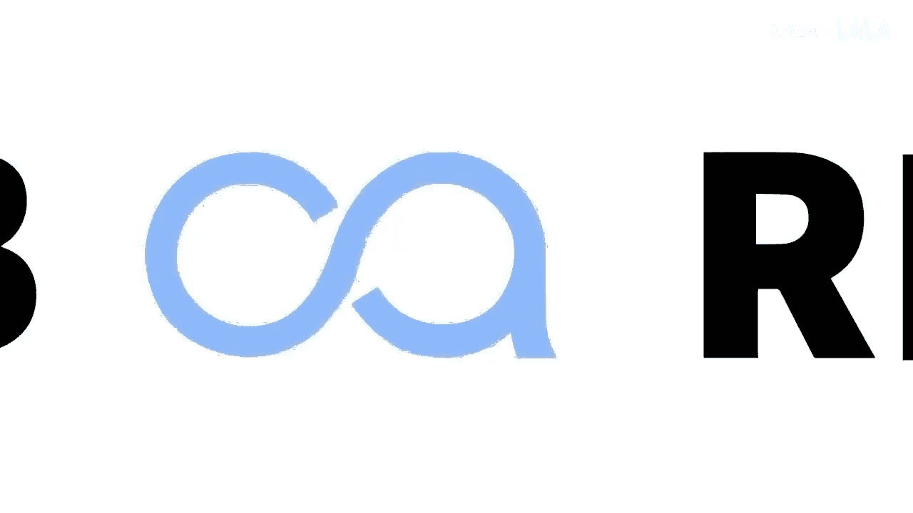
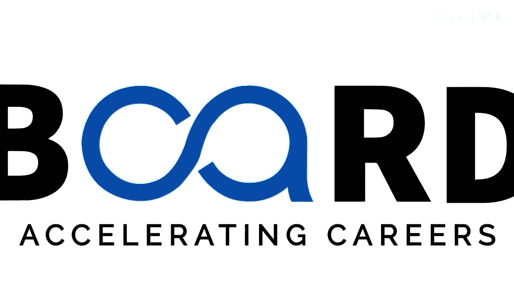

# 【Java全栈开发 专项课程（下）】Board Infinity—中英字幕 p08 p7_01_java-collections-framework -BV1fryaYgEqb_p8-

喺底。Today in this session， I'm going to talk about collection framework in Java。Basically。

 collections in Java is a framework that stores and helps us to manipulate a group of objects。

It is a hierarchy of interfaces and classes that provides easy management of a group of objects。

 a very effective and associative way for providing data structure and algorithms a support。

Consider an example of a piggy bank。 We have all had during our childhood。

Where we use to store our coins， the piggy bank is called collection。

 and the coins are nothing but objects。

So a collection is an object or a container that stores a group of other objects。

 Java collection framework include the following， like， as I said， interfaces。

 classes and algorithms。When we talk about collection framework， it comprises of interfaces。

 classes and algorithms。When we say interface， an interface is an abstract type of object。😊。

It is an topmost position in the framework hiaraki。 Consider in a layman term。

 it is a group of related methods with empty bodies， and also you can call it as an abstraction。

 which is a process of hiding the implementational details from the user and by providing the functionality only。

Then we have classes， we all know what is a class， a collection of similar type of objects。

 and it is an implementation of the collection interface。At last。We have Alberta。

It is a method that perform useful calculation， computation and comparison。

 such as searching and sorting and on objects that implement collection interface。

You can also consider in calling as the iteration or different iterations to solve a one given problem and find out the best one as per their time complexity and space complexity。

At last， you need to understand， as I said， collection is in hierarchical interface where。😊。

The topmost iteration is the interface。 You can see the blue1 at the interfaces and the green1 at the classes。

 You can see that the base is the interface。 That's a itable interface。😊。

Being extended or implemented into the collection interface。

 and then we have list Q and set interface each and every interface has specific subclasses which are implementing the behaviors or the contracts or the abstract methods written inside these interfaces so I will be talking about list Q and set in my upcoming session。

 How can you store your specific data inside these and iterate the data or I trade a list of objects as per your own requirements。

So stay tuned to learn more practical iterations of collection interface or collection framework to make it in a real time implementation。

 See you in the next session until next time。 Stay tuned。 Thank you。😊。

。

