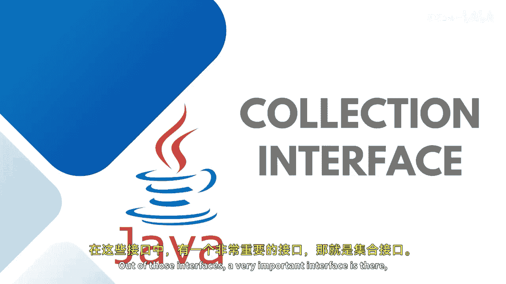
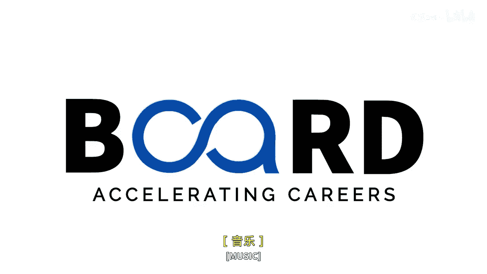

# 【Java全栈开发 专项课程（下）】Board Infinity—中英字幕 p09 p8_02_java-collections-interface -BV1fryaYgEqb_p9-

Hi there。 As I discussed in my previous session， there is a collection framework。

 which is a hiarchical tree， which is a collection of interfaces and classes out of those interfaces。

 our very important interface is there。 That's a collection interface。😊。

The collection interface is the root of the foundation。On which the collection framework is built。

It is a general interface that has no declaration。😊。

Where we pass a generic type of object that the collection will hold。

If the collection will hold the integer or spring， we need to pass it while initializing the classes of this。

Implemented interface。 It provides the basic operation like adding， removing。

 clearing the elements in a collection， checking whether the collection is empty or not。

Letest Q and set are the components that extends this collection interface。

And all these classes of collection framework implements the sub interfaces。

 That's a collection interface。 That's what I'm trying to explain。😊。

The major is the IT interface extended into the collection interface and then you have list Q set classes which further have interfaces that further have the classes like a linklist priorityity queue。

 hash set and much more。So stay tuned to learn more about these classes and extended interface in my upcoming session until next time stay tuned。

 see you in the next session。

