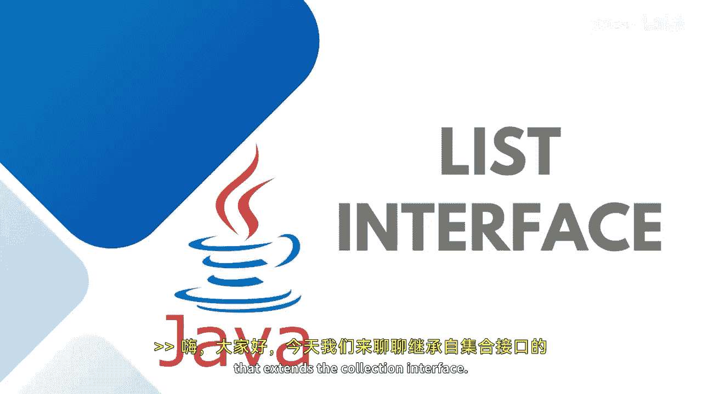

# 【Java全栈开发 专项课程（下）】Board Infinity—中英字幕 p10 p9_03_java-list-interface -BV1fryaYgEqb_p10-

Hi there。 In this session， I will talk about the list interface that extends the collection interface。

 A list is used to store ordered collection of data， and it may contain duplicate elements。

 ordered collection means the order in which the elements are being inserted。

 and they contain a specific value。😊。

The element present can be accessed or inserted by their position in the list by using0 based indexing where the index starts from 0。

This interface is available inside the Java dot U package。

And there are several classes in Java that implements the list interface， including errorlist。

 linked list and vector。😊，These three classes allows us to manipulate the group of objects by itrating their specific type。

 Just we need to understand what are the methods declared in this interface by default abstract and what they holds just like we can do add at all clear size ittraator contains and much more methods that we have So let's get started with the syntax how the list interface reference variable is being created by initializing these classes and then we will take it forward you can simply come to this main method and say list is an interface as you know this is available inside the u package we need to specify the data type Consider I am keeping here in teacher which is a wrappper class。

😊，Im first of all creating a linked list reference variable again I am telling you you cannot create the list type of iteration。

 you can see that it' is not allowing me and asking the definition because list is list as an interface and we cannot instantiate the interface we need to use the concrete class that's a linked list vector or error list this way。

In case you wanted to store the error list， you need to simply come up and say list of whatever type you wanted to store and say whatever reference variable you wanted to give I give it as an error list and instantiate the concrete class that's an error list。

And then， we have list。Of indiger。Where we wanted to store the vectors data equals to new vector list。

You can see that whenever I am instantiating any of the concrete class at that point of time。😊。

I am giving the data type because as I told you this is a generic type of interface where classes and interfaces list also in these classes also where depending upon what kind of data you wanted to manipulate or a group of objects you wanted to store in these reference variables that you need to pass at the time of instantiating these classes。

I hope it is clear to all of you。 Let's talk about Erist in the next session。

 See in the next session until next time。 Stay tuned。 Thank you。🎼。

