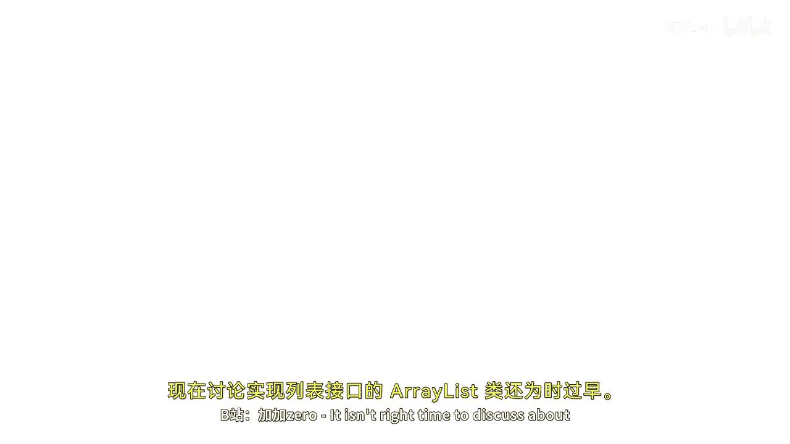
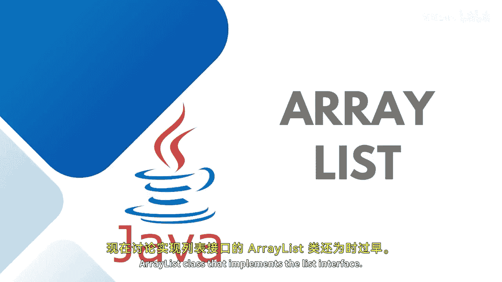
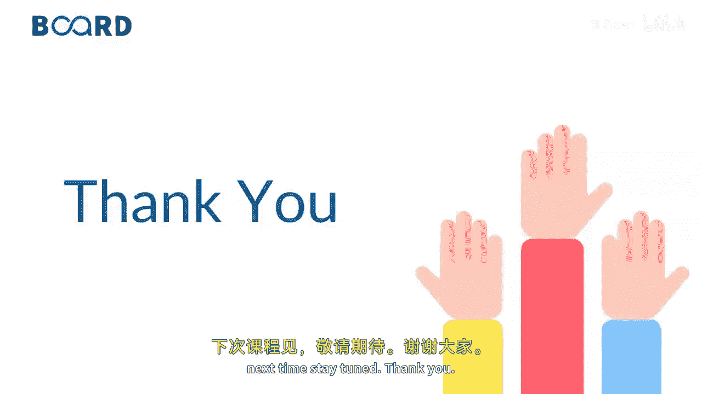

# 【Java全栈开发 专项课程（下）】Board Infinity—中英字幕 p11 p10_04_java-arraylist -BV1fryaYgEqb_p11-

It is a right time to discuss about errorist class that implements the list interface。

 So you must have figured it out from the name itself that error list is similar to arrays。😊。

But they are also called dynamic arrays。 That means it does not have a fixed size。

 and its size can be increased or decreased if elements are added or removed。As I discussed。

 it implements the list interface。😊，This image shows the elements in the error list and how the size of the error is dynamic I have not given the size or initialized with the size the data keep adding it up as per the requirement and the values gets added。

😊，Since the errors cannot be used for the primitive re types like int car and teacher。

 As I discussed in the list case， you need to use a wrappper classes。

 which starts from the capital letter。😊，Before starting it forward。

 you need to understand what are the specific or very common methods that we have just to add a object or a collection of object you have a add method。

 then we have add method where we wanted to add the element at a specific position if you want to remove all the elements from this st list you can use a clear method。

😊，If in case you wanted to find out the index of any element， you can find out the index of。

And if a particular element is repeatedet， then you can use a last index of to get the index of the last occurrence of the specific element。

 If the element does not exist， it will return -1。😊。

Clone is just to create a shallow copy of an error list with the help of clone or you can specifically use the error method that returns the object list。

Trim to size is basically trims the capacity of this errorist instance to give it to the current size。

 whatever being prescribed。 So let's get started to understand practically how Erist comes into the real time together and plays an important role。

And， I'm going to create。A list of string。是。That's being initialized with error list。Yes。

As I told you， they are existing in the u package。 You need to import it。This way。

You can see that once the package is imported two times you can see ja。util。erlist and ja。util。

t list， you can also use ja。util do star or asterisk so that all the classes and interfaces gets inherited or used。

Then I would like to add list dot add。The first ring， let's say， king。Let's start at。Yes。She呀。

Let's add one more。S的。Yes。C。So here I have initialized an error list with add method in case you wanted to print your string list。

😊，First of all， just try printing directly what you have in the list。

So you can see that you have King， Sya and Sarah。You can also do one thing。

 you can use the for each method to iterate your list。Just inherit。

 use your for each method as the syntax I have told you。

Value equals to not equals to colon and the name of the list。

The enhanced for each slope helps you to it your collections most of the time。So any of the syntax。

Is easier for you to manage。 You can just use this。

So here the elements are itrating one after the another one by one。

You can find out the size of your list， by writing。Les dot size， if you wanted to。

Remove any specific element。 What you can do is you can simply write。Lest dot remove。

 you need to pass even the complete object。 It means you need to write on the string that you want to remove。

 Or if you want to remove from a specific index， let's say I wanted to remove from the index 0。

And then you can try printing the elements again and or check the size choice is completely yours。

 So here I just wanted to check。 So earlier， it was having three values。 King Sria and Sarah。

 once the king is removed， which is having it index 0。 Sya and Sarah are the left out elements。

So by this way， you can use whatever methods I have shown you in my presentation。

 All the methods are implemented in the area list。 See you in the next session until next time。

 Stay tuned。 Thank you。

🎼。

