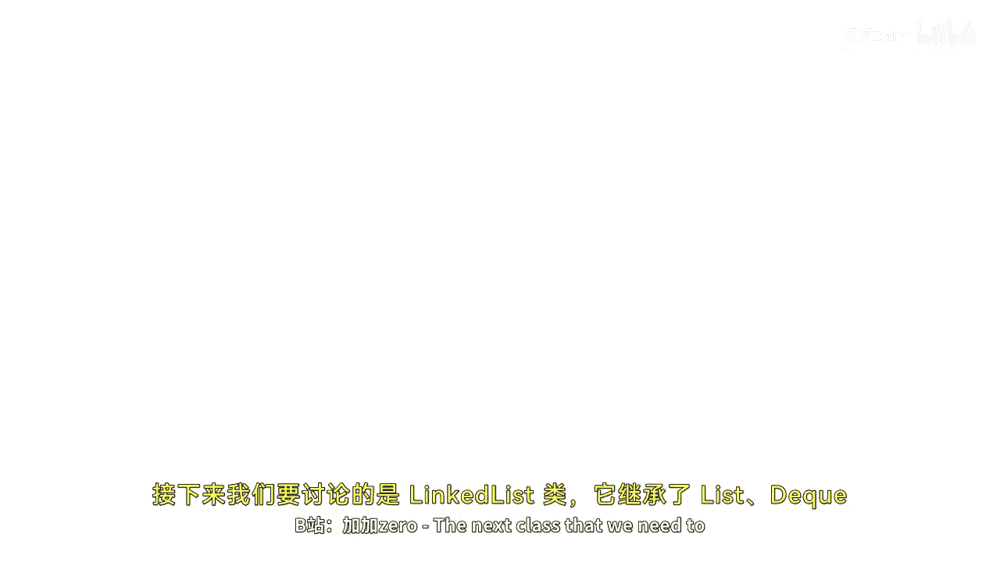
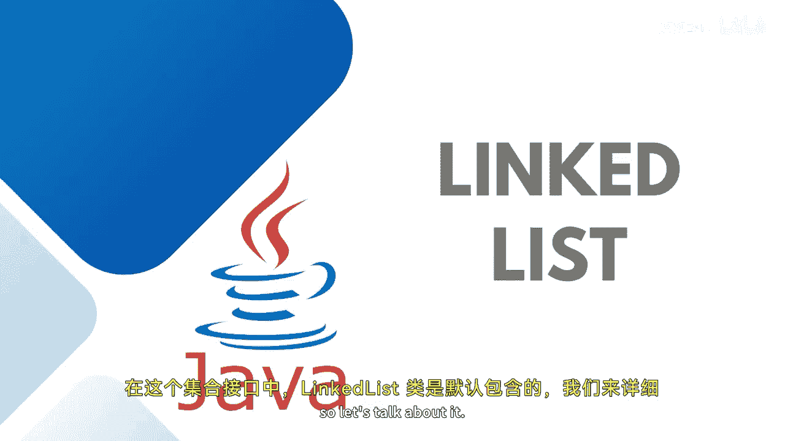

# 【Java全栈开发 专项课程（下）】Board Infinity—中英字幕 p12 p11_05_java-linkedlist -BV1fryaYgEqb_p12-

The next class that we need to discuss is a linkless class that extends the。😊，L D Q and Q interface。

 and by this we get a link list data structure where the elements are called nodes。

 So we have linkless class by default added into this collection interface。 So let's talk about it。

Here I'm going to initialize the linked list class。😊。

You can create a reference variable of the list type also that's not a problem。

 you can just do the right one which is opted out for you。

Here we have list equals to new linked list example。

Then I would just like to display the size of the link list。Where I say linked list。Dot size。

Then I'm going to add certain elements into my linked list， linked list dot add。The first string is。

 let's say， Java。The second string is I'm just studying the programming languages。Byid。

The next one is linkedlist dot at。Javascript。Lnk list dot at。C shop。That's it。And then。

I just wanted to print my link list。Guys。As I told you。

 there are in methods that you can use just telling you something here and there。

Let's say in your link list you wanted to add a specific element at index2。

 you just write to and define the language whatever you wanted to add。So by this way。

 you can add your object at a specific index position。If in case you wanted to remove。Your element。

What you can do is you can use linked list dot remove。Either you can pass the index。

 which element you wanted to remove。Otherwise， you can also pass the object which object you wanted to remove。

 Let's say I wanted to remove Java。So you can remove any of the way。

I would like to print this link list once again after adding and removing a couple of elements。

And I can also check the size of the link list at the end。Again， there are a couple of more methods。

That you can use just like find out the index of last index of contains occurrence and all so we can see that initially the size was three。

4 strings added then I removed the element at zeroth position Java and then jascript the remaining is Python the C plus plus that I added at index position2 and then the C sharp and at last the size is3 So this is how you can use link list methods like add remove in size and moreover methods to manipulate on linked list。

Here， we just use three or four of them。 These methods are almost similar to the error list。

 Stay tuned to learn more until next time， Stay tuned。 See you in the next session。🎼。

