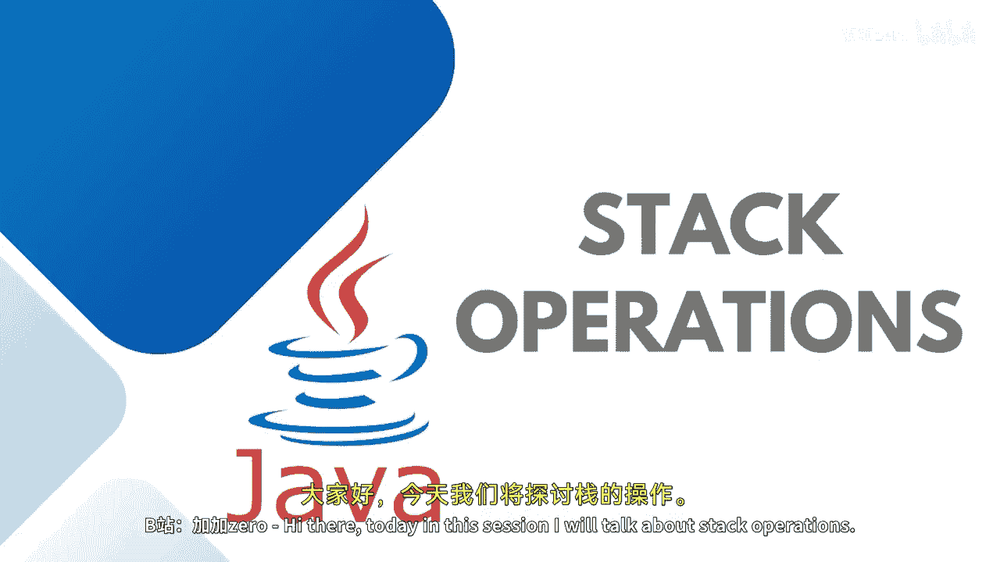

# 【Java全栈开发 专项课程（下）】Board Infinity—中英字幕 p15 p14_02_stack-operations -BV1fryaYgEqb_p15-

Hi there。 Today in this session， I will talk about stack operations。😊。

As I said that。Stap works on the principle of last in first out。

 It means all the operation gets happen from one end only that's known as a top。

 When we push the element inside the element。 That's an insertion from the top。

 first 10 gets pushed 1020，30 and 40。When you talk about pp operation。

 it removes the very top element from the stack as well。

If in case you wanted to check which is the last element ready to delete or pop that you can use a method called peakak and if in case you wanted to look it up whether the stack is empty or not then there is a is empty method。

So these are the methods to check this up empty push pork and peak and in case you wanted to search the element we do have this method available。

Let's first try to do a couple of operation or some of these operations with the help of this stack class in Java。

So you can see that here we had three elements we just pushed the fourth element 40 and now the top element is 40。

 which just was earlier 30。By working on the stack you have to check the value of the top according to that you will get to know the status of the stack if the stack is empty then it will return-1 if the stack has one element then the top value index is 0 if the stack is full then its n-1。

And when it is exactly N， that is overflow。N is the size of the array or the elements that you have in the array itself。

So this is how it works。 Let's try to understand it practically。

Here I'm going to create the stack object。As I said， this is available in U package。

It is a generic type。 Im giving it as integer。Once the stack is created。

 I just wanted to print the initial size of the stack that is stacked or size。

I would like to push couple of。Values inside this stack so stack dot push 10。Stag dot push，20。30。

And 40。Here I just wanted to print the stack values， so you will see that first it will print 10，20。

30 and 40。I would like to check the size of the stack that is stacked size for stack。

If I will pop out the element， I can also print what is the element which is popped out because pop method returns the integer value。

😊，Here。So this is tag dot pop。And after popping out。

 I just wanted to tell you which element is ready to。😊，Pop， that is with the help of a peak method。

 So peak tells you which element is ready for removal， but it will not remove。

 It will just print the topmost element。At last， I wanted to display the size of。

Stack once again that is tag dot size and also I just wanted to print the stack elements after one pop operation gets happen。

So let's just run this up so you can see that initially the stack size was0。

 then four elements gets pushed it up size became4。

I have not written which element I wanted to remove。 So it just said。

That the 40 is the element which is removed， which is at the topmost position next time which element is ready to delete a peak that is 30 it is not removed。

 It is just telling you you can see that it is not printing towards its printing 3 means only 40 is removed with the help of the pop method at last we have three elements inside the stack that is 10。

20 and 30。I hope it is pretty clear to all of you what are all the operations that you can perform with the help of stack。

One thing to note is that the stack is thread safe。

 It might be overhead in an environment where the threat safetyy concept is not needed。

 so you can use a Erdicu in the place of stack in those scenarios。

 See in the next session until next time， stay tuned。 Thank you。

。

