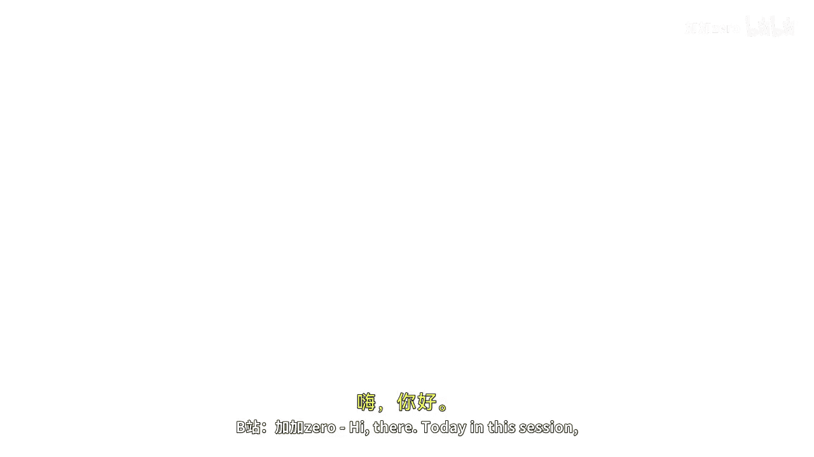
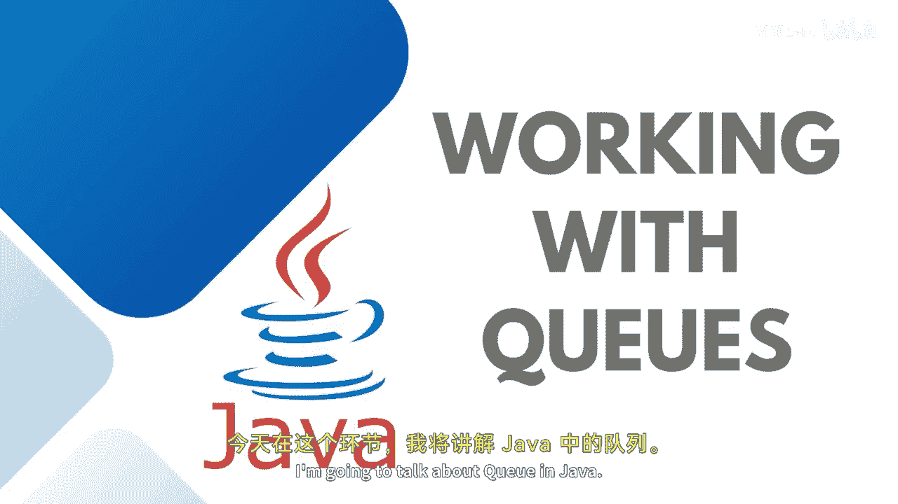
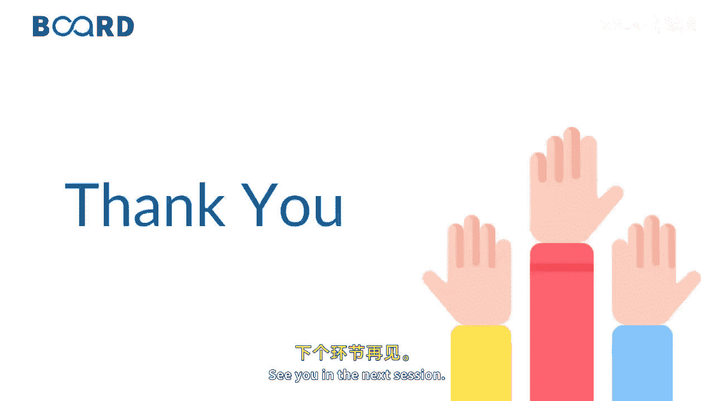

# 【Java全栈开发 专项课程（下）】Board Infinity—中英字幕 p17 p16_04_working-with-queues -BV1fryaYgEqb_p17-

Hi there。Today， in this session， I'm going to talk about Q in Java。

Basically， Q is an interface。That extends from the collection interface。

A data structure which stores the data in ordered form。

 and that is also known as a linear sequence of items to be stored。As I discuss。

 stack goes forward last in first out， Q has a different principle that is first in first out。

You can assume any of the data structure from the real time that takes a first input operates that takes a second input operates that one by one whichever element gets first entered into the queue gets operated first。

We can insert an item to the rear end of the queue。 Actually， there are two ends。 One is a rare。

 and one is a front。 We insert the elements from the rear and remove from the front of the Q only。

 A queue is a sequential order， basically。You can consider any real time example where queue can be implemented。

 For example， here we are talking about a people waiting for their turn or a queue of airplanes waiting for landing instructions or maybe you can take any of the people waiting let's say in a bank for their transaction or over the bus stand。

 so you can see that last person to enter。Will be from the rear that's to be added into the Q And front is to leave。

This is the Q representation As I said， a Q in data structure can be accessed from both of its size front for the deletion and back for the insertion。

 This is the front and this is the back a Q in data structure can be implemented using arrays linked list or vectors and for the sake of simplicity I'll be using one dimensional array so that you can easily concentrate on the iteration of the queue with whatever operations a Q allows so stay tuned to learn more about the Q applications and operations to be understand more in detail see you in the next session。

🎼。

