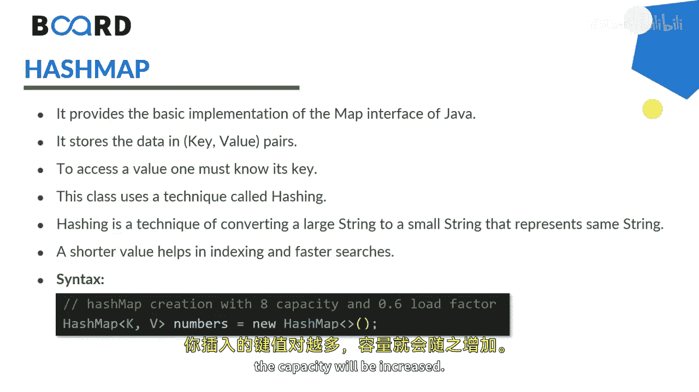
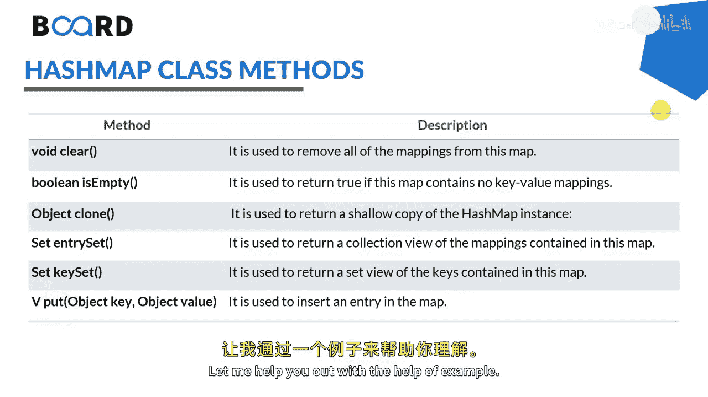
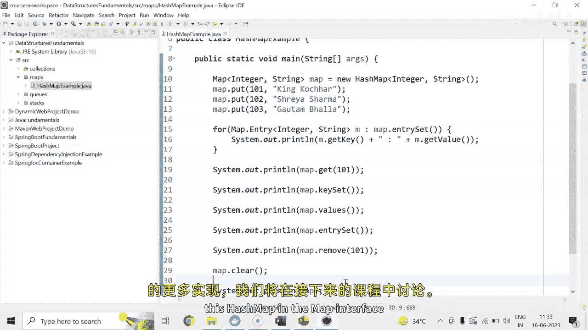

# Java全栈开发：21：HashMap详解 🗺️

在本节课中，我们将要学习Java集合框架中的一个重要组成部分——HashMap。HashMap是Map接口的一个基础实现，它用于存储键值对数据。我们将了解其基本概念、工作原理、常用方法，并通过示例代码演示其基本操作。

## 概述

HashMap实现了Map接口，以键值对的形式存储数据。要访问一个值，必须知道其对应的键。HashMap内部使用了一种称为“哈希”的技术，该技术能将一个大的字符串转换成一个代表相同字符串的较短值，这有助于实现更快的索引和搜索。

## HashMap的创建与泛型

上一节我们介绍了HashMap的基本概念，本节中我们来看看如何创建和使用泛型HashMap。

HashMap可以使用泛型来指定键和值的类型。其创建语法如下：

```java
HashMap<K, V> map = new HashMap<>();
```

其中，`K`代表键的类型，`V`代表值的类型。HashMap在创建时具有初始容量，随着插入更多键值对，其容量会自动增加。

## 常用方法

以下是HashMap中一些常用的方法，我们将在示例中具体演示它们的用法。



*   `clear()`: 移除映射中的所有映射关系。
*   `isEmpty()`: 检查映射中是否包含键值对。
*   `clone()`: 创建HashMap的一个浅拷贝。
*   `entrySet()`: 返回映射中包含的映射关系的Set视图（即键值对集合）。
*   `keySet()`: 返回映射中包含的键的Set视图。
*   `put(K key, V value)`: 将指定的值与此映射中的指定键关联。
*   `get(Object key)`: 返回指定键所映射的值。

## 示例演示



现在，让我们通过一个具体的例子来看看这些方法是如何工作的。

首先，我们创建一个HashMap，其键为`Integer`类型，值为`String`类型，并插入几个键值对。

```java
HashMap<Integer, String> map = new HashMap<>();
map.put(100, "King");
map.put(101, "Kocher");
map.put(102, "Gotham");
```

### 遍历HashMap

如果你想以任意顺序遍历所有条目，可以使用`for-each`循环配合`entrySet()`方法。

```java
for (Map.Entry<Integer, String> entry : map.entrySet()) {
    System.out.println("Key: " + entry.getKey() + ", Value: " + entry.getValue());
}
```

### 根据键获取值

如果你想根据特定的键获取对应的值，可以使用`get()`方法。

```java
String value = map.get(101);
System.out.println(value); // 输出: Kocher
```

### 获取所有键或值

你可以分别获取映射中所有的键或所有的值。

```java
System.out.println(map.keySet());   // 输出所有键，如 [100, 101, 102]
System.out.println(map.values());   // 输出所有值，如 [King, Kocher, Gotham]
```

### 移除元素

要移除映射中的某个元素，可以使用`remove()`方法。

```java
map.remove(101); // 移除键为101的映射
```

### 清空映射

要清空整个映射，可以使用`clear()`方法。

```java
map.clear(); // 清空所有映射
```

执行`clear()`后，再次打印映射将为空。




## 总结


本节课中我们一起学习了Java HashMap的核心知识。我们了解了HashMap通过键值对存储数据，并利用哈希技术实现高效访问。我们掌握了如何使用泛型创建HashMap，以及如何使用`put`、`get`、`remove`、`clear`、`keySet`、`values`和`entrySet`等核心方法进行数据的增删改查和遍历操作。HashMap是Java编程中处理键值对数据的强大工具，在后续课程中我们还将探讨Map接口的其他实现。