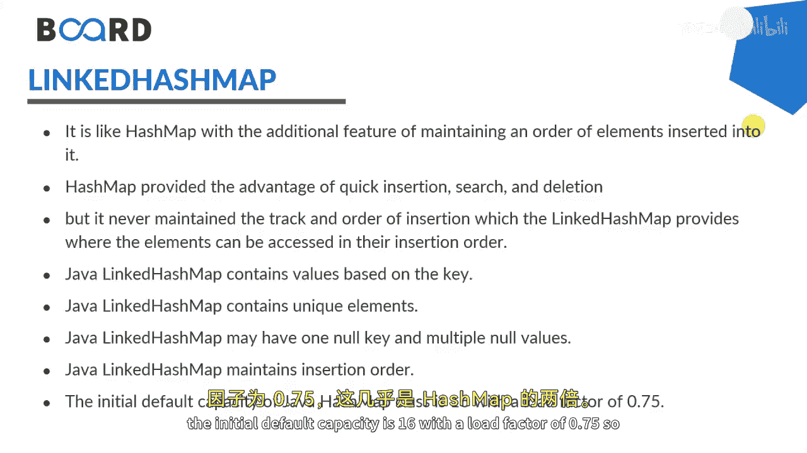
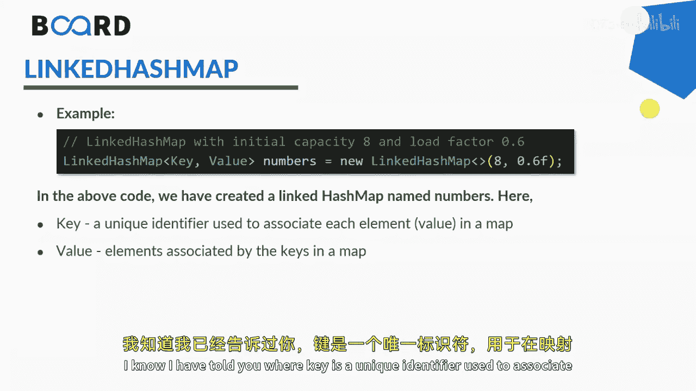

# 【Java全栈开发 专项课程（下）】Board Infinity—中英字幕 p22 p21_03_java-linked-hashmap -BV1fryaYgEqb_p22-

Hi there。 Today in this session， I will talk about linked hashmap。😊。

Liinnk hashm class。Of Java collection framework provides the hash table and the linked list implementation of the map interface。

Hashm provides the advantage of quick insertion， search and deletion。

 but it nevers maintained the track in order of insertion。

 which the length hashmap provides where the elements can be accessed in their insertion order。

Java link hashmap interface extends the hashmap class to store its entries in hash table and internally maintains a doubly linked list among all the entries to order its entries。

Java link hash mapap contains unique elements and contain the values based on the key， as I said。

And may have one null key and multiple null values associated to it。

Java link hashmap maintains the insertion order where the initial default capacity is 16 with a load factor of 0。

75， so it's almost double to the hashm。

This is a syntax of creating the linked hashmap where the key and value can be associated。

 you can also modify the capacity and the load factor as per your own requirement。

I know I have told you where key is a unique identifier used to associate each element in a map。

 and the value is a value that associates to it。 Most of the values are common。

 Most of the methods are common， just like get， clear， get or default or set。

 but it has some more specific methods like for each as a by consumer interface and the contains value。

 I will try to tell you all of them practically demonstrated。

Here I will be creating linked hashmap。Of5 keyass。String or。Value as inte。

 You can take any combination。I just take even numbers here。Pot that。

 I will be adding couple of even numbers。Even numbers start put。This is 2。Even numbers。Dotput。

This is 3。This is 4。And so on。Would like to print this even numbers hashm。

Whatever we added gets printed。It's asking me to add a key value pair at the time of initialization。

 That's completely okay。 Let's just modify it。Andastic。

So here we have two key value pairs in the linked hashm。

If you would like to create one more linked hash mapap out of this， so you can create linked hashmap。

String。Indiger。Numbers equals to new linked Ham。Where in the parameters only you can pass the even numbers or whatever existing hash map is there。

And now， if you would like to add few more same numbers， dot put， I'm adding6。I'm heavy good。

There are some more specific methods that you can hydrrate with。

You have used putier to add the elements into the linked hashm， you can use a putif present。Numbers。

 dot put if。Absent or absentact。You can add 6。If absent， so if it is not absent， it will add。

 If it is absent， it will not add。 So here you just gonna。Numbers。

I'm just trying to add six cellss eight also so you can check that eight will be added but not six because8 is not present。

That's what it。Not being repeatedet。 So we can see that sex is only one that's added already。

 and that is the8 that added with the help of Poif absent。

So these are something how you need to it your methods in the put hash map。Moreover。

 you can just get this up with the help of more methods like clean container。

 but those are the common methods that's what I'm not iterating it up here。

