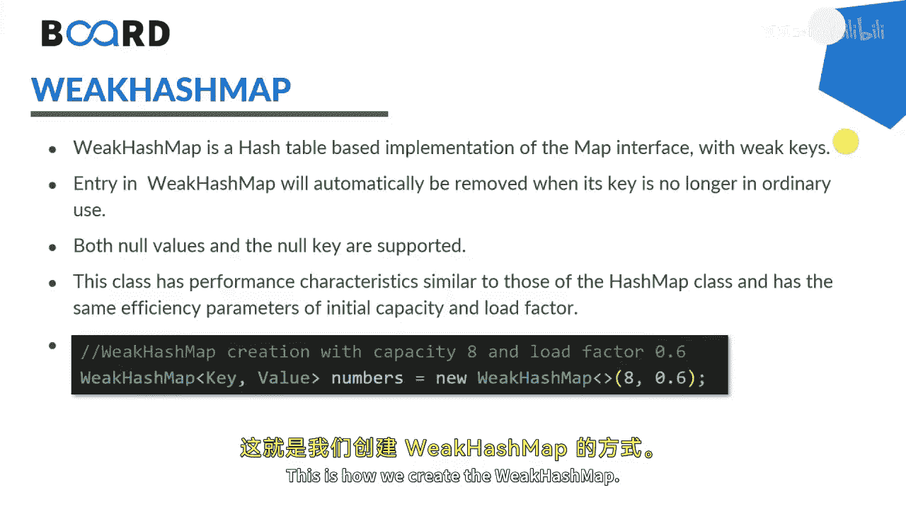

# 【Java全栈开发 专项课程（下）】Board Infinity—中英字幕 p23 p22_04_java-weak-hashmap -BV1fryaYgEqb_p23-

Hey guys， in this session we will learn about Java weak hashmap and its operations with the help of examples and I will also tell you the differences between weak hashmap and hashmap。

 so let's get started。

Basically， weak hashmap is a hash table based implementation of the map interface with weak keys。

Entry in weak hashm will automatically be removed when its key is no longer in ordinary use。

 Both null values and null keys are supported。The class has performance characters similar to those of the hash map class and has the same efficiency。

 parametersmeter of initial capacity and load factor read the capacity of this map will be 16。

 and the load factor will be 0。75。 This is how we create the weak hash map。

So in the above code， as Ive said， key is a unique identifier and the value elements are associated by the key in the hashm capacityity of the map is 188。

 meaning it can store 8 entry and the load factor would be 0。6。

These are the specific methods of weak hashm that you can im by I will tell you out all these things in a practical demonstration。

How these methods needs to be played out。 So let's get started。Here I'm creating weak hashm。String。

An integer。Sayme numbers equals to new weak hashm。Numbers， start。The key is， let's say， one。Numbers。

Dotport。The key is， let's say， too。And number start， the key is 3。After inserting the elements。

 I would like to print my weak hash map。That's numbers。As I told you。

It make a reference to the null as well。 So you can assign any value to the null。

 So for what purpose I am doing is， Im creating one string。

 Let's say4 equals to new string and where I' am inserting the key4。

And the integer value for that I would like to assign it to it。The moment I insert or put this value。

 I can say， numbers output。This is four key， and this is the four value。Later on， if I print my。

Week hash mapap numbers。I must be having four in empty sets inside it this way，4，3，2，1。

Pot that if I would like to assign nu to the。K， that's 4。 And after that。I would like to print my。

Week entry or weak hash map。Just have a look， as I said。Nll values are allowed。

 but you need to make a performance of garbage collection。 So you need to say system dot。GC。

 and then you can print your relevance。 So I just print it after the G C only。

So you can see that the fourth element sets to the null and null wouldn't be visible to you。

 That's the performance of weak hashm。Rest of the operations comes common。

 where you can get all entries， entry sets， values that are the implementations that you can go for any of the hash map category of the class as well。

 I hope it's clear and understood to all of you。 I'll see you soon in the next session until next time。

 Stay tuned。🎼。

