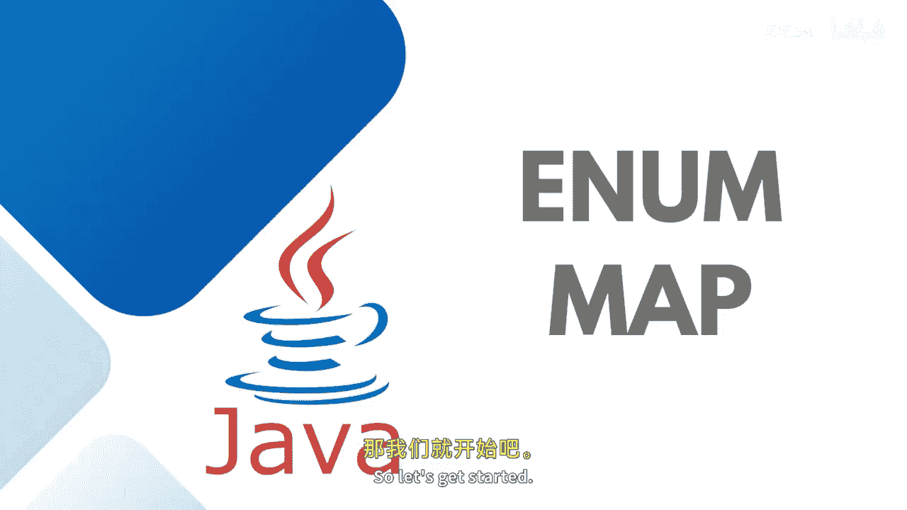

# 【Java全栈开发 专项课程（下）】Board Infinity—中英字幕 p24 p23_05_java-enummap -BV1fryaYgEqb_p24-

Yeah。

Hi there。 Today in this session， I will talk about Java in a map class。😊。

And it operation with the help of examples。 So let's get started。

Basically， the innerA map class of the Java collection framework provides a map implementation for the elements of an Eum or the Enum keys。

In In map， inner returns are used as keys。It inherits from the inneram and abstract map class。

 as well。It's a high performance map implementation and much faster than the hash map because the keys are prescribed all keys of E Enum map in must be a key of a single Enum type and doesn't allow the nu null keys and throw the null pointed exception when we attempt to insert the null key Enam map is internally represented as an array。

In order to create an inner map we must import the Java dot U inner map package first and once we import the package。

 here is how we can create the representation of In hierarchy。

 this is what I was trying to teach you collection extends to the map interface map implements to the abstract class class and last is the In class which also implements two more implemented interfaces such as cloneable and the serializable。

Benefits to use the inneram map is its compact typeafe and sorted keys because the Inum keys are already prescribed before their usage。

 so no dynamic implementation happens methods would be common coming back from the collection that's called map。

 so let's get started to practically implemented the Enum map interface class itself。

So here I'm first of all， creating the enna。Of different size。After that。

 I'll just go to the main method and I'll say en。Map where we need to define the inner。And the indi。

Here I need to specify size dot class， that's a enum class。In a map is available under the U packet。

 so you need to import that。My class name is same as the inner map， that's what it's conflicting。

So I just refactor it to inner a map。Examp。应该。很多这多累。喂，张搞去。好的好咧。Post that。 I will add size start。

Sizes dot port。Sizes。Size start small。 That's a key。And the value is 20。Sizes dot， both， sizes， dot。

Medium。Let's say， that's 30。Sizes do。That size start large。40。Sizes dotport。Size taught extra large。

And that's 50。And here we go to print it。Here we go with executing this program？

If you would like to print。Sizes taught keyet will print all the keyset。If I will go to print sizes。

 dot key values， not key values on the values。Will print all the values。If I will go and print sizes。

 dot。Entry set it will print the complete entry set， just like printing the sizes at line number 19。

If you would like to get the value of a specific key， you can printprint S out。Sizes， dot。

Mention the size start medium。 It will print the specific value associated to that。

It should be capitalist。Rest of the replace。 replace all。

Remove clear all the methods are common that works with all the collections。

 I hope you all can try that。This is how the inner map workss in Java。

So see you in the next session until next time， Stay tuned。

。

