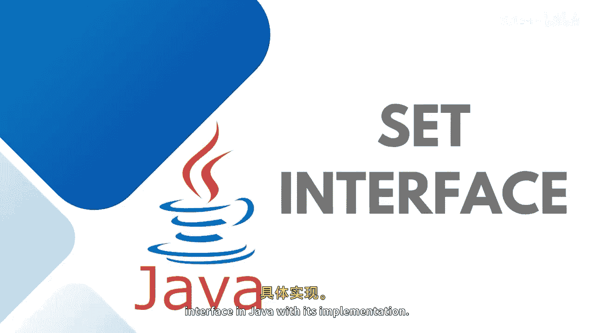

# Java全栈开发：28：Set接口详解 🎯


在本节课中，我们将学习Java集合框架中的Set接口及其实现。Set接口提供了数学集合的特性，并且不允许包含重复元素。

## 概述



Set接口是Java集合框架的一部分，它扩展了`Collection`接口。与`List`接口不同，Set不能包含重复的元素。由于Set是一个接口，我们不能直接创建它的对象。为了使用Set的功能，我们需要借助实现了Set接口的类。

## Set接口的层次结构

上一节我们介绍了Set的基本概念，本节中我们来看看它的具体实现类。

Set接口由`Collection`接口扩展而来。它本身也被其他子接口扩展，例如`SortedSet`和`NavigableSet`。

为了使用Set接口的功能，我们可以使用以下几个类：
*   `HashSet`
*   `LinkedHashSet`
*   `TreeSet`
*   `EnumSet`

这些类都定义在Java集合框架中，并提供了Set接口的具体实现。

## Set接口的常用方法

Set接口继承了`Collection`接口的所有方法。以下是其中一些核心方法：

*   **`add(E e)`**: 向集合中添加指定元素。如果元素已存在，则添加失败。
*   **`addAll(Collection<? extends E> c)`**: 将指定集合中的所有元素添加到此集合中（求并集）。
*   **`remove(Object o)`**: 移除集合中指定的单个元素。
*   **`removeAll(Collection<?> c)`**: 移除此集合中那些也包含在指定集合中的所有元素（求差集）。
*   **`retainAll(Collection<?> c)`**: 仅保留此集合中那些也包含在指定集合中的元素（求交集）。
*   **`contains(Object o)`**: 判断集合是否包含指定元素。
*   **`containsAll(Collection<?> c)`**: 判断此集合是否包含指定集合中的所有元素。
*   **`iterator()`**: 返回在此集合元素上进行迭代的迭代器。
*   **`toArray()`**: 返回一个包含此集合所有元素的数组。

## 集合运算

类似于数学中的集合，Set也支持基本的集合运算，包括并集、交集和子集判断。

*   **并集 (Union)**: 将两个集合的所有元素合并，重复元素只出现一次。可以通过`addAll()`方法实现。
*   **交集 (Intersection)**: 获取两个集合中共有的元素。可以通过`retainAll()`方法实现。
*   **子集 (Subset)**: 判断一个集合的所有元素是否都包含在另一个集合中。可以通过`containsAll()`方法实现。

## 实践：创建与遍历Set

让我们通过一个简单的例子来实践如何创建Set和遍历其中的元素。

首先，我们创建一个`HashSet`并添加一些整数元素。

```java
import java.util.HashSet;
import java.util.Iterator;
import java.util.Set;

public class SetExample {
    public static void main(String[] args) {
        // 创建一个HashSet
        Set<Integer> set1 = new HashSet<>();

        // 向集合中添加元素
        set1.add(100);
        set1.add(200);
        set1.add(300);
        set1.add(400);

        // 打印整个集合
        System.out.println("Set elements: " + set1);
    }
}
```

运行上述代码，输出结果将显示集合中的四个元素。注意，`HashSet`不保证元素的顺序。

接下来，我们使用迭代器(`Iterator`)来遍历集合中的每个元素。

```java
// 获取迭代器
Iterator<Integer> iterator = set1.iterator();

// 使用while循环遍历
while (iterator.hasNext()) {
    System.out.print(iterator.next() + " ");
}
// 输出可能为：400 100 200 300 （顺序可能不同）
```

你也可以使用增强型for循环（for-each）来更简洁地遍历集合：

```java
for (Integer number : set1) {
    System.out.print(number + " ");
}
```

## 总结


本节课中我们一起学习了Java中的Set接口。我们了解了Set不包含重复元素的特性，认识了它的主要实现类`HashSet`、`LinkedHashSet`、`TreeSet`和`EnumSet`。我们介绍了Set接口的核心方法，并演示了如何创建Set、添加元素以及使用迭代器和for-each循环进行遍历。关于Set更深入的操作和不同实现类之间的区别，我们将在后续课程中继续探讨。