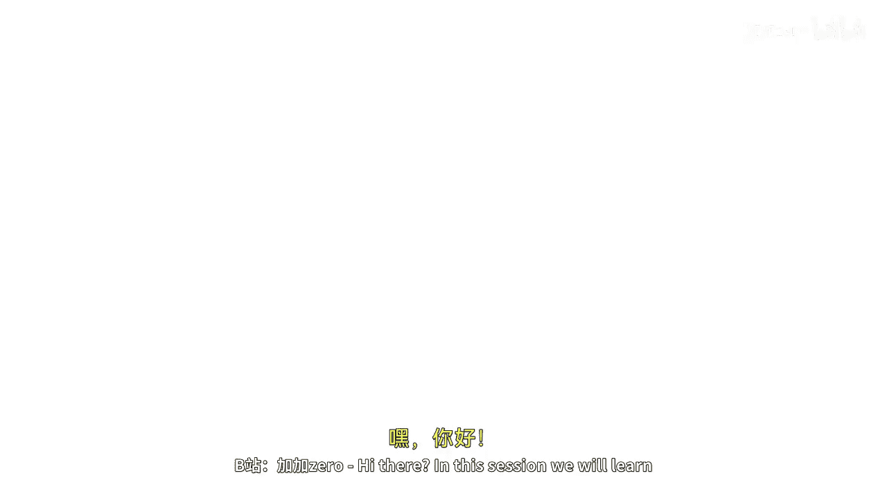
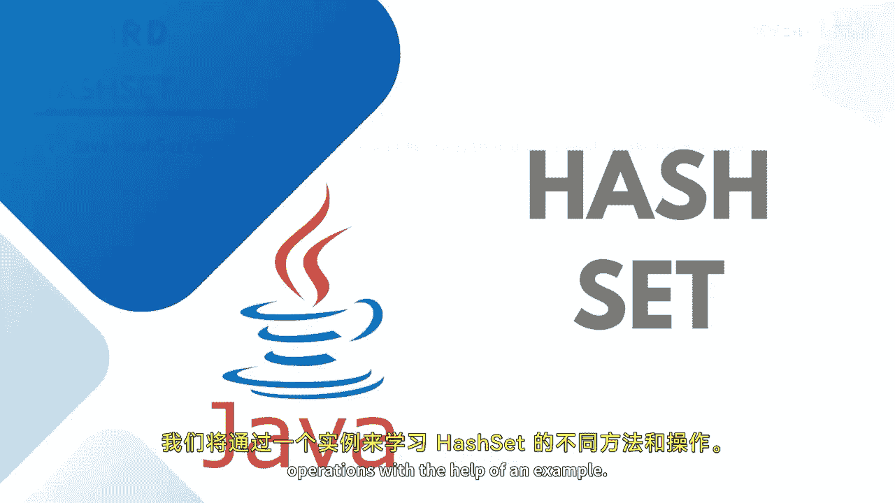
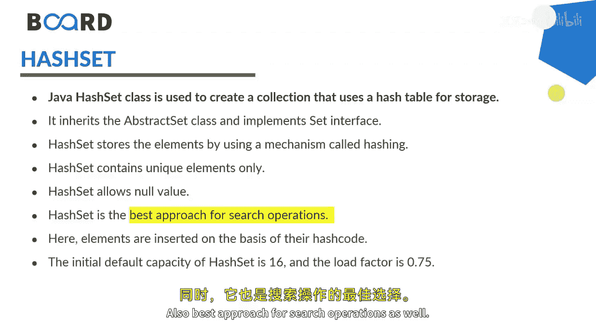
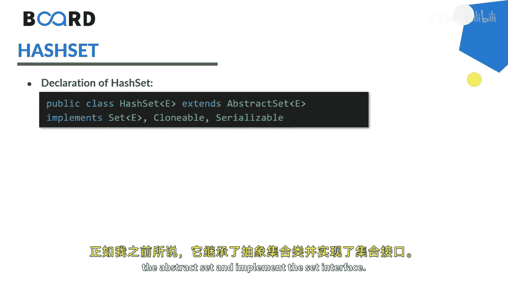
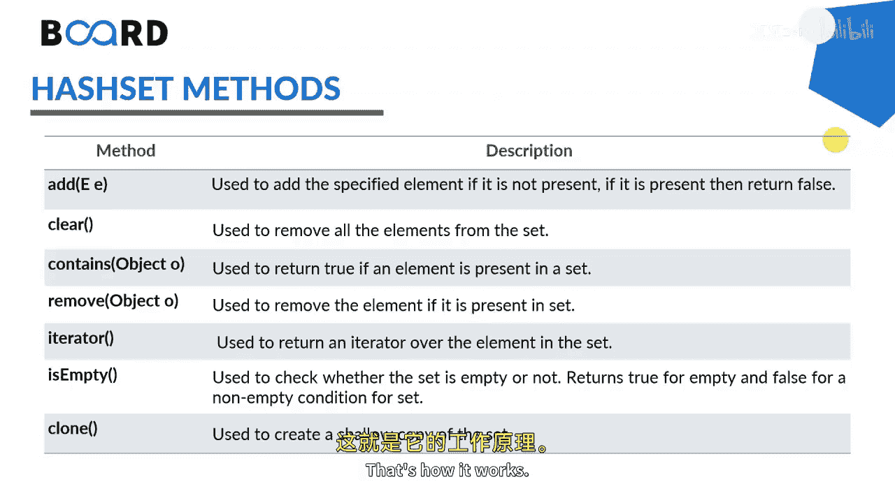

# 【Java全栈开发 专项课程（下）】Board Infinity—中英字幕 p29 p28_02_java-hashset -BV1fryaYgEqb_p29-

Hi there In this session we will learn about the Java hashet class。

 we will learn about different hashet methods and operations with the help of an example。

 so let's get started。

The Java hash set class of the Java collection framework provides the functionality of the hash table data structure。

It inherits the abstract set class and implements the set interface。

Hashet stores the element by using the mechanism called hashing。Hashet contains the unique elements。

The capacity of the hash set will be 16 and the load factor will be 0。

75 contains unique elementsdiments allows null values。And also best abroad for search operations。

 as well。

This is how the hashet declaration works， as I told you。

 it extends the abstract set and implements the set interface。

These are the common methods of hashet that we can operate on。

 such as the add clear contained remove hydrdator is empty and cloth。

We have already discussed multiple times how these methods work from the collection interface and implementing back into the set and the hash map as well。

So that's how it works， let's get started to practically implement it。

Here， I'm going to create hashet。Of type inte teacherger， where I would like to store numbers。

Numbers start at00。Numbers start at 200。Numbers taught at 300。Numbers start at 400。Once it is done。

 would like to print。Ss out。Numbers。That's how it prints well。Po that。

 if you would like to access with the help of iterator， as I explained you， iterator。Of type integer。

Irate equals two numbers。Dot iterator。Checking while I treat。Dot has next。I trade dot next value。

 to be printed。I'm not changing the I'm changing the line。

 that's what I'm not putting in comma or something。If you would like to do the removal。

 you can easily go for S out and say。Numbers taught remove the object that let's say I would like to remove the element 300。

So this will remove the element 300 and will return to you because the element is returned。

Returned into。If you would like to remove all the elements， you can just simply。Check numbers。

 dot remove all。Whether all the elements are removed or not。

So this will again return to you or false just to tell you whether the opt numbers are removed or not。

Considering we have two hardets。😊，To make a union of it。So I'm just making this haset a copy of it。

By naming it as。Set one。And similarly， I'm making a copy of it。By making it as set to。

Pos that once we have two equal sets， we just let's try to say。Set one dot。At all。Said to。

And printing the set one。Once you will do this， you can see that。😊。

Remove all is actually getting printed。The moment we say that we wanted to print the set one。

 why am getting empty set because I didn't change the set names while adding the elements my back。

 So that's。Really， that's what I tell you all the day all the time。

 Pra will help you out to get more achievable。😊，We always learn from errors， said to。Said to。

Said to and said to。So you can see that 40000， 200 and 300 values are coming only once。

If I will be having any additional value that's not in the set one gets up into the set one。

So as we know， union will do the union of two operations。 All the values will come only once。

 if you would like to do the。Interscept that will do the common things。

 So you need to use retain all methods， set1 dot retain all set2。

 and then you can print the set one after retaining it。

So you can see that 500 is not a common element。Thus， coming up into the set，2 gets printeded。

I should just comment it out because once I will do the Add all。

 the element gets added up there so now you can see that 500 is not there because its the element available in set2 and not in the set one。

If you would like to do the difference， you need to use remove all。

So just what we can do is we can say， set one dot。Difference。Remove all。From set to。

 you will get the difference。So you can see that it's nothing yet printed。

 Let me just try with search2。Because set 2 has an extra element。 and let's try to print set 2 here。

So the moment I just execute this time I'll get 500 because that's available in set2 and not in the set one。

So that's how your hash set works with all the operations。In Java。

 see you in the next session until next time， Stay tuned。 Thank you。

🎼。

