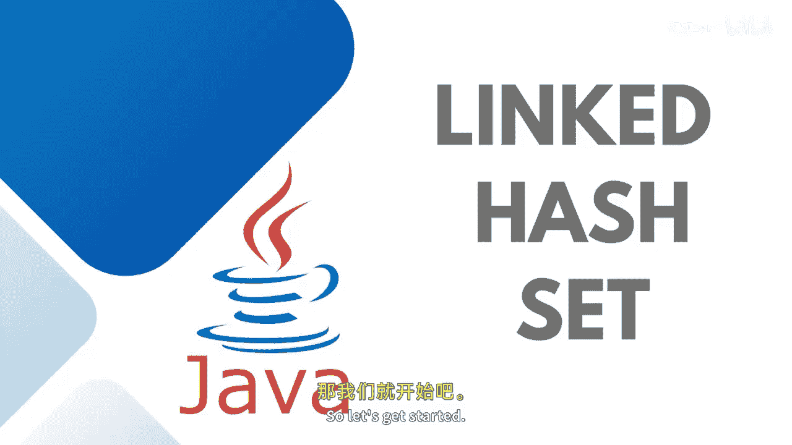
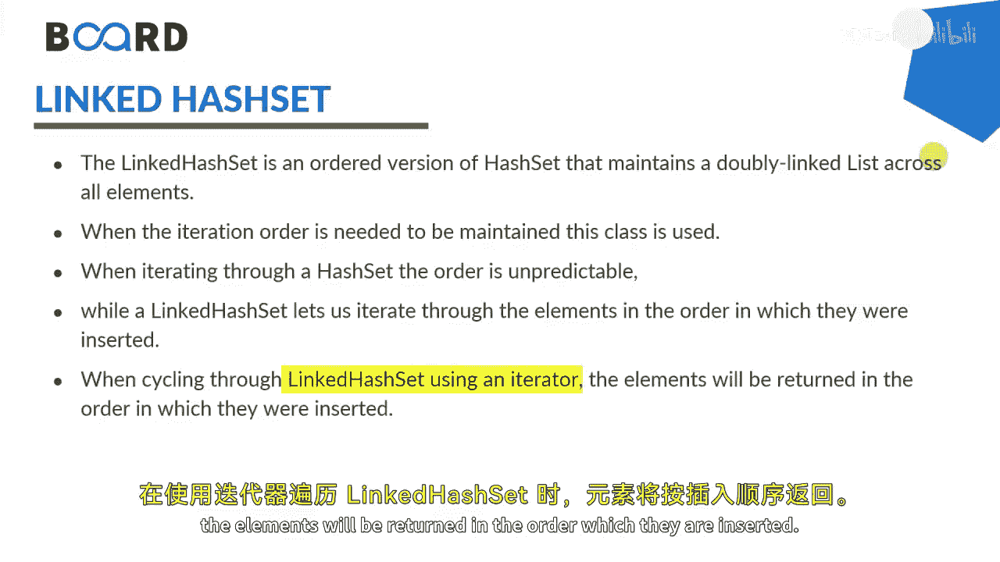
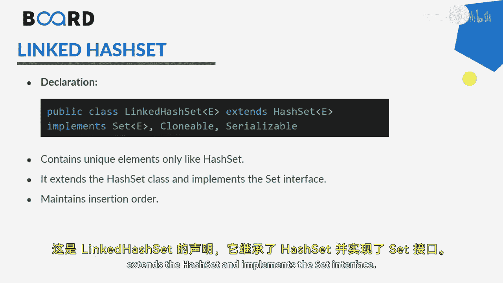
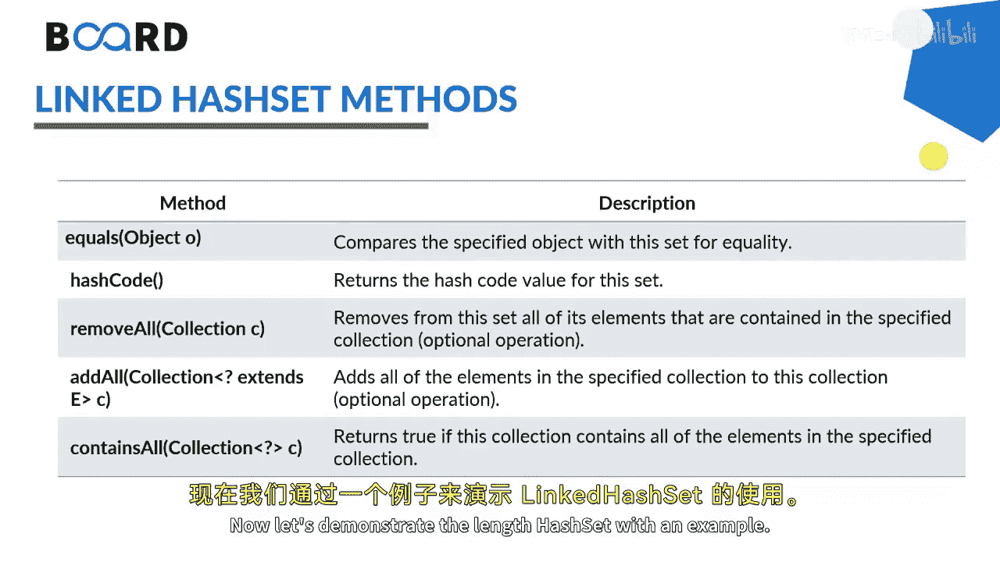

# 【Java全栈开发 专项课程（下）】Board Infinity—中英字幕 p31 p30_04_java-linkedhash-set -BV1fryaYgEqb_p31-

Hi there In this session， we will learn about the Java linked hashet class and its methods with the help of examples。

 so let's get started。

The linked hash set class of the Java collection framework provides the functionality of both the hash table and the linked list data structure。

 It is an ordered version of hash set when the itration order is needed to be maintained this class is used The elements of linked hashet are stored in a hash table similar to the hash set linked hashets maintain a doubly linked list internally for all its elements and defines the order in which the elements are inserted into the hash table。

When cycling through linked list or linked hashet using an ittator。

 the elements will be returned in the order which they are inserted。

This is the declaration of link hashet where it extends the hash set and implements the set interface。

These are some common methods that you can use equal hash code remove all Add all and contains all linked hashet works with the capacity 8 and 0。

75 load factor it's available in Java dot U linked hashet package itself if you would like to modify the capacity and the load factor you can pass it as in constructor while creating the instance of linked hashet。

Now let's demonstrate the length hashet with an example， so let's get started。

Here， I'm creating a error list。Of indiger。Even numbers equals to new error list。

Even numbers dot at to。Even numbers。Nott at 4。Even numbers。Dot at 6。Here。

 I would like to print all the even numbers。Here I'm creating a linked hashet。

That will store the integral values。Adding a list of even numbers from the error list that we have created。

Yeah。And here were going print it。Post that if you do not implement this way。

 you can also do one thing。You can create a linked hashet initially this way。

By not passing the even numbers， if it is not ready。 And then later。

 you can say numbers taught at all。And you can add your even numbers inside it。

And here you can keep adding moreover numbers into it as well。And here were going to print it。

Similarly， if you would like to I your。Link has set， just go for write table or writetra。

Or five integer。Itraator equals to numbers， start ittraator。V。Hdator do pass， next， is there。

Just sit out ittraator dot next。Similarly， if you would like to remove， then there is。Itra dotri。

 It should be numbers。Numbers。Dot remove。Specific object， let's say two。

 and if you would like to remove all the numbers， say numbers， dot remove all。

You can perform the set operations as well。Just like we have a link list linked has set one。😊。

And we have another。 That's true。In both， I'm going to add couple of numbers。Here I'm adding two，4。

6 and here I'm adding two and four only。Here I'm adding two and four。And in this next。

 I'm adding two，4 and6， just changing their number name， set one。Said to。Post that。

 I'm going to say numbers。Set one dot。At all。Set two。 and here I'm printing the set one。

So that says union all adding all the numbers which is not available in set one will be added to the set one from the set2。

Next that we have is intersection， as I told you， it is retain all set1 dot retain all。Set2。

 so it will just tell you the common one， printing the set one because it will compare and keep it into the set one。

So it's two and four， not six。Next that we have a to find out the difference for the difference。

 the larger one should be kept first set2 dot。Remove all elements that are available in set one with the same element number or element value。

And then printing the left over and set to。We can see that the6 is being delete。

6 is being left to and4 are deleted。That's how your union。Yes。Intersection。And difference of works。

Stay tuned to learn more about the set interfaces and its more of our implementation in my upcoming session。

 see you in the next session。

🎼。

