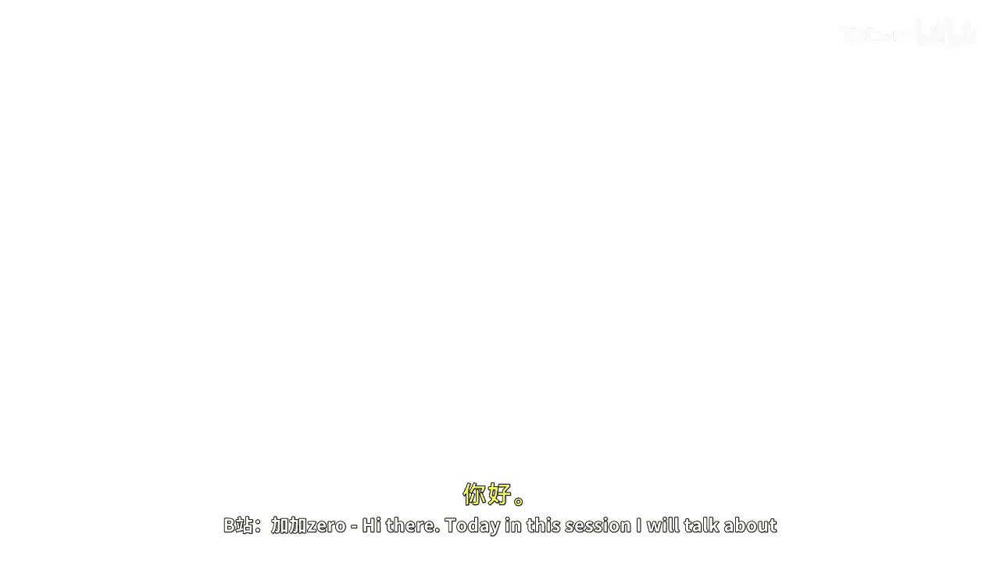
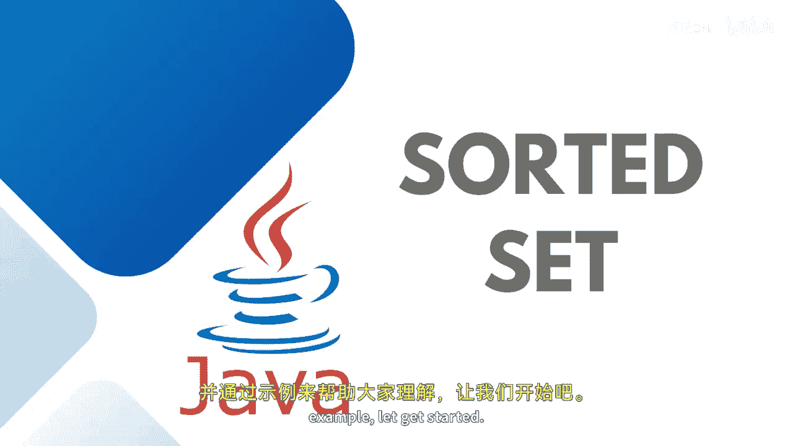
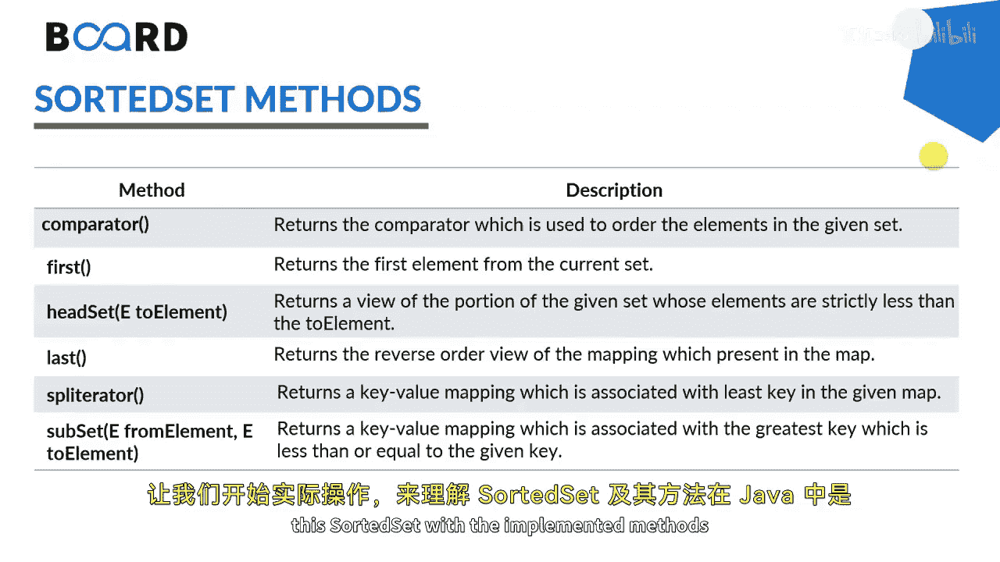

# Java全栈开发：32：SortedSet接口详解 🎯



在本节课中，我们将学习Java中的SortedSet接口及其方法。SortedSet是Set接口的一个扩展，它保证集合中的元素以排序后的顺序存储。我们将通过示例来理解其工作原理和常用方法。

---

## 概述



SortedSet接口位于`java.util`包中，它实现了数学上的集合概念。此接口继承了Set接口的所有方法，并增加了一个核心特性：**所有元素都以排序后的方式存储**。

SortedSet接口的继承关系如下：Set接口扩展为SortedSet，SortedSet再扩展为NavigableSet接口，最终由TreeSet类实现。因此，要使用SortedSet的功能，我们需要使用TreeSet类。TreeSet是基于自平衡二叉搜索树（红黑树）的实现，这使得该接口提供了在树结构中导航的能力。

以下是SortedSet中一些常用的方法：
*   `comparator()`: 返回用于排序的比较器。
*   `first()`: 返回集合中的第一个（最低）元素。
*   `last()`: 返回集合中的最后一个（最高）元素。
*   `headSet(toElement)`: 返回此集合中严格小于`toElement`的部分视图。
*   `subSet(fromElement, toElement)`: 返回此集合中从`fromElement`（包含）到`toElement`（不包含）的部分视图。
*   `tailSet(fromElement)`: 返回此集合中大于等于`fromElement`的部分视图。

上一节我们介绍了Set接口的基础，本节中我们来看看它的有序版本SortedSet。

---

## 实践示例

现在，让我们通过代码示例来实际理解SortedSet及其方法在Java中是如何工作的。

首先，我们创建一个SortedSet实例并添加一些元素。

```java
SortedSet<String> sortedSet = new TreeSet<>();
sortedSet.add("India");
sortedSet.add("Australia");
sortedSet.add("South Africa");
sortedSet.add("Japan");
// 尝试添加重复元素
sortedSet.add("India");
```



当我们打印这个集合时，会观察到两个现象：
1.  重复的“India”只出现一次，体现了Set的去重特性。
2.  元素按字母升序排列输出：Australia, India, Japan, South Africa。

接下来，我们使用迭代器遍历集合，可以看到顺序依然保持。

```java
Iterator<String> iterator = sortedSet.iterator();
while(iterator.hasNext()) {
    System.out.println(iterator.next());
}
```

---

## 常用方法演示

以下是SortedSet其他一些实用方法的演示。

**检查元素是否存在**
使用`contains`方法可以检查集合中是否包含特定元素。

```java
boolean containsIndia = sortedSet.contains("India"); // 返回 true
```

**获取首尾元素**
使用`first`和`last`方法可以快速获取排序后集合的第一个和最后一个元素。

```java
String firstElement = sortedSet.first(); // 返回 "Australia"
String lastElement = sortedSet.last();   // 返回 "South Africa"
```

**移除元素**
与普通Set一样，可以使用`remove`方法移除单个元素。

```java
boolean isRemoved = sortedSet.remove("Japan"); // 返回 true，元素被移除
```

如果要清空整个集合，可以使用`clear`方法或`removeAll`方法。

```java
sortedSet.clear(); // 清空所有元素
// 或者
sortedSet.removeAll(sortedSet); // 同样清空所有元素
```

---

## 总结

本节课中我们一起学习了Java的SortedSet接口。我们了解到SortedSet是Set的一个有序版本，它自动对元素进行排序并去除重复项。其核心实现类是TreeSet，它基于红黑树数据结构。我们通过代码示例实践了如何创建SortedSet、添加元素、遍历集合，并演示了`first`、`last`、`contains`、`remove`等关键方法的使用。SortedSet为需要有序且唯一元素集合的场景提供了便利。


Java集合框架中还有其他的Set实现，敬请关注后续课程以了解更多内容。