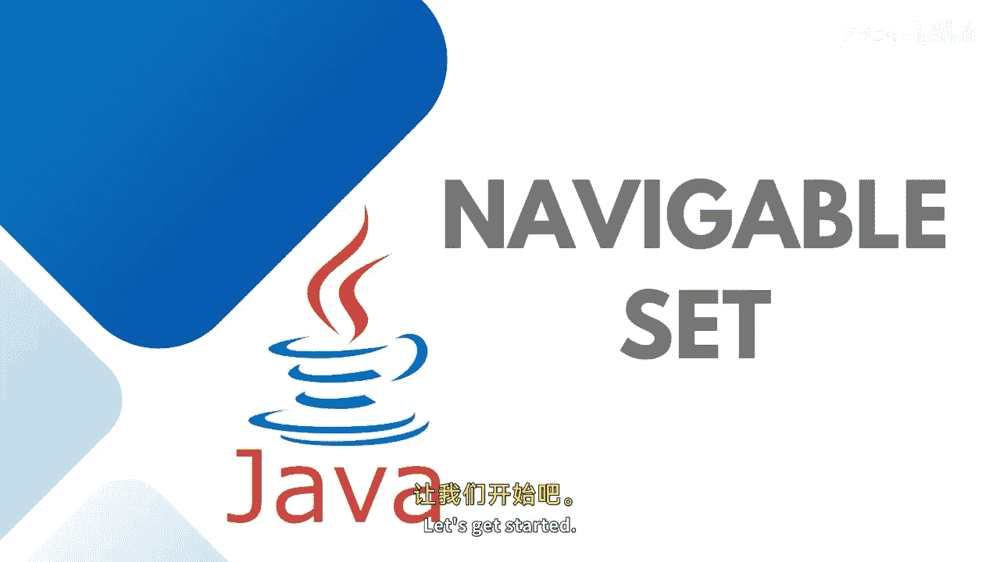
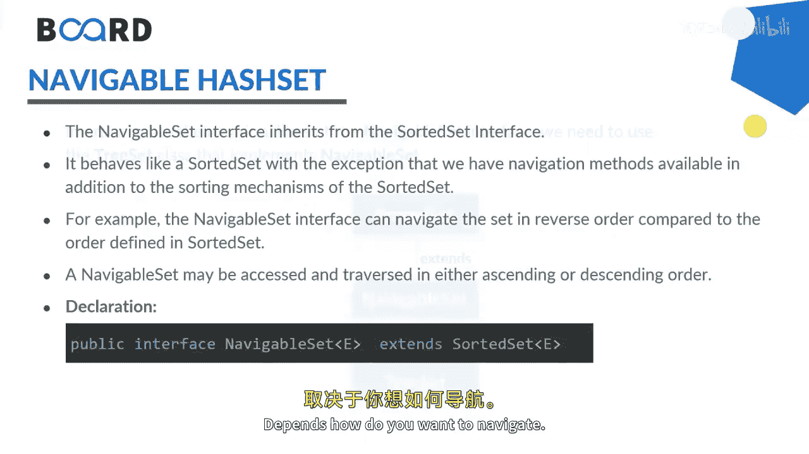
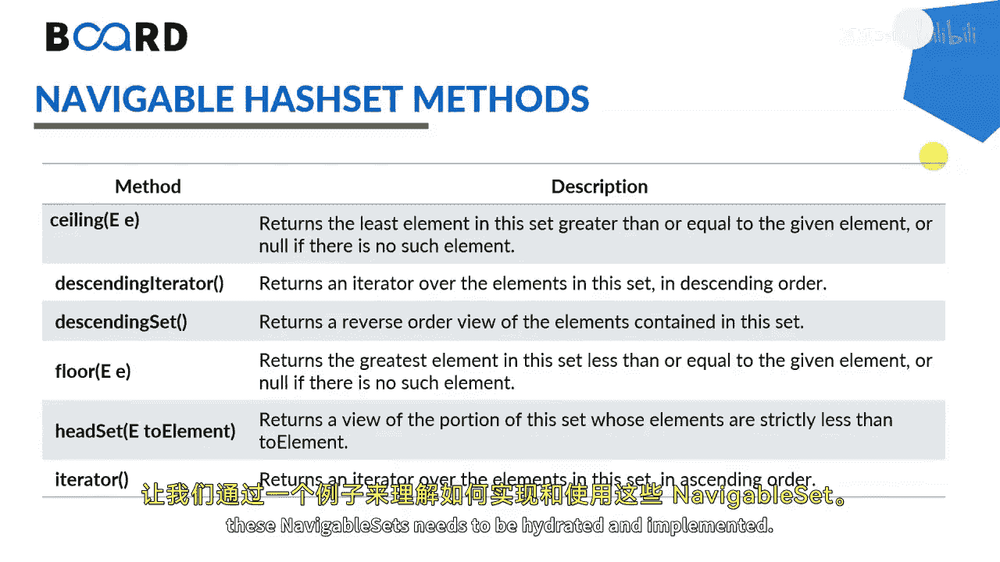
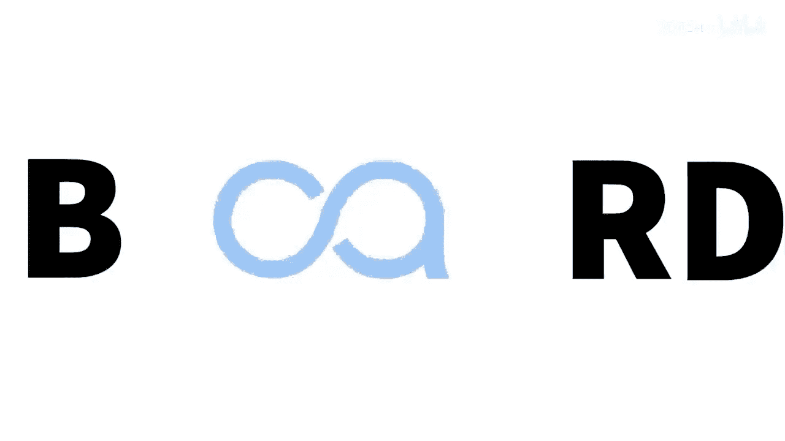

# 【Java全栈开发 专项课程（下）】Board Infinity—中英字幕 p33 p32_06_java-navigablehash-set -BV1fryaYgEqb_p33-

Hi there。 Today， In this session， we will learn about Java navigable set interface and its methods with the help of an example。

😊，So let's get started。

The navigable set interface of the Java collection framework provides the feature to navigate among the set elements。

It behaves like a sorted set with the exception that we have navigation methods available in the addition to the sorting mechanism of the sorted set。

It is considered as a type of sort set， as I said， in order to use the functionality of thed navigable set interface。

 we need to use the three set class that implements the navigable set。

The navigable set may be exist and traversed in either ascending or descending order depends How do you want to navigate。

This is how the tree structure works。 Soage set。Extends the into the navigable set。

 and navigable set implements into the three set。These are the specific methods comes up。

 so let's get understand with the example how these navigable sets needs to be iterated and implemented。

Here， I'm creating a navigable。Set。From the u package， which will hold the individual values。

Will be using with three set class。Seid dot at 0。Set dot add。Let's keep it， 10。wy。Seid dot， add 30。

Seid dot at 40 and 50。Pos that I get a reverse view of the navigable set。So I will say navigable set。

Of type in teacher。Dverse set。Equals to set dot descending set。So here you can print the main。

And here you can print the navigable set。Which is a reversed set。Let's try executing the program。

So you can see that it's 10， 20，30， 40 and 50 and the reverse of it is 50， 40， 30， 20 and 10。Next is。

 if you would like to tail set。So I will say， navigable set。Of integer。3 or more。Equals 2。

Set taught tail set。3。Buoleion exclusive。 Let's make set to2。And disprint it。So， you can see that。

More than three elements are here， so it gets printed。Now， I will get lower of three。3。

Set dot lower of three。That's returns null。After that， you can try。Getting poll first。

Set dot poll first and after that try printing your set once again。Tennis pole are removed。

Eliminated leftover values in the set at 2030，40 and 50。Similarly， you can say poll last。

Set taught poll， last。So you can see that 50 is also removed。

So these are the navigable methods that you can nitrate。 you can one by one poll each and everything。

 you can also go and use the contains method if required。Set dot contains。

Any particular element that you would like to contain。

 let's say I would like to say said dot the first element needs needs to be there or not。

So you can see that it's printing to you because it is not empty。

So that's how your navigable set implementation works。Further。

 you can make it implemented and work with a real time object oriented， rather than the interior。

 you can put on the employer object or some more real time entity to do the operations as well。

Until next time， see you again。 Stay tuned for the more implementations。

🎼。

