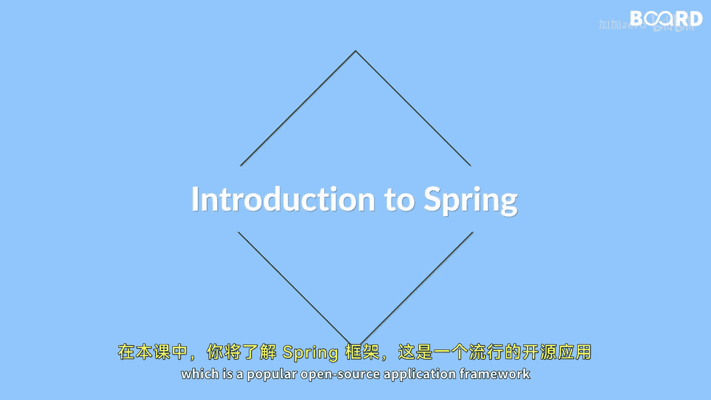

# 【Java全栈开发 专项课程（下）】Board Infinity—中英字幕 p35 p34_01_what-you-will-learn-in-this-lesson -BV1fryaYgEqb_p35-

🎼Hi there。 In this lesson you will learn about the spring framework。

 which is a popular open source application framework for building enterprise level Java applications。

😊。

🎼We will begin by discussing what the spring framework is and its benefits。🎼Next。

 we will explore the various components of spring framework architecture。

 including the core container， data access， web framework， and more。😊。

🎼We will also cover the environment set for spring development and creating a dynamic web project in spring。

🎼Finally， we will learn how to develop a spring application using the Meven built tool。😊。

🎼By the end of this lesson， you will have a good understanding of the spring framework and be ready to start building your own spring applications so see you in the next video。

😊。