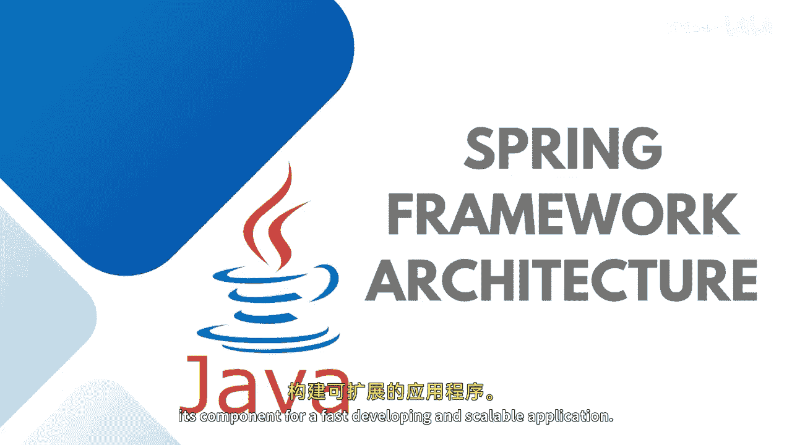
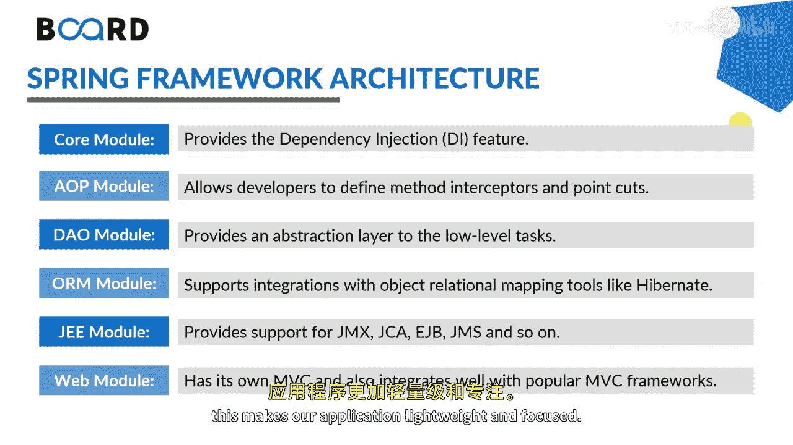
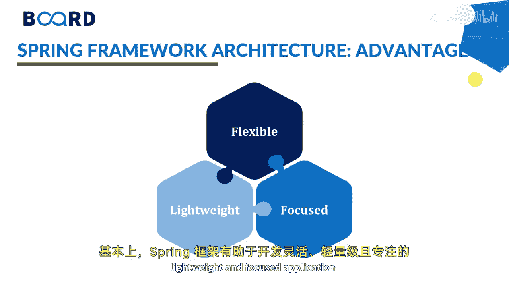
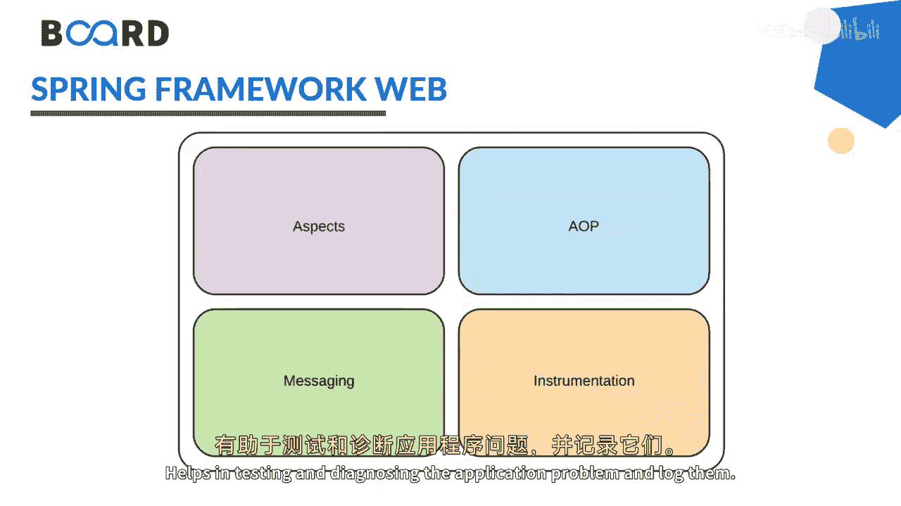

# 【Java全栈开发 专项课程（下）】Board Infinity—中英字幕 p37 p36_03_spring-framework-architecture -BV1fryaYgEqb_p37-

Hi there。 Today In this session， I will talk about spring framework architecture。😊，Basically。

 spring framework is comprises of various components which are organized and relates to each other。

 so we need to understand these architecture and its component for a fast developing and scalable application。

 so let's get started。

Basically， when we talk about framework。String is a modular framework。

 It does not come as a package or bundle of multiple modules， as I am right mentioning here。

It comes as modules， multiple modules， core module， AOP module， data access， object module。

 orM module， Java enterprise Ed module and the web module。

 So what I really wanted to say is various spring component comes as independent modules。

 and this gives us a flexibility of use what we need and leave the rest for example。If you want to。

You spring jam is。And JMS is a JW module。 we don't need to use a spring web module。

 so if we use this way in a very iterative way， this makes our application lightweight and focused。

Let's talk about the spring framework。 Basically spring framework helps in developing the flexible lightweight and focused application。

😊。

This is a complete framework。It's a high level look of spring framework architecture and the subsequent sections I will tell you one by one。

 for example， the data integration web core container and testing。😊。

So spring framework is basically first all based upon the core container。

 and the core container is a heart of spring。 It contains some base framework classes and tools。😊。

The entire spring framework is based upon this core container。

 The core module contains the basic spring framework classes。

 including dependency injection and Ioc containers。

 No matter which type of spring application you are building。

 You will always have direct or indirect dependency over spring core。

 Then we have spring bean that module packet manages the lifecycl of the bean。

 In the spring framework， a bean in any Java class。

 which is registered with spring and spring manages these bean classes。

 So there is a bean factory which creates the bean classes in every library you will get inside it。

 Then we have spring context， basically it is a context Js。

 These spring beans are defined in the context called spring context。

 and will allow us to access the spring context as well that is also known as application bean context。

 Then we have。😊，Express language it is a powerful expression language which is used for resolve expression to value at runtime and that' is also known at spell and can query the object graphs on runtime and can be used in Xl or as well as Java annotations。

😊，Next， we have spring web。As its name suggests itself。

 spring web components are built to implement the Web application and web modules can build complete embaC applications。

 So here we have web socket servers， web and portlet。

 basically web socket or the serverlet provides many features for building the Web applications。

 There is one more component of spring web that's a spring embasy that provides a mechanism for building the model view controller based upon application。

 Then we have also a web socket that provides a support for the Web sockets as it is a sort of tunnel between a service and the consumer in the Web applications So we use HtTP connections that the client has to pull on the server for any updates。

 Then we have weblet that supports the building of the Web portlets which are pluggable user interface software components that are managed and display in a web。

😊，Next we have the data access where the OM JMS and JDBC OXM transaction comes into the picture the JDBC provides an abstraction over Java JDBC API where we need to access the data from the database and we usually need to deal with the statements queries and the result sets ORM is a support of OM implementation that's an object relation mapping that's an hibernate that comes into the picture JMS stands for Java messaging services which defines the specification for publisher and subscriber communication OXM that provides an abstraction of object XzeL marshalling which defines the way of transferring and accessing the data in the form of XimL At last we have transaction management APIs。

Provides a uniform way of managing the transaction of the data objects， as well as databases。

 At last， we have some miscellaneous components such as spring AO aspect instrumentation and the messaging。

 AOP is an implementation of aspect oriented programming and aspect is in any secondary task。

 which is an object needs to perform Me is basically that provides support for integration with messaging statement and system。

 and the module provides simplified and uniform way of interacting with various messaging services。

 At last we have instrumentation that provides support for class instrumentation used for monitoring performance of an application helps in testing and diagnosing the application problem and loggedin。

 So stay tuned to learn more about these implementations practically how it comes into the real time。

 See you in the next session。😊。

。

