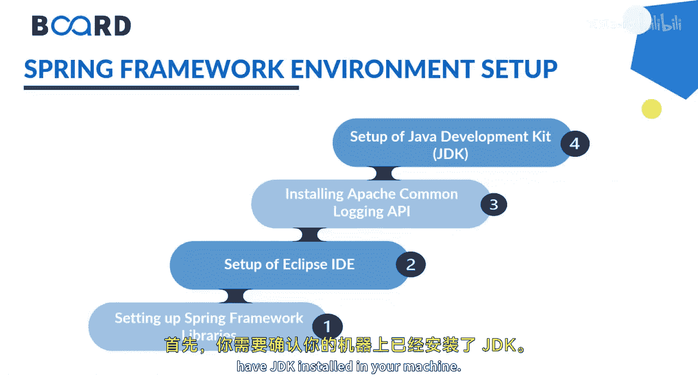
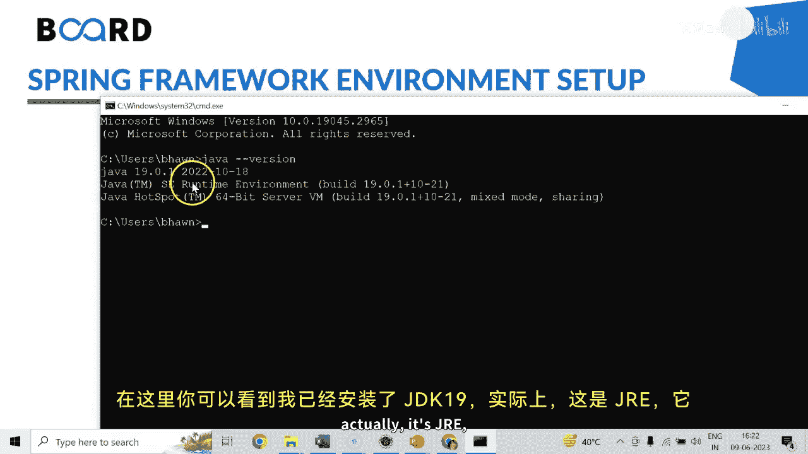
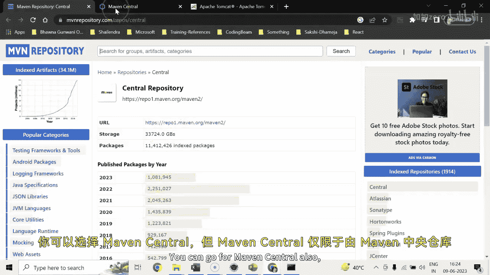
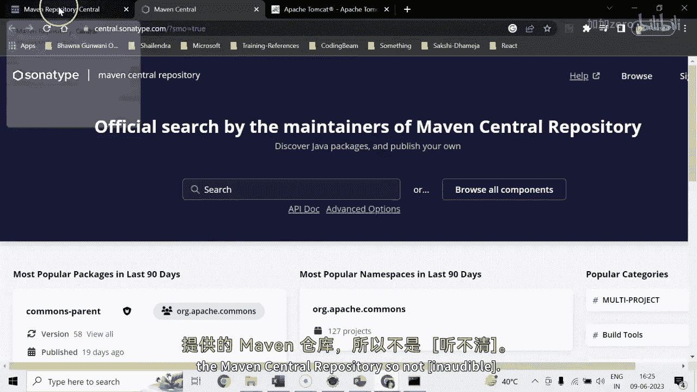

# Java全栈开发：专项课程（下）：Spring框架环境搭建指南 🛠️

在本节课中，我们将学习如何为Spring框架开发搭建必要的本地环境。这包括验证和安装所需的软件，以及了解如何获取Spring框架库。



## 环境准备概述

在开始使用Spring框架之前，必须在您的计算机上安装一些必备软件，并清楚如何使用它们。以下是需要完成的步骤。



## 1. 验证JDK安装

首先，需要确认您的机器上已安装Java开发工具包（JDK）。

您可以通过命令行来检查JDK是否已安装。打开命令提示符并输入以下命令：

```bash
java -version
```

如果已安装，命令将返回JDK的版本信息。例如，您可能会看到类似 `JDK 19` 的输出。JDK通常与JRE捆绑在一起。

## 2. 安装Apache Tomcat服务器

接下来，您需要安装Apache Tomcat服务器。这是一个广泛使用的Java应用服务器。

您可以访问Apache Tomcat的官方网站来下载所需的版本（如8、9或10）。根据您的操作系统（例如Windows）选择相应的安装程序（如32位或64位的Windows服务安装器）。

下载完成后，运行安装程序并按照提示完成安装。建议在安装过程中选择完整安装。安装完成后，您可以在程序文件目录（如 `C:\Program Files\Apache Software Foundation\Tomcat 9.0`）中找到它。

## 3. 配置集成开发环境（IDE）

我们推荐使用Eclipse IDE进行Java开发。Eclipse支持创建各种Java项目，包括核心Java、移动应用、Web应用等。





对于Spring框架项目，我们通常使用Maven来管理依赖。在创建Maven项目时，您需要知道如何获取Spring框架库。

## 4. 获取Spring框架库

在Maven项目中，您可以通过Maven仓库来添加项目依赖。一个常用的仓库是 `mvnrepository.com`。

以下是获取Spring依赖的步骤：
1.  访问 `mvnrepository.com`。
2.  在搜索框中输入您需要的依赖名称，例如 `spring core`。
3.  从搜索结果中选择合适的包和版本（例如 `spring-core 5.3.9`）。
4.  页面会提供该依赖的Maven坐标。您只需复制 `<dependency>...</dependency>` 代码块。
5.  将复制的依赖粘贴到您Maven项目的 `pom.xml` 文件中。

使用Maven管理依赖的优势在于，当您添加一个核心依赖（如 `spring-core`）时，Maven会自动下载并管理其所有相关的支持库，无需手动处理多个JAR文件。

对于动态Web项目，您也可以手动下载JAR文件，但使用Maven项目是更高效和推荐的方式。

## 课程总结

本节课我们一起学习了搭建Spring框架开发环境的核心步骤。我们首先验证了JDK的安装，然后安装了Apache Tomcat服务器，接着配置了Eclipse IDE，最后详细介绍了如何通过Maven仓库来获取和管理Spring框架的依赖库。掌握这些基础环境配置是进行Spring应用开发的第一步。


希望这些概念对您来说已经清晰。请继续关注，以学习更多关于Spring框架应用开发的知识。我们下节课再见。