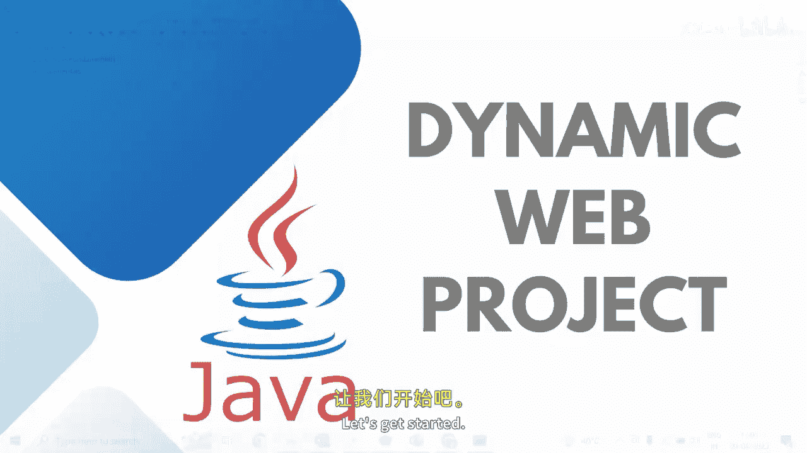
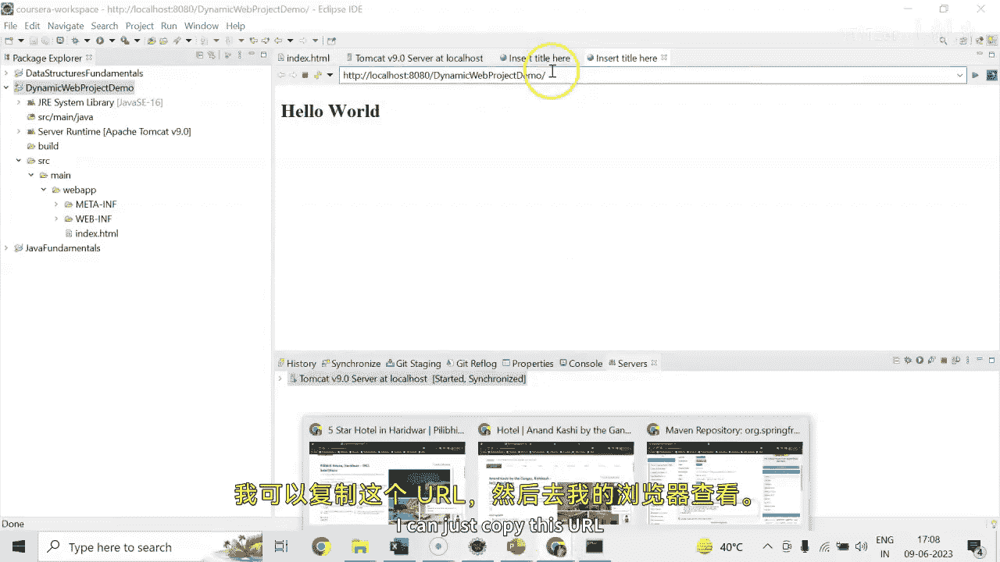
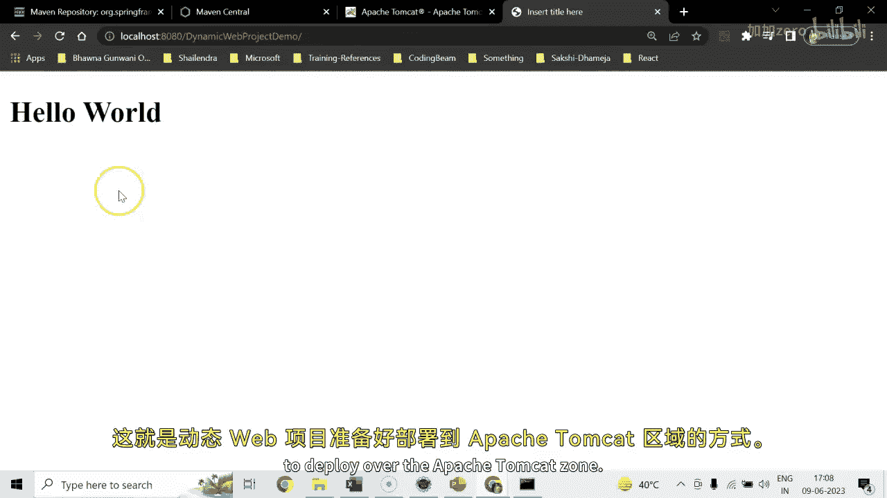

# 【Java全栈开发 专项课程（下）】Board Infinity—中英字幕 p39 p38_05_demo-developing-dynamic-web-project -BV1fryaYgEqb_p39-

Hi there。 Today In this session， we will discuss how to create a dynamic web project in Eclipse。

 One thing I would like to clarify before proceeding it further。😊，Along with having JdiK and eclipse。

 you need to have Apache Tomcat installed because almost always you will be deploying your Java application to an application server such as Jbos Tomcat。

Webs fair or wherever you want。 So I will be using Apache Tomcat for this dynamicmic web project or whatever further projects I will be creating and deploying。

So， let's get started。

You need to go to file， look out for new。 I cannot see the templates here。

 go for other and look out for dynamic web project this way。I will be naming the project here。

 let's say。Dynamic web project。Demo default location is wherever the projects are getting saved。

 that is coursesera workspace。My target runtime is also selected here because I generally keep creating dynamic web project if it in your case it is not there。

You can click on this new run time。 Look out for whichever apache oncat is installed in your machine。

 Go for that server， next。😊，Browse it。Let's say in my case it is saved in Cri program files。

 Aache softwareft Foundation， truet 9。0， that's it。😊。

So this is the location that you need to search it up here。And once it is set。

 you need to say finish。 So your Tomcat target runtime will be set。 dynamic web module version。

 We are not be creating JSP and several pages so you can keep selecting the latest 1，4。0。

 That's not a problem。Then you see simply need to say next， Gu， one thing I wanted to tell you here。

 two times my configuration is done。 So whichever configuration works for you， you can set this up。

 In my case， it's set saying that mine is finished two times。 I just select the default one。😊。

And simply say next， and the project is created successfully。😊。

Once the project is created successfully， you will be able to see this here。 Let me just。😊。

Edit my active working repository。You do not need to take care of it if you are not maintaining the projects under the working repository or working sets。

So here is the dynamic web project already created。Now you need to do one thing。

 you just need to go to SRC main and Web app under this。

 you need to create your Web application pages that you wanted to run。

Let's say I wanted to create my very first index dot， Html or index dot。😊，JSP paid。

 So I will simply go for adding。H T M L should be fine。 index dot H T M L。

Naming this as index or Ttmr。I'm simply writing a hello word message here。Now to run this project。

 you need to configure your server， go to Windows。Show you。

You can see that my server is already configured。 I am doing once again in front of you。

 So I just right click on it and delete because in your case， it not must be。

 So click this link to create a server， as I said there。😊。

You can select your Tom gett right version and say next。If you will say next。

 it will ask you to go to your Apache Tommcat configuration seed drive folder。

 You need to select the right folder that I have told you one minute back and select that and finish。

You need to double click over this Tommcat 9。0 server that you have added。

 You just need to update the admin port that is 8005 in my case。

 in your case too by default Apache Tommcat server runs on port number 8080 I'm sure my Tommcat server is not running from the services。

 So 8080 should be available， so I just select save this configuration。

Just to ensure that my server is configured successfully or not。

 I need to right click on the server name and say start。

 And you can see that my server has been started。 I am all set to test my dynamic web project now。😊。

I will simply right click on the project。And just need to say run as run on server。

 You need to select the server that's being configured。 It is already started。

 So it will tell you which project it will run。 It will ask you that your server is already started。

 Do you want to restart。 Yes， I want to restart my server。

Here you can see that your server has been restarted and your hollow world is successfully printed from index dot HTML。

Right now， this browser is getting open in your Eclipse IdeE。😊，You can configure the browser to open。

Over the main itration， so what you can go do is you can go for preferences。

Just expand this and look out for the browser。So here is a web browser I would like to go for external Chrome web browser。

 apply and close。Next time when you will run your project。

 it will open it in your Chrome external browser。Just have a look。

I think I have not saved the changes。 Let me just go for the preferences Chroe。

 apply and apply and close。 Now I just need to run my application once again。

Not really sure why it's not working， I can just copy this URL。

And go to my browser and just look it up。 You might need to restart your eclipse After setting the preferences。

 Your h is getting printed right away。 So this is how the dynamicmic web project is ready to deploy over the Apache Acastel。

 So stay tuned to learn more about web application development environments until next time。

 See you soon。

。

