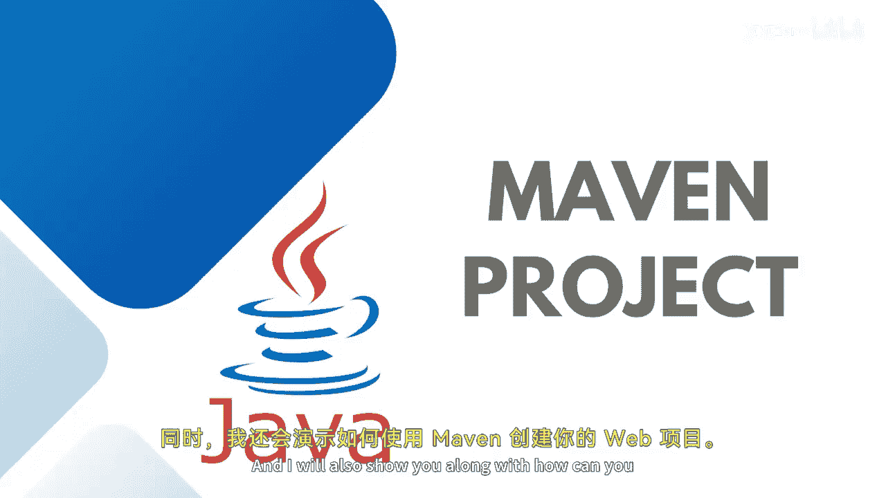
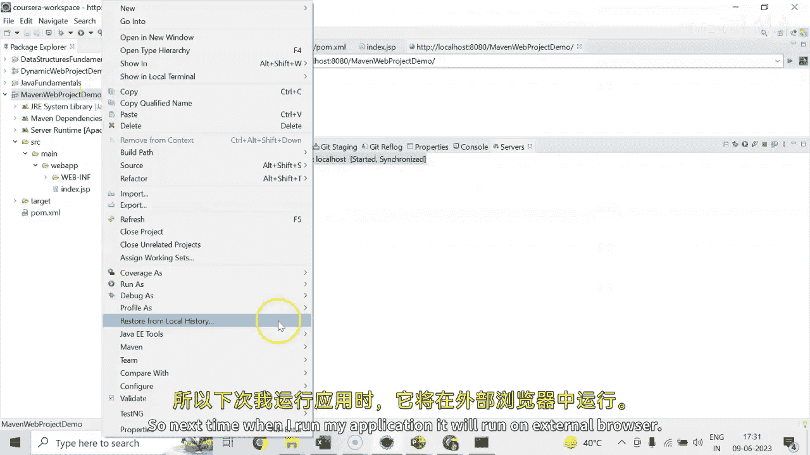
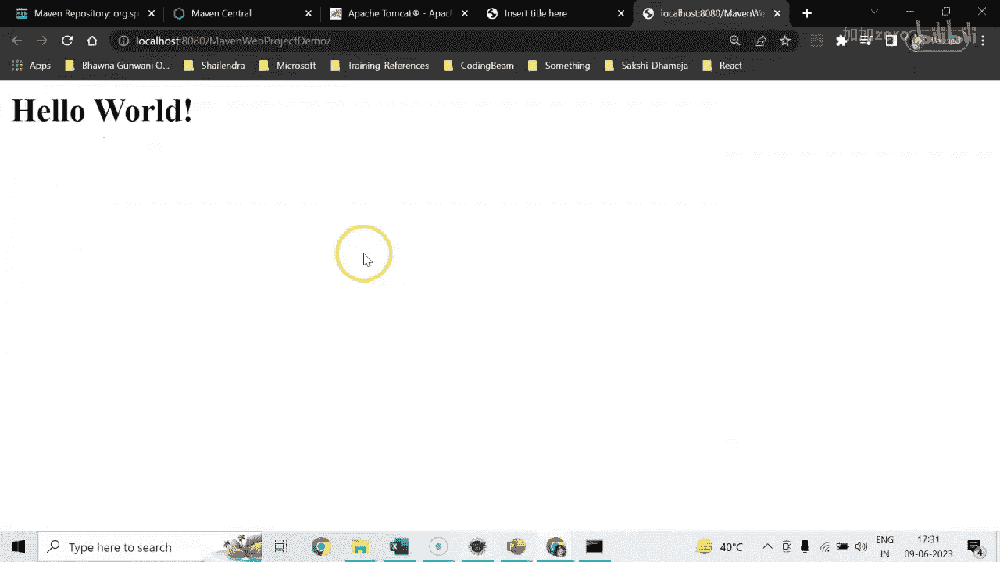
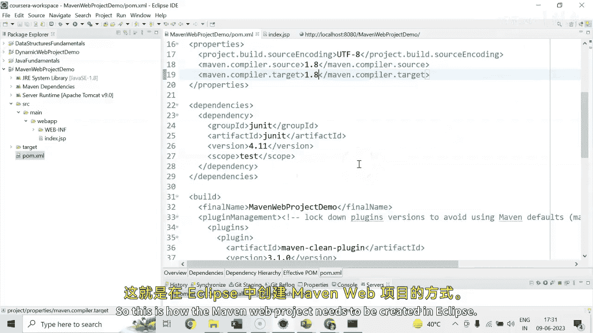
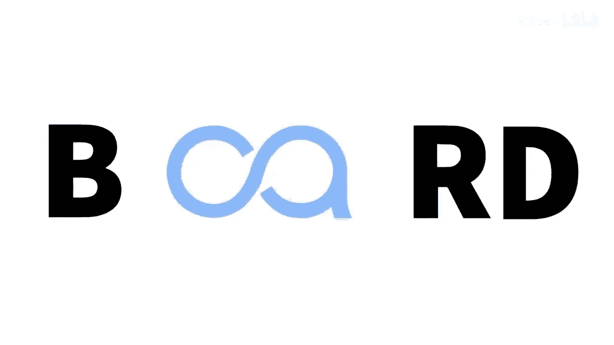
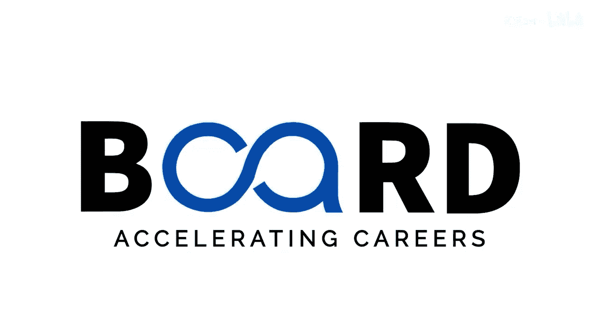

# 【Java全栈开发 专项课程（下）】Board Infinity—中英字幕 p40 p39_06_demo-developing-spring-application-using-maven -BV1fryaYgEqb_p40-

Hey， guys， today in this session， I will tell you how to create a spring application using mevevin from Eclipse only。

 and I will also show you along with how can you create your web project using meve。

 So let's get started。 firsts of all， my last project was running on Tomcat。

 So I need to right click on the server and clean the Tomcat work repository。

 So if any work repository would be working with my Tommcat will get stopped Next。

 what I need to do is I just need to go to file this time。😊。

Say new。 And I need to look out for the Mevin project。

So here you just go for a Mevin project this way。While creating a me project， you have two options。

 You can go for a simple project。 It's a core Java project。

 Then you select a simple core Java project。 It will not ask for。😊。

The template and will ask for the mevin configuration， but if you do not select this simple project。

 you just click on the next， it will ask you what type of archetype you wanted to select。

 So I wanted to look out for the web app for example。

 so you just need to write down the Web app or you can just write down Apache So any catalog gets started from the Apache Mevevin Apache that will be filtered it out。

 So sometimes it takes a minute or two or maybe less than that to just populate your meven project you can write so many things here。

 you can write down meven Apache Apache web app whichever feels better for you So here you can see that here we have Meven Apache web application as I can select this one only because my spring framework project also need a web application integration or if you just wanted to create a core meven project go for Meven archetype qui。

I'll just go for the web app。And I just need to say next here， first of all。

 we need to write on the group I group I is basically the package name， base package name。

So here I just create a Men Web project。Mavin Web project or spring project， whatever you name it。

 Simply I need to say next。Project will take a minute to generate with all the configurations。

 Actually， Mevin project is something that you have a basic skeleton of similar type of skeleton for all the application so that。

Template gets generated so it takes a minute along with that。

 so you can see that my ma project is here and I can see that my project is generated successfully。

 Now what next I need to do is need to do couple of things。 first of all。

 I can see that here Po dot Xl file is there。In this Po dot Xl file， my compiler is 1。7。

 I will ask you to just change it to 1。8 at least and after that you need to just right click on your project and you can need to say the Meven update project。

 whichever project you want to update just select and the sentence say the force update。

Once the force update is done， you can see that here also the standard edition will be changed to 1。

8 at least。Next， what you need to do is you need to right click on your maven project and go to the properties。

Here we have target run times that on which particular server my maven application will work。

 I just wanted to look out for a budget Tomet 9。0。 It's mandatory to tell that on which particular server my。

We app will run。Under this Webab folder， we already have index dot JSP where the basic haover is written。

So we are all set to run this Nn web project demo。Just right click on your project and say run。

 you need to go to Apache build dot dot dot， first of all， you need to build your project。

Simply say go， clean install。This will build your mevevin project and it saying that the build has been successfully done and there is no error Now I need to run this Apache meven project on server so I just need to right click once again and say run on server。

Asking that which project to run， I just removed the dynamic one and wanted to run the me one。Yes。

 I want to restart my server。And here is my hollowow world is running successfully。

 I can go for windows。😊，References。Here you can see that I need to select the external web browser and then Ch and then I can apply with。

 So next time when I run my application， it will run on external browser。

You can also see one important thing that there is a pom dot Xml and over the pom dot Xml you will be able to see here that dependencies are there and by default J unit dependency added I told you how to check up the dependencies from MPN repository website and keep it into your dependencies note here so you can just manage it somehow so this is how the Men Web project needs to be created in Eclipse until next time stay tuned see you in the next session。

