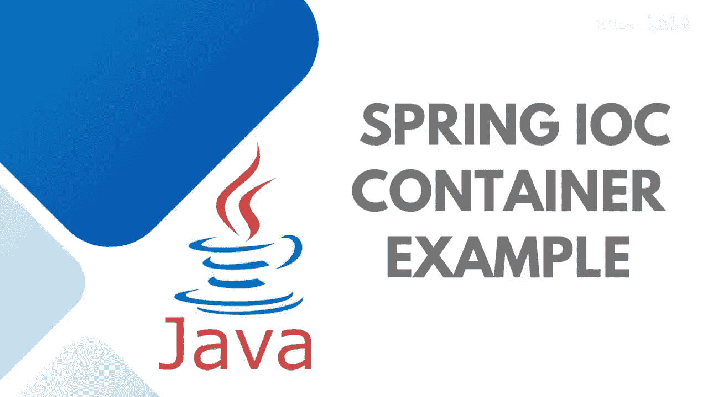
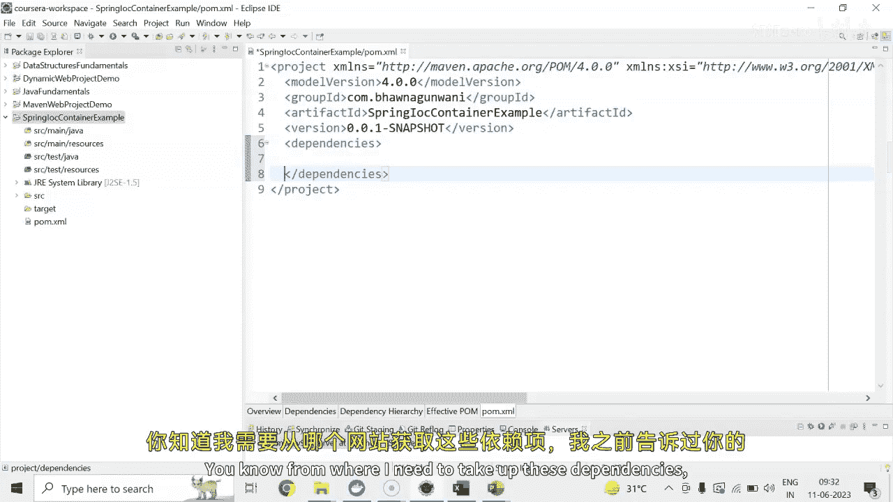
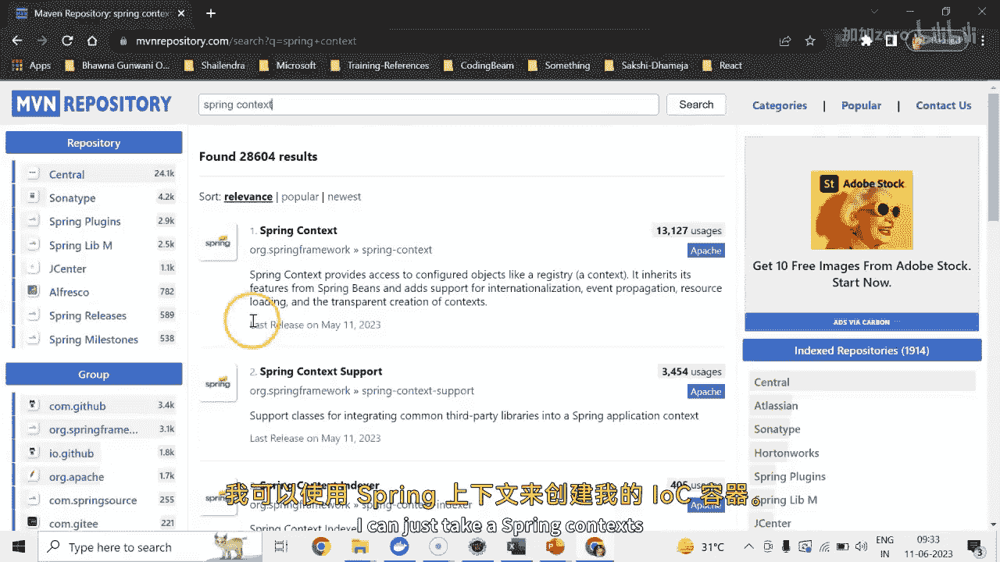
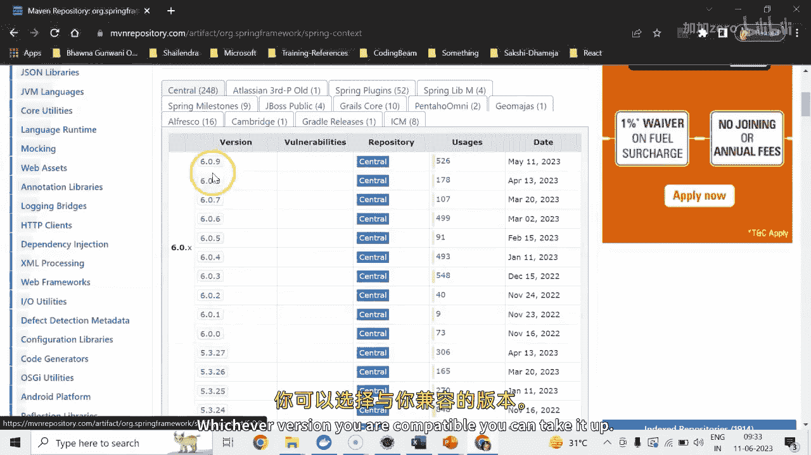

# Java全栈开发：43：创建Spring IOC容器 🏗️

在本节课中，我们将学习如何创建Spring IOC容器。该容器负责实例化、配置和组装Spring Bean。我们将使用XML配置方式来完成这个演示。

## 概述

Spring IOC容器是Spring框架的核心，它管理着应用中所有对象的生命周期和依赖关系。配置元数据可以通过XML、Java注解或Java代码来表示。本节我们将专注于使用XML配置来创建容器。

## 创建Maven项目

首先，我们需要创建一个Maven项目作为基础。我们将生成一个简单的Java项目，不包含Web应用等复杂结构。

以下是创建项目的步骤：

1.  选择项目骨架类型，这里我们选择“简单项目”。
2.  设置Group ID为 `com.panagwani.spring.ioc.container.example`。
3.  完成项目创建。

项目生成后，我们可以在 `src/main/java` 目录下存放Java文件，在 `pom.xml` 文件中管理依赖和配置。

## 配置项目与依赖

创建项目后，需要进行一些基础配置并添加Spring依赖。

首先，我们需要将项目的Java编译器版本从默认的1.5调整为至少1.8。这可以通过项目属性中的Java编译器设置来完成。修改后，需要更新Maven项目以使更改生效。

接下来，我们需要在 `pom.xml` 文件中添加Spring Context依赖。Spring Context模块已经包含了Spring Core，因此添加它即可。我们可以从Maven中央仓库获取依赖信息。添加依赖后保存文件，Maven会自动下载所需的库文件。

如果项目没有自动更新，我们可以在 `pom.xml` 的 `<properties>` 标签中手动指定Maven编译器的目标版本，例如设置为17。每次修改 `pom.xml` 后，都建议通过右键项目选择“Maven -> Update Project”来更新项目。

## 创建Bean类

配置好项目环境后，我们需要创建一个简单的Bean类。

在 `src/main/java` 下，于包 `com.panagwani.spring.ioc` 中创建一个名为 `HelloWorld` 的类。这个类包含一个私有字符串属性 `message`，并为其生成Getter和Setter方法。同时，我们重写 `toString()` 方法，以便在打印对象时显示我们想要的信息。

## 配置XML元数据

Bean类创建完成后，我们需要通过XML文件来配置它，告诉Spring容器如何管理这个Bean。

在 `src/main/resources` 目录下创建一个名为 `applicationContext.xml` 的配置文件。我们需要在文件中声明必要的命名空间。然后，在文件中定义一个Bean：指定其ID为 `helloWorld`，类路径为我们刚刚创建的 `HelloWorld` 类。接着，通过 `<property>` 标签为 `message` 属性注入值，例如“Hello”。

## 创建Spring容器并获取Bean

最后一步是编写主应用程序类，启动Spring容器并从容器中获取我们配置的Bean。

在基础包下创建一个包含 `main` 方法的类，例如 `ApplicationLauncher`。在 `main` 方法中，我们使用 `ClassPathXmlApplicationContext` 类来加载 `applicationContext.xml` 配置文件，从而初始化Spring IOC容器。

容器初始化后，我们通过容器的 `getBean` 方法，传入Bean的ID `helloWorld` 来获取该Bean的实例。获取到的对象需要强制转换为 `HelloWorld` 类型。此时，Bean已经由Spring容器完成实例化和属性注入。我们可以打印这个对象来验证配置是否成功。

运行这个Java应用程序，控制台将输出Bean的详细信息，证明Spring IOC容器已成功创建并工作。

## 总结

本节课我们一起学习了创建Spring IOC容器的完整流程。我们首先创建了一个Maven项目，然后配置了项目环境并添加了必要的Spring依赖。接着，我们定义了一个简单的Bean类，并通过XML文件配置了该Bean的元数据。最后，我们编写代码初始化了Spring容器，并成功从容器中获取了配置好的Bean实例。这种基于XML的配置方式是Spring IOC的基础，同样的配置也可以通过Java注解或Java代码来实现。掌握这些步骤后，你就可以在未来的Spring项目中运用Bean了。