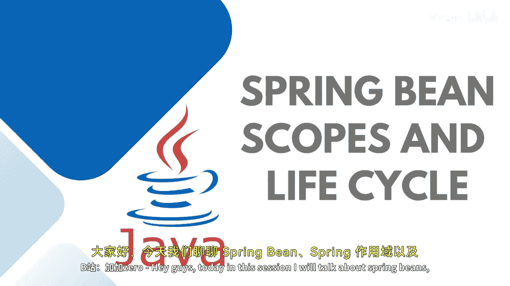
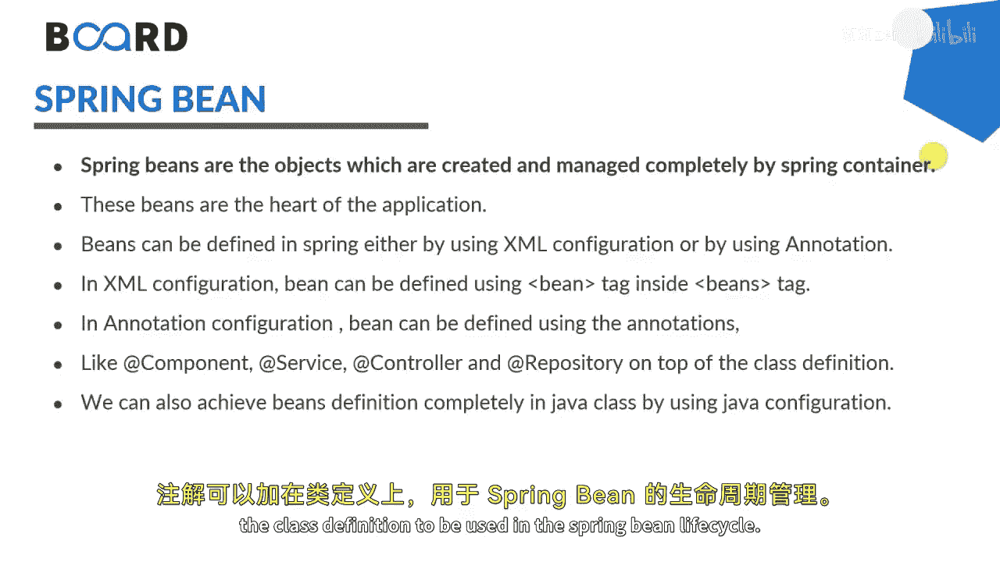
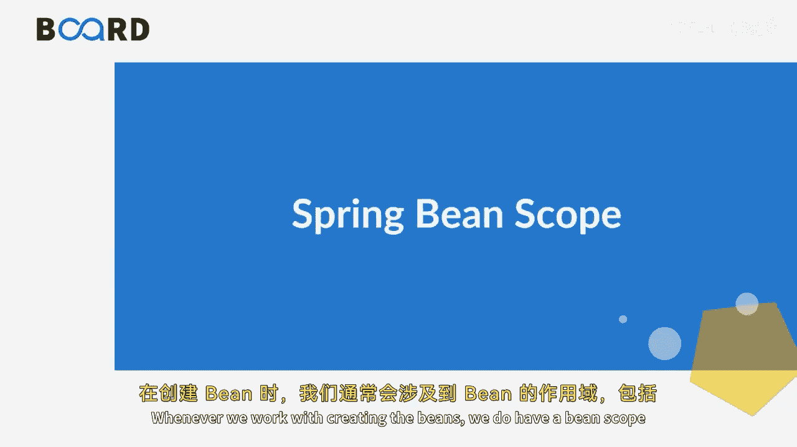
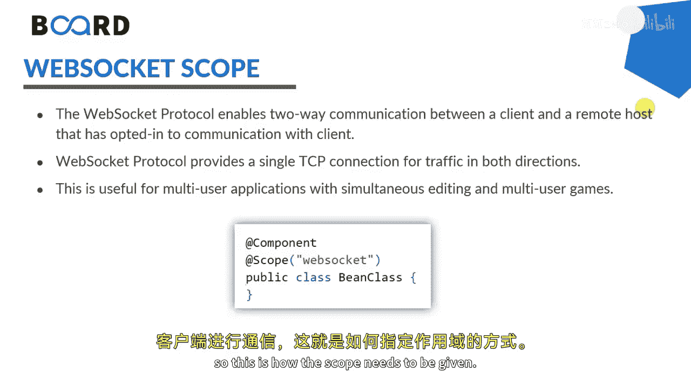
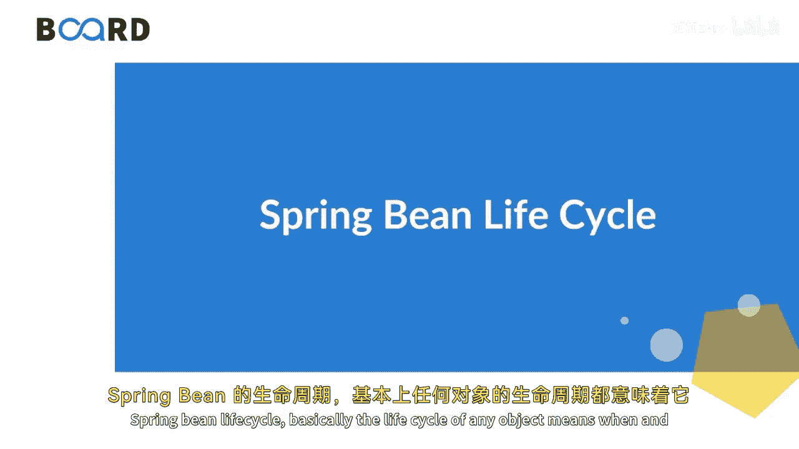
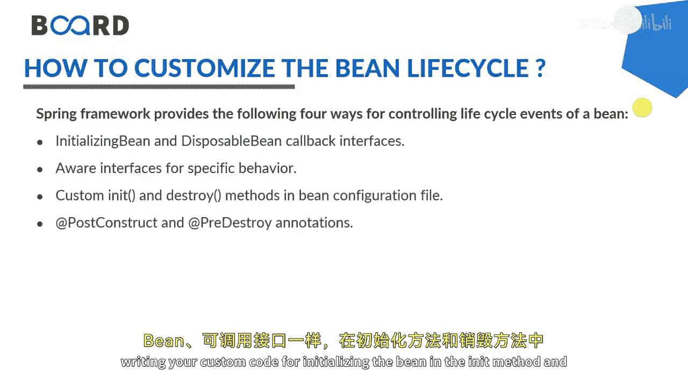
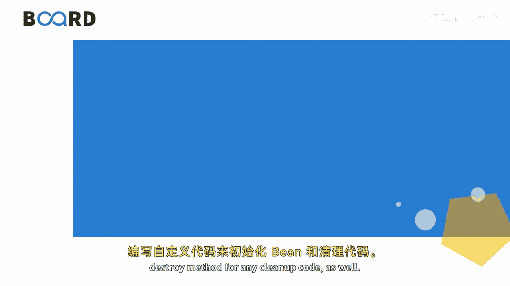
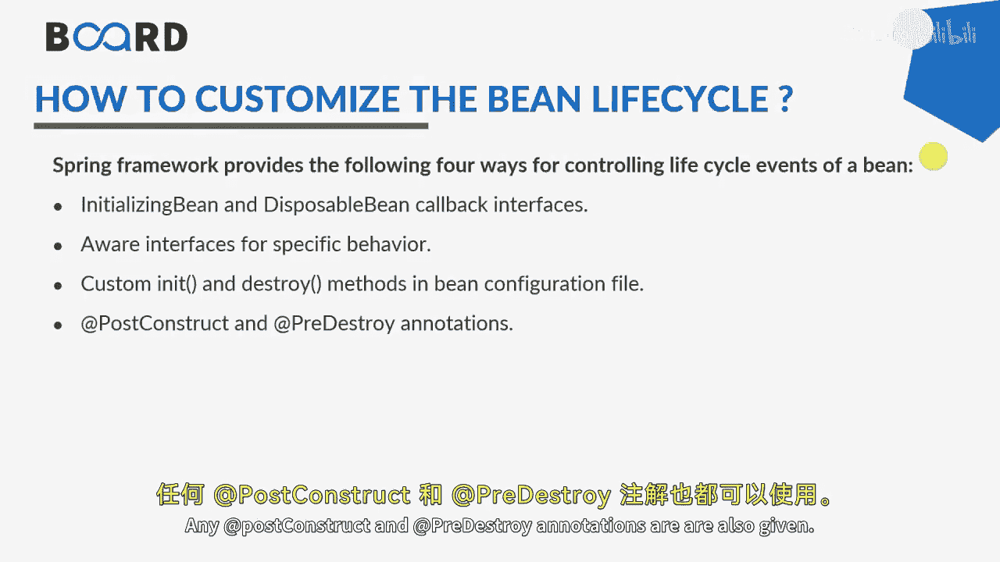
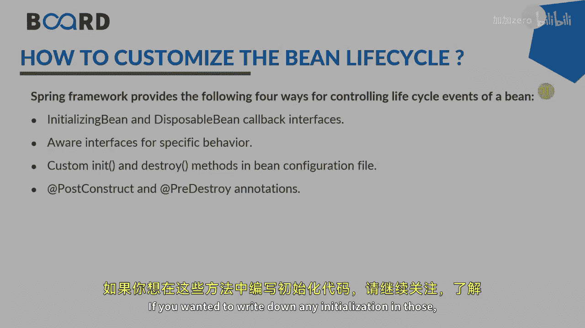

# Java全栈开发：44：Spring Bean、作用域与生命周期 🚀

在本节课中，我们将要学习Spring框架中的核心概念：Bean、Bean的作用域以及Bean的生命周期。我们将了解什么是Spring Bean，如何配置它们，以及Spring容器如何管理它们的创建、使用和销毁过程。

---

## 什么是Spring Bean？ 🤔

Spring Bean是构成Spring应用程序骨架的对象，它们由Spring IoC容器进行实例化、组装和管理。简单来说，一个Bean就是一个由Spring IoC容器管理的对象。

你可以通过XML配置文件或Java注解来配置Bean的元信息。例如，在XML中，我们使用 `<bean>` 标签来定义一个Bean；在Java注解中，我们使用 `@Bean` 注解来创建或配置Bean注入。此外，还有 `@Component`、`@Service`、`@Controller` 和 `@Repository` 等注解，它们通常用在类定义之上，以参与Spring Bean的生命周期管理。

---

## Spring Bean的作用域 🎯

在定义Bean时，你可以为其声明一个作用域。这决定了Spring容器创建Bean实例的方式。Spring支持多种作用域，主要包括以下几种：

以下是Spring Bean的几种核心作用域：

1.  **Singleton（单例）**：这是默认的作用域。在整个应用程序中，Spring容器只会创建该Bean的一个实例。这个单例实例会被缓存，所有后续对该Bean的请求都会返回这个缓存的对象。
    *   **配置方式**：在Bean配置中设置 `scope="singleton"`。

2.  **Prototype（原型）**：每次请求该Bean时，Spring容器都会创建一个新的实例。因此，对于有状态的Bean，通常使用原型作用域；对于无状态的Bean，则使用单例作用域。
    *   **配置方式**：在Bean配置中设置 `scope="prototype"`。

3.  **Request（请求）**：为每一个HTTP请求创建一个新的Bean实例。这意味着如果服务器正在处理50个请求，就会创建50个独立的Bean实例。一个实例的状态改变对其他实例不可见。
    *   **配置方式**：在Bean配置中设置 `scope="request"`。

4.  **Session（会话）**：为每一个HTTP会话创建一个新的Bean实例。如果服务器有20个活跃会话，就会创建20个实例。但在同一个会话内的所有请求，访问的是同一个Bean实例。
    *   **配置方式**：在Bean配置中设置 `scope="session"`。

5.  **Application（应用）**：也称为全局作用域。在整个Web应用程序运行时，Spring容器为每个Web应用创建一个实例。这类似于Servlet上下文（`ServletContext`）的作用域。
    *   **配置方式**：在Bean配置中设置 `scope="application"`。

6.  **WebSocket**：为每个WebSocket会话创建一个Bean实例。需要注意的是，此作用域在较新版本的Spring中已被标记为过时（deprecated）。

---

## Spring Bean的生命周期 🔄

对象的生命周期指的是它何时以及如何被创建、在其生存期间如何行为、以及何时以及如何被销毁。同样，Bean的生命周期指的是Bean何时以及如何被实例化、初始化和销毁。

Bean的生命周期由Spring容器管理。其基本流程如下：

1.  **启动容器**：当我们运行程序时，Spring容器首先启动。
2.  **创建实例**：容器根据请求创建Bean的实例。
3.  **依赖注入**：容器将所需的依赖注入到Bean中。
4.  **初始化**：如果Bean定义了初始化方法（如 `init-method` 或使用了 `@PostConstruct` 注解），容器会调用它来执行自定义的初始化代码。
5.  **就绪使用**：此时，Bean已准备就绪，可供应用程序使用。
6.  **销毁**：当Spring容器关闭时，如果Bean定义了销毁方法（如 `destroy-method` 或使用了 `@PreDestroy` 注解），容器会调用它来执行清理工作，然后销毁Bean。

为了在Bean初始化和销毁时执行特定代码，Spring提供了多种方式：

以下是控制Bean生命周期事件的几种主要方法：

*   **实现 `InitializingBean` 和 `DisposableBean` 接口**：分别重写 `afterPropertiesSet()` 和 `destroy()` 方法。
*   **XML配置**：在 `<bean>` 标签中指定 `init-method` 和 `destroy-method` 属性，指向Bean类中的自定义方法。
*   **使用注解**：在方法上使用 `@PostConstruct` 和 `@PreDestroy` 注解。

---

## 总结 📝

本节课中我们一起学习了Spring框架中关于Bean的核心知识。我们首先了解了Spring Bean是由IoC容器管理的对象。接着，我们详细探讨了Bean的几种作用域，包括单例、原型、请求、会话和应用作用域，它们决定了Bean实例的创建策略。最后，我们梳理了Bean的完整生命周期，从容器启动、实例创建、依赖注入、初始化、使用到最终销毁的各个阶段，并介绍了如何通过接口、XML配置或注解来介入生命周期的初始化和销毁环节，以执行自定义逻辑。

理解Bean的作用域和生命周期对于构建高效、可控的Spring应用程序至关重要。在接下来的课程中，我们将继续深入学习Spring依赖注入，了解Setter方法和属性如何帮助注入依赖。