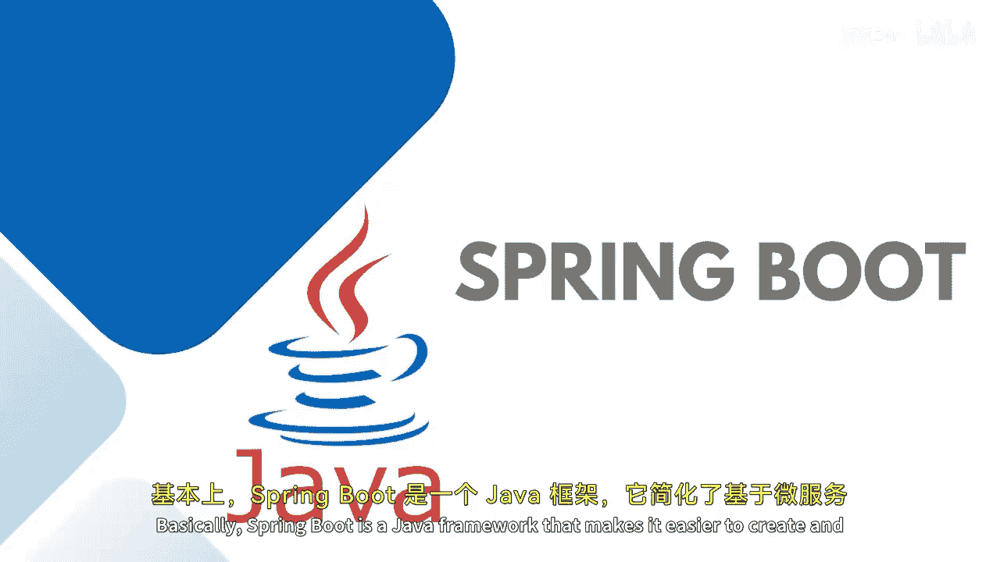
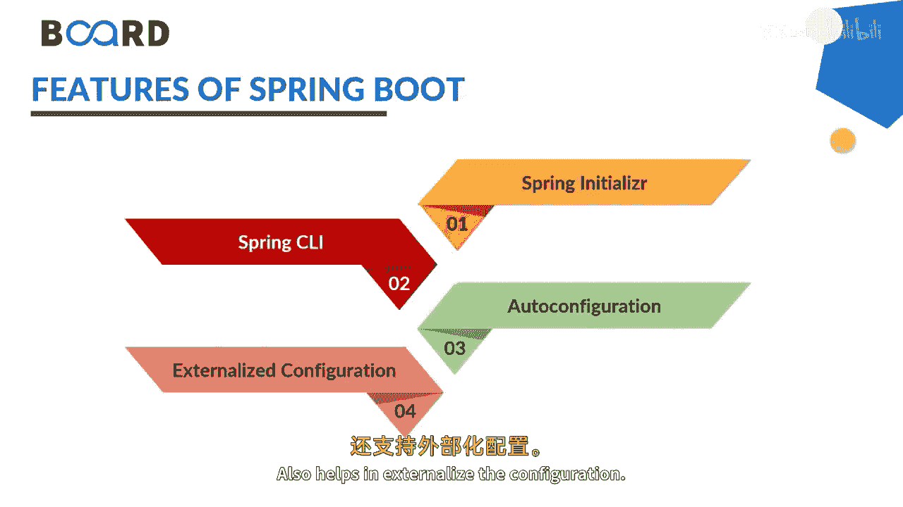

# Java全栈开发：专项课程（下）：第47讲：Spring Boot入门指南 🚀

在本节课中，我们将学习Spring Boot框架。Spring Boot是一个用于简化Java应用程序开发的框架，特别适合基于微服务的架构。我们将了解它的核心概念、优势以及基本组成部分。

## 概述

Spring Boot是Spring框架的一个模块，旨在简化配置和设置过程，使开发者能更专注于编写应用程序代码。它支持快速应用开发，通常被称为RAD。

## 什么是Spring Boot？

Spring Boot是一个Java框架，它让创建和运行基于微服务的Java应用变得更加容易。

**核心公式**：`Spring Boot = Spring Framework + 嵌入式服务器 + 自动配置`

它通过提供一系列“启动器”依赖和自动配置，减少了传统Spring应用所需的大量XML配置工作。

## 为什么使用Spring Boot？

我们使用Spring Boot，主要基于以下几个原因：

以下是Spring Boot的主要优势列表：
*   **开源框架**：由Pivotal团队开发，用于创建微服务。
*   **快速启动**：提供了更快捷的方式来设置、配置并运行简单和Web应用程序。
*   **独立应用**：可用于运行和构建独立的应用程序，无需部署WAR文件。
*   **简化配置**：无需复杂的XML配置，并内置了Tomcat、Jetty或Undertow等服务器。
*   **生产就绪**：提供生产环境所需的特性，并易于管理和定制Spring容器中的Bean组件。

## Spring Boot的核心特性

上一节我们了解了Spring Boot的优势，本节中我们来看看它的一些具体特性。

以下是Spring Boot的关键特性列表：
*   **项目生成灵活**：可以通过Maven项目生成，或利用Spring Initializer网站生成项目骨架。
*   **命令行工具**：也可以使用Spring Boot CLI命令来生成项目。
*   **自动配置**：项目初始化后，自动配置功能即可使用，无需手动设置。
*   **外部化配置**：支持将配置（如数据库连接）外移到属性文件或环境变量中，便于不同环境部署。

## Spring Boot的组成部分与应用

Spring Boot提供了多种实现来支持应用开发。

以下是Spring Boot的一些核心子组件和功能：
*   **Spring Boot Starters**：一组依赖描述符，可以轻松地将相关依赖添加到项目中。
*   **灵活的配置**：提供了配置Java Bean、数据库事务等的灵活方式。
*   **批处理与REST端点**：提供强大的批处理功能，并能方便地管理和定制REST API端点。
*   **注解驱动**：提供基于注解的Spring应用开发方式，注解开箱即用。
*   **依赖管理**：简化了大型应用中的依赖管理。
*   **架构支持**：Spring Boot有助于创建三层架构或仓库设计模式。
*   **嵌入式Servlet容器**：内置了Servlet容器（在Spring框架中即DispatcherServlet），无需单独部署。

## 总结

本节课中，我们一起学习了Spring Boot的基础知识。我们了解到Spring Boot是一个通过自动配置和嵌入式服务器来极大简化Spring应用开发的框架。它使开发者能够快速创建独立、生产级的Spring应用程序。在接下来的课程中，我们将继续学习如何使用Spring Initializer以及如何在Spring Boot应用中创建REST端点。