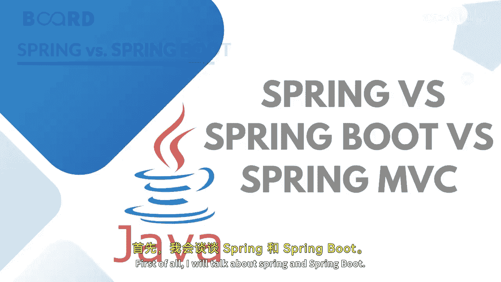
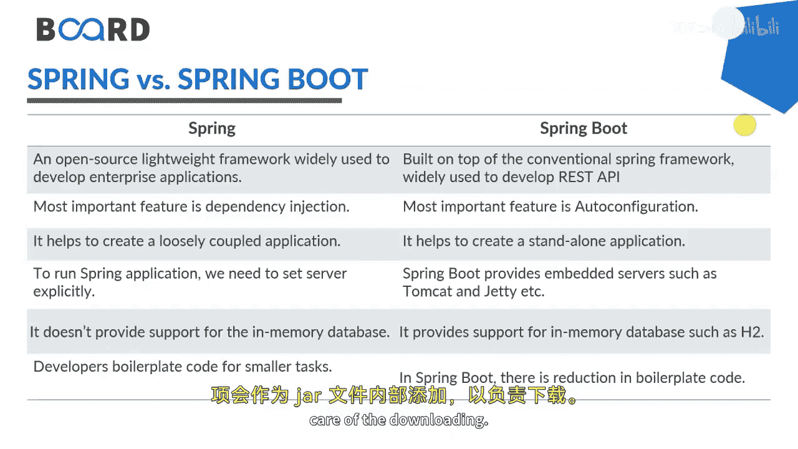
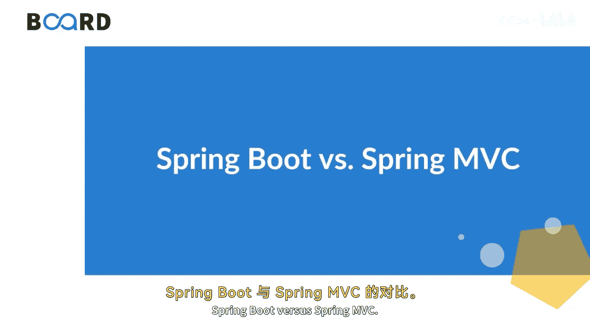

# Java全栈开发：P48：Spring、Spring Boot与Spring MVC的区别 🚀

在本节课中，我们将学习Spring生态中三个核心概念：Spring框架、Spring Boot和Spring MVC之间的区别。我们将逐一分析它们的设计目的、核心特性以及适用场景，帮助你理解在何种情况下应该选择哪种技术。

## 概述

Spring是Java领域最流行的应用程序开发框架。它的主要特性是依赖注入（Dependency Injection）或控制反转（IoC）。借助Spring框架，我们可以开发出松耦合的应用程序。当应用程序的类型或特性被明确定义时，使用Spring框架是更好的选择。

上一节我们介绍了Spring框架的基本概念，本节中我们来看看Spring Boot。

Spring Boot是Spring框架的一个模块，它允许我们以极简或零配置的方式构建独立的应用程序。当我们想要开发一个简单的基于Spring的应用程序或RESTful服务时，使用Spring Boot是更好的选择。

以下是Spring与Spring Boot之间的主要区别：

*   **定位与用途**：Spring是一个开源、轻量级的框架，广泛用于开发企业级Web应用程序。Spring Boot则主要用于开发REST API。
*   **核心特性**：Spring最重要的特性是依赖注入。而使用Spring Boot，是因为可以用最少的代码创建REST API，并享受其自动配置功能。
*   **应用耦合度**：Spring创建松耦合的应用程序。Spring Boot创建独立的应用程序。
*   **服务器配置**：运行Spring应用程序需要显式设置服务器。但Spring Boot提供了嵌入式服务器，如Tomcat或Jetty。
*   **内存数据库支持**：Spring不提供对内存数据库的支持，但Spring Boot支持。
*   **样板代码**：在Spring中，开发者需要手动集成和实现较小任务的样板代码。但在Spring Boot中，样板代码大大减少，配置本身也是极简的。
*   **依赖管理**：开发者需要在`pom.xml`中手动为Spring项目定义依赖。但Spring Boot引入了**Starter**的概念。当你使用Spring Initializr生成应用程序时，依赖项会作为JAR包内部添加，以自动处理下载。

接下来，我们来比较Spring Boot与Spring MVC。

Spring Boot使得快速引导和开始开发基于Spring的REST API变得容易。它避免了大量的代码实现，隐藏了幕后的复杂性，使开发者能够快速上手并轻松开发基于Spring的应用程序。

Spring MVC是一个用于构建Web应用程序的Web MVC框架。它包含许多用于各种功能的配置文件，是一个面向HTTP的Web应用程序开发框架。

Spring Boot和Spring MVC是为不同目的而存在的，因此直接比较它们并不完全公平。但由于它们都是Spring框架的模块，我们仍可以列出一些关键差异。

以下是Spring Boot与Spring MVC之间的主要区别：

*   **设计目的**：Spring Boot用于打包基于Spring的应用程序以创建REST API。Spring MVC则用于创建完整的基于MVC的Web应用程序。
*   **配置方式**：Spring Boot为构建Spring应用程序提供了默认配置。Spring MVC则使用其内置功能开发Web应用程序，需要手动配置。
*   **启动与配置**：在Spring Boot中，无需手动构建配置。但在Spring MVC中，一切从DispatcherServlet开始，你需要自行配置。
*   **部署描述符**：Spring Boot不需要手动提供部署描述符（但你可以选择提供）。Spring MVC则始终需要一个部署描述符。
*   **代码与依赖管理**：Spring Boot避免了样板代码，并将依赖项打包在一个单元中。在Spring MVC中，每个依赖项都是单独处理的。
*   **开发效率**：Spring Boot减少了开发时间并提高了生产力。而Spring MVC需要更多时间来实现相同的功能。

## 总结

本节课中我们一起学习了Spring、Spring Boot和Spring MVC的核心区别。Spring框架提供了依赖注入的基础，用于构建松耦合的企业应用；Spring Boot在其基础上通过自动配置、嵌入式服务器和Starter依赖，极大地简化了独立应用和REST API的创建；而Spring MVC则是一个专注于构建传统Web应用程序的MVC框架。理解这些区别有助于你在不同的项目需求中选择最合适的工具。请继续关注后续课程，学习更多关于Spring Boot REST API开发的内容。