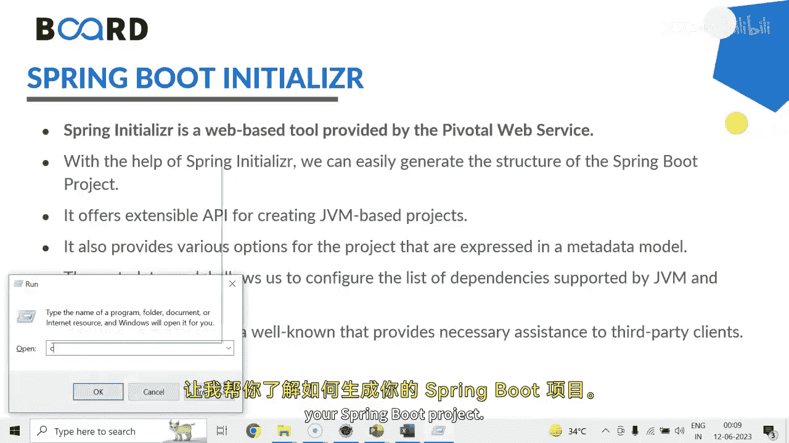
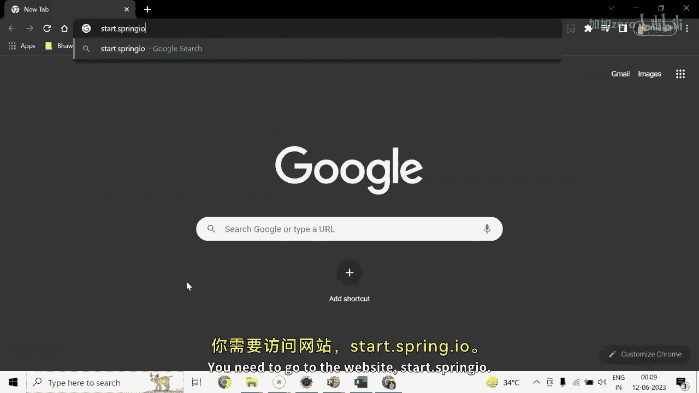

# Java全栈开发：05：Spring Initializer与Maven项目创建 🚀

在本节课中，我们将学习如何使用Spring Initializer工具来快速生成一个Spring Boot项目的骨架结构。这是一个基于Web的工具，能帮助我们轻松配置项目元数据和依赖。

## 概述

Spring Initializer是一个由Pivotal Web Services提供的基于Web的工具。借助它，我们可以轻松生成Spring Boot项目的结构。它提供了一个可扩展的API，用于创建基于JVM的项目，并提供了多种选项。这些选项通过一个元数据模型来表达，该模型允许我们配置JVM支持的依赖项列表和平台版本。它还将元数据以标准格式提供，为第三方客户端提供必要的支持。

Spring Initializer模块包含多个组件，例如：Spring Initializer Actuator、Initializer BOM（物料清单）、Initializer Docs、Generator、Generator Test、Metadata Service Example、Version Resolver和Initializer Web。它支持多种集成开发环境接口，如STS、IntelliJ IDEA、NetBeans或Eclipse。在本教程中，我将使用Eclipse。

## 项目生成步骤

以下是使用Spring Initializer生成并导入一个Spring Boot项目的具体步骤。

### 1. 访问Spring Initializer网站

首先，你需要访问网站 `start.spring.io`。

### 2. 配置项目基本信息

在网站页面上，你需要进行以下配置选择：
*   **项目类型**：选择Maven或Gradle。这里我们选择Maven。
*   **语言**：选择Java、Kotlin或Groovy。这里我们选择Java。
*   **Spring Boot版本**：可以选择快照版（Snapshot，表示仍在开发中）或稳定版。例如，可以选择 `3.1.0`。
*   **项目元数据**：
    *   **Group**：通常填写组织名。默认是 `com.example`。
    *   **Artifact**：填写项目名称。例如，`spring-boot-fundamentals`。
    *   **Name**：项目名称。
    *   **Description**：项目描述。
    *   **Package name**：包名，通常由Group和Artifact组合而成。
    *   **Packaging**：选择打包方式，如JAR。
    *   **Java版本**：选择JDK版本，例如17。

### 3. 添加项目依赖

在“Dependencies”部分，点击“ADD DEPENDENCIES”来为项目添加所需的库。例如，对于Web项目，可以添加 **Spring Web** 依赖。这个依赖包含了创建RESTful API所需的注解和嵌入式Tomcat等包。

### 4. 生成项目

配置完成后，点击页面上的“GENERATE”按钮。浏览器会下载一个包含项目骨架的ZIP压缩包。

### 5. 保存并解压项目

将下载的ZIP文件保存到本地目录，例如 `D:\SpringBootProjects`。然后解压该文件。解压后，你可能会看到一个嵌套的文件夹结构，可以将最内层的项目文件夹剪切到目标目录（如 `D:\SpringBootProjects`）的根目录下。

### 6. 将项目导入Eclipse

打开Eclipse，可以通过以下两种方式之一导入项目：
1.  点击 **File** -> **Open Projects from File System...**，然后浏览到你的项目目录。
2.  或者点击 **File** -> **Import...**，在弹出的对话框中选择 **Maven** -> **Existing Maven Projects**，然后点击 **Next**，浏览并选择你的项目根目录（即包含 `pom.xml` 文件的文件夹），最后点击 **Finish**。

如果导入后未在项目资源管理器中看到项目，可能是因为设置了工作集（Working Set）。你可以通过点击项目资源管理器右上角的倒三角图标，选择 **Edit Active Working Set...**，然后将新导入的项目添加到当前活动的工作集中。

## 总结

本节课我们一起学习了如何使用Spring Initializer在线工具快速生成一个Spring Boot Maven项目，并将其成功导入到Eclipse集成开发环境中。我们了解了配置项目基本信息、添加依赖以及导入项目的完整流程。生成的项目已经具备了基础结构，在下一节课中，我们将在此项目基础上创建第一个Web请求处理器。