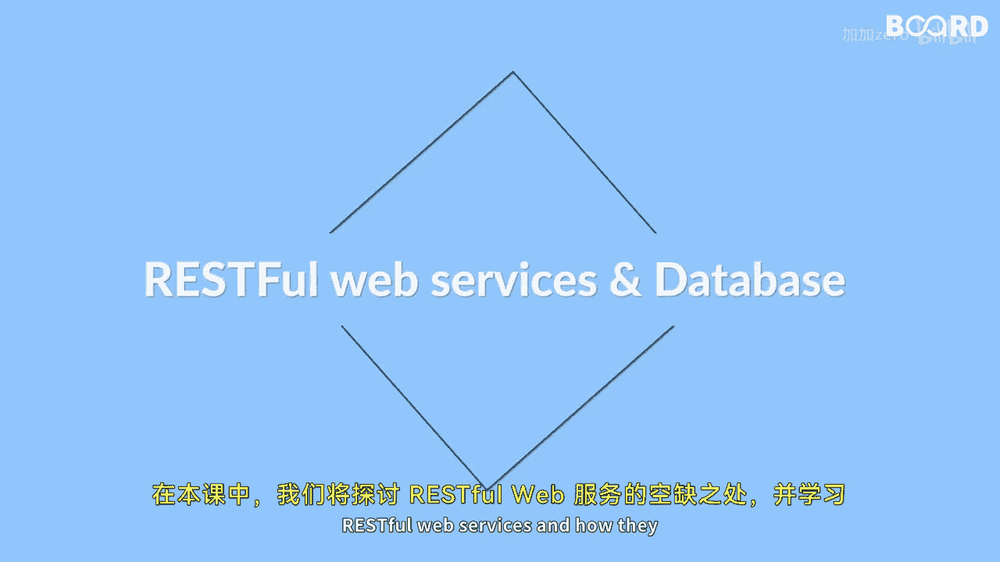

# 【Java全栈开发 专项课程（下）】Board Infinity—中英字幕 p51 p50_01_what-you-will-learn-in-this-lesson -BV1fryaYgEqb_p51-

🎼Hi there In this lesson we will explore the world of restful web services and how they can be implemented using Java and spring。

😊。

🎼We will start by learning the basics of restful web services and then move on to the implementing a simple Hello service with a path variable。

😊，🎼We will then cover more advanced topics such as implementing the uniform methods such as get post。

 put and delete。😊，🎼To create， retrieve， update and delete user resources。

🎼We will also dive into connecting our restful web services to our database using spring Data JA。

🎼You will learn how to configure the applications to connect to a database and creating an entity class。

😊，🎼Defining a repository interface and implementing the grid operations using spring JPA。😊。

🎼By the end of this lesson you will have a solid understanding of how to develop and deploy restful web services using spring and connect them to a database so see you in the next video。

