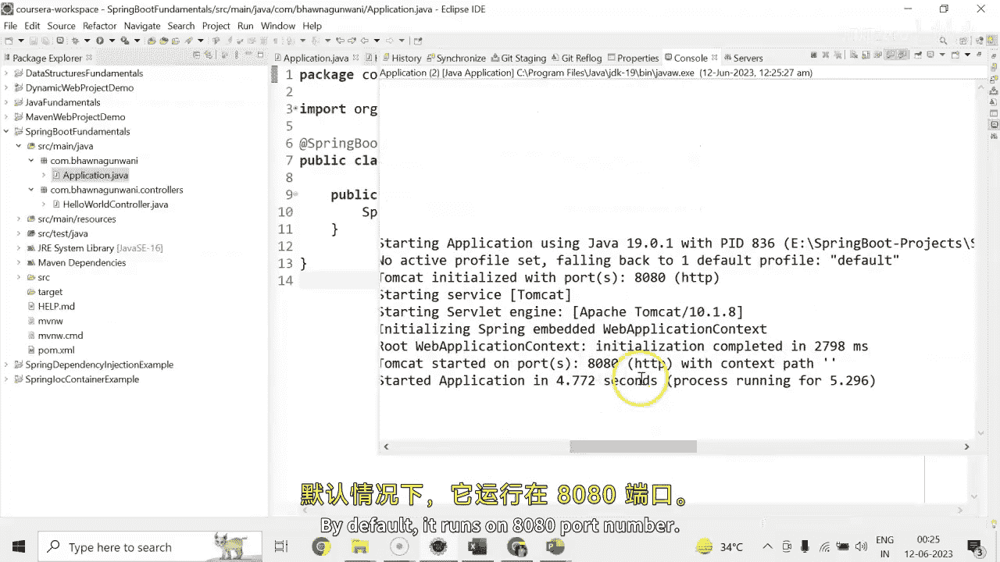
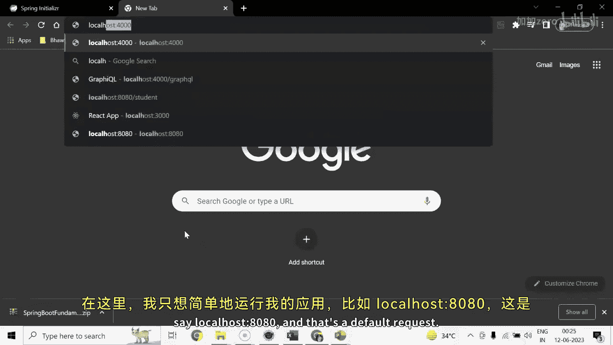

# 【Java全栈开发 专项课程（下）】Board Infinity—中英字幕 p52 p51_02_enhancing-the-hello-world-service-with-a-path-variable -BV1fryaYgEqb_p52-

Hi there。 Today In this session， I will tell you how to create a how controller and add the rest APIs inside there and passing the path variable along with。

 So let's get started。 First of all， when I expand this Si main Java。 This is my base group Id。

 I would like to make it little minimize， just write Comd Pabna Gvani。

 and I will have this as in my group Id， which is a code group Id。😊，Under this。

 the application name will have a main method。 I will also try to summarize it a little bit more。

 I will just try to application dot Java to make it more understandable。

Next I would like to go and create the controller inside it so you can create inside the same package or you can create another package as well。

 so you just right click on your SRC main Java。And say new and create your package。

You can create the class。 And at the time of creating a class， you can generate a new package。

 That's not a problem。Havena Guvani dot controllers。And here we have hello word。Controroll it。

So as it is a string boot application and I wanted to create a rest API。

 the annotation that needs to be used here is a rest controller。

Each and every annotation is being coming up right from your po dot Ximl the springboard initializer is there。

 you can see that springboard webb is there。Once the package's controller is being instantd as rest controller。

 I can write my uniform methods here。 so first of all I'm writing my very first Hello method。

Which is the HtTP method， get HtP method。And for that， that's a get request。

 I'll go for get mapping request。Which will be coming right from this package， same packet。

 I wanted to say that if someone will try to say。The default request， than this public。String。

Message。Will be return。 That is return。Welcome to Spring Bo application。Similarly。

 if someone will try to make another HtP method that's your hello word so you just simply write hello word and if someone will try to get hello hyphen word will get this which will return a basic string message once again that's a hello word so to htP get methods I have created which will make up the request when I'll run my application how to run this application guys。

 you need to go to your application do Java which is going to initialize your stringbo application run and just look it up for the Java application so whatever packages or the controllers that you have created your request needs to be checked from there by default it runs on 8080 port number my 8080 port number is available so I could not get any error。

Here I would just like to simply run my application。

 say local host 8080 and that that's a default request， so just copy this URL and go to your eclipse。

And here， I can make a comment on it。Similarly， with the next request， I can simply。

Go and make a test on it， and I will write a URL right here。 So that is saying hello。

So that's your second request gets rendered by default。

 So this is how the basic rest controller is created。In which the get mapping annotation for mapping。

HTP get request onto the specific handler method， and whereas we have the two methods。

 one is a message and one is a hellobo。Stay tuned to learn more how to create your model or a beam and how to inject your model or a beam to make these requests more appropriate in real time。

Until next time， see you soon。

