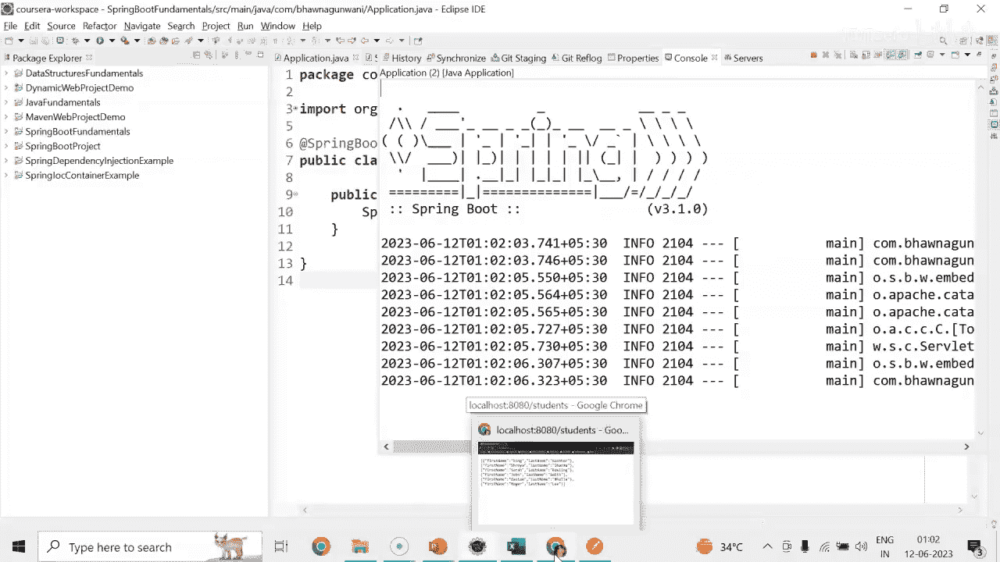
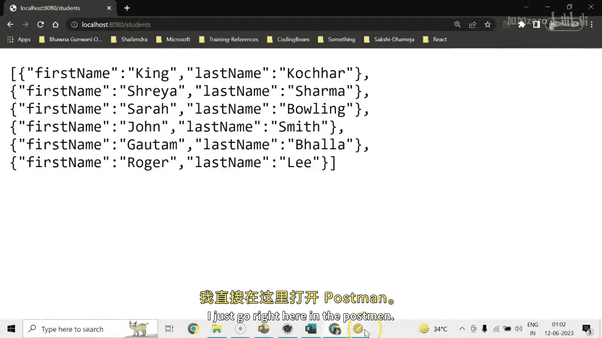
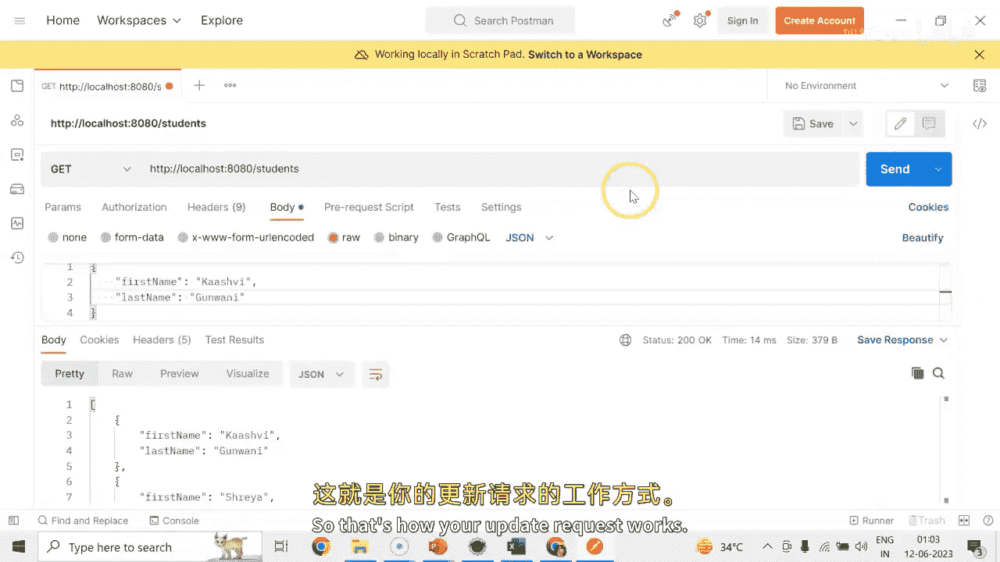

# Java全栈开发：05：实现PUT方法更新用户资源 🛠️


在本节课中，我们将学习如何使用Spring Boot的`@PutMapping`注解来实现一个REST API的PUT方法，用于更新学生资源。我们将通过修改控制器中的特定端点，使其能够接收路径变量和请求体，从而更新现有学生的信息。


---

## 更新学生资源的实现步骤

上一节我们介绍了如何获取学生资源，本节中我们来看看如何更新一个已有的学生信息。我们将修改`StudentController`，添加一个处理PUT请求的方法。

首先，在控制器中添加`@PutMapping`注解，并指定相应的URL路径。这个方法将接收一个路径变量（学生名）和一个包含新学生信息的请求体。

```java
@PutMapping("/student/{firstName}")
public void updateStudent(@PathVariable String firstName, @RequestBody Student student) {
    // 更新逻辑将在这里实现
}
```

以下是更新逻辑的具体步骤：

1.  **遍历学生列表**：使用`for-each`循环遍历现有的学生列表。
2.  **匹配学生**：检查列表中是否有学生的`firstName`属性与路径变量`{firstName}`的值相匹配。
3.  **更新信息**：如果找到匹配的学生，则使用请求体`@RequestBody Student student`中提供的新数据，更新该学生的`firstName`和`lastName`属性。
4.  **无操作**：如果没有找到匹配的学生，则不执行任何更新操作。

核心的更新逻辑可以用以下代码块表示：

```java
for (Student s : studentsList) {
    if (s.getFirstName().equals(firstName)) {
        s.setFirstName(student.getFirstName());
        s.setLastName(student.getLastName());
        break; // 找到并更新后退出循环
    }
}
```

---

## 测试更新功能



现在，让我们运行应用程序并测试更新功能是否正常工作。



首先，通过GET请求获取所有学生的当前列表，确认目标学生（例如名为“King”的学生）存在。

接下来，构造一个PUT请求。这个请求需要：
*   **URL**：指向特定学生，例如 `/student/King`。
*   **请求体 (Body)**：一个JSON对象，包含要更新的新信息，例如将名字改为“Kashmir”，姓氏改为“Goodman”。

```json
{
    "firstName": "Kashmir",
    "lastName": "Goodman"
}
```

发送PUT请求后，如果收到状态码 **200 OK**，则表示更新成功。

最后，再次发送GET请求获取学生列表。你可以验证名为“King”的学生信息已被成功更新为“Kashmir Goodman”。

---



本节课中我们一起学习了如何实现REST API的PUT方法。我们创建了一个端点，它通过路径变量定位资源，并通过请求体接收更新数据，最终完成了对学生信息的修改。这是构建完整CRUD功能的关键一步。