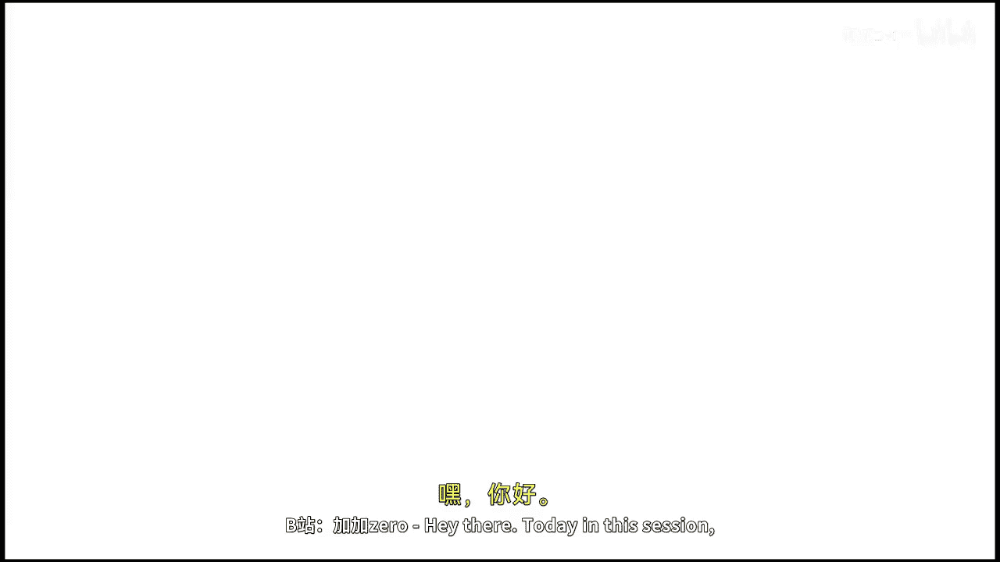
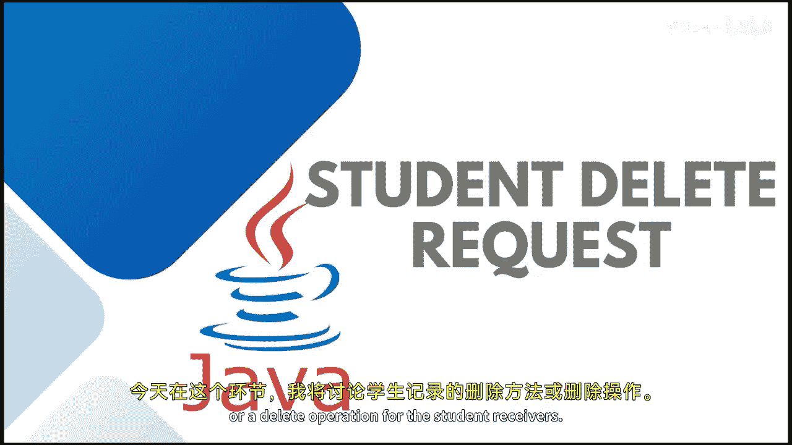
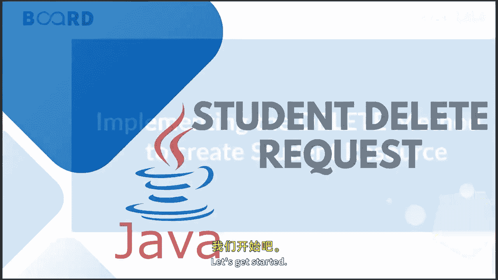

# 【Java全栈开发 专项课程（下）】Board Infinity—中英字幕 p56 p55_06_implementing-a-delete-method-to-delete-a-user-resource -BV1fryaYgEqb_p56-

Hey there， today in this session I am going to talk about the delete method or a delete operation for the student resource。

 so let's get started。

Here， I'm going to create a delete mapping。Where I will just pass student and the first name on the basis of which I would like to delete。

Public void， delete student。The path variable would be the first name。

I would like to it each student。From the student list。Again， I will check if the third dot。Get me。

Get first name is equals to the first name， which I am going pass。

Then students start remove that object needs to be removed。From the list。

That's how your delete operation works。 You can check by many ways you can check by I。

 but I'm checking with object because I do not have any unique I。

 So let's terminate the project and use run this once again。Going right way back to the postmen。

The lead operation， going remove。The object， Kashfi Gvani from the list。

Sending back the request  to 0，0s the status。I can check again with the help of the Get students request。

 and here is， you can see that the Kashfi and Rani object has been deleted。So， that's how your。

Delete rest API works。In the next session or our next module。

 we're going to talk about how to do all these operations with the help of database implementation。

 so stay tuned see you in the next session。

