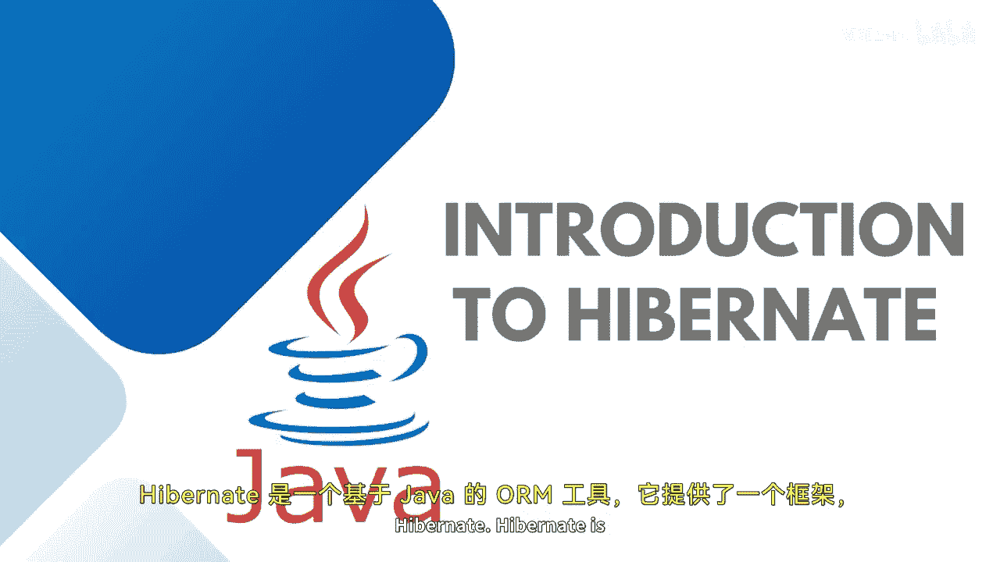

# 【Java全栈开发 专项课程（下）】Board Infinity—中英字幕 p59 p58_03_introduction-to-hibernate -BV1fryaYgEqb_p59-

Hello guys， today in this session， I will introduce you with Hibernet。😊。

Hbinnet is a Java based Oim tool that provides a framework for mapping applications between object unal mapping。

 as well as the domain objects to the relational database on the tables and vice versa。

It was started in 2001 by Gavin King as an alternative to EJB2 style entity B。

Hybinnet allows the mapping of an object oriented model to relational database and prefer the most popular JA implementation in one of the most popular Java framework in general。

It sits between the Java objects and the database server。

 as I have demonstrated you in my previous session。

This is your data access layer and this is your relational database。

 whatever Java persistence API you will use into your Java entity framework。

You will be hibernet will sit in between an internally hibernate works on the JDBC architecture which is a traditional approach to communicate with the database being a server and works for the hibernet as an ORM。

V hibernet because hibernet has its own language called HQL hibernet query language。

 It has no database locking provides transld for comp time exception conversion It supports outer join fetchting and lazy initialization I have told you supports the J Java J2 double E integration and JX and JCA packages also supports the annotation and pagination。

It provides the smart query general and query criteria support。

Along with it gives up better support for the session factory and the entity manager objects or the providers。

Hvenet supports different kind of relationships， such as one to one， one too many。

 many too many and many to one。 It gives the association such as aggregation and composition is a relationship and has a relationship。

Hbernet also allows you to store the elements as a collection of list sets and map that we have discussed in the data structure。

Primary and composite key generation is mandate to be implemented。

 One thing I would like to tell you in the hibernet。

 it is very important that your entity should have at least one primary key。

It gives the concept of inheritance where one entity can be inherited into the another one。

 It also provides the dual layer of caching， which is a first layer and the second layer gives a validation and full text search integration with the help of the annotations and the configurations or the filters that you can add as per your requirement。

Stay tuned to learn more about the implementations of Java in spring application until next time。

 see you soon。

