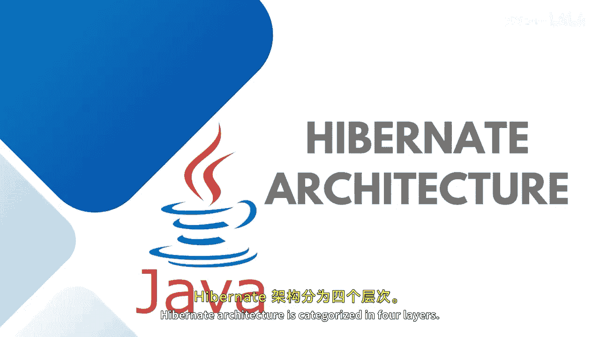
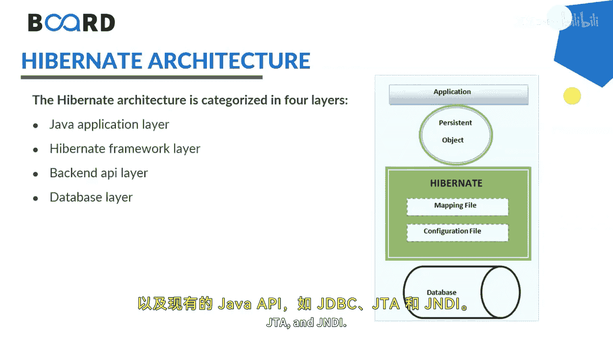
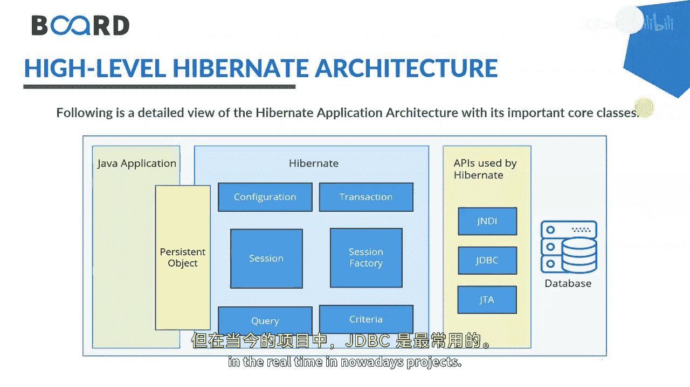
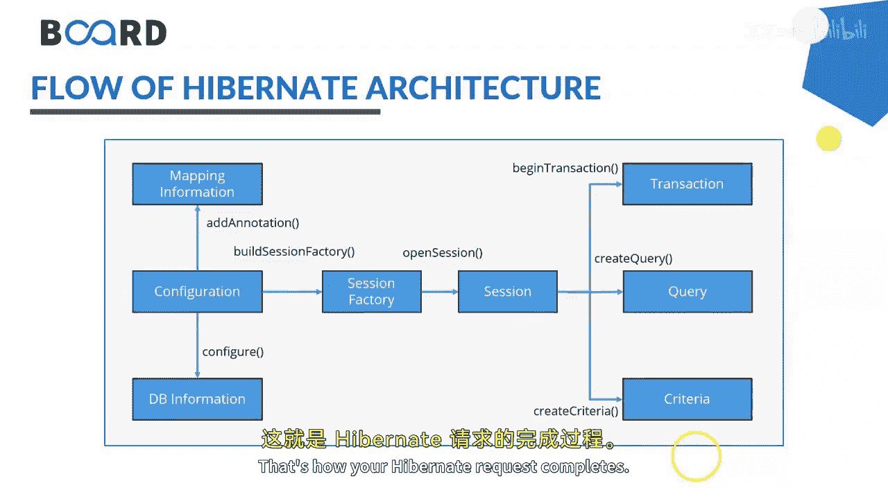
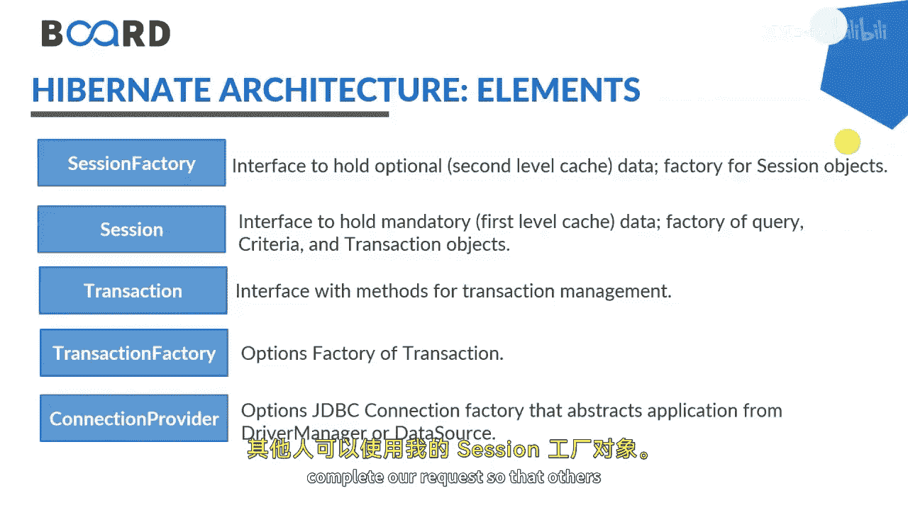
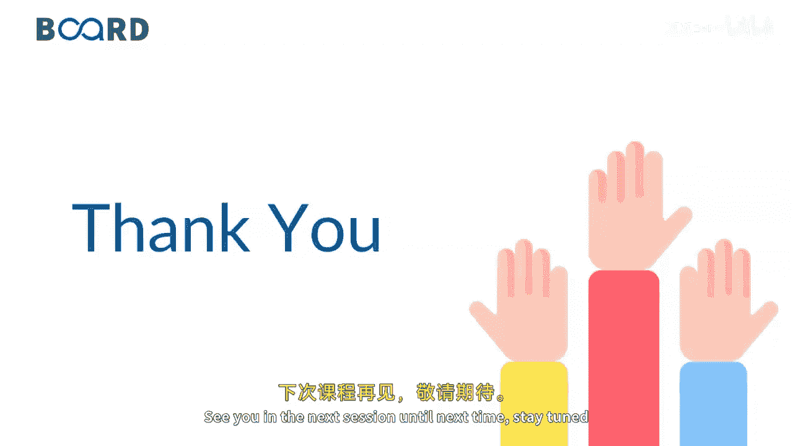

# Java全栈开发：04：Hibernate架构详解 🏗️

在本节课中，我们将学习Hibernate框架的核心架构。我们将了解其分层结构、关键组件以及数据操作的完整流程。理解这些概念是高效使用Hibernate进行数据库操作的基础。

## 架构分层

Hibernate架构主要分为四个层次。

以下是这四个层次的具体说明：

*   **Java应用层**：这是开发者编写业务逻辑和创建持久化对象的层面。
*   **Hibernate框架层**：这是Hibernate的核心，提供了配置、会话管理、事务处理等功能。
*   **后端API层**：Hibernate在此层与各种Java API（如JDBC）交互，以执行底层数据库操作。
*   **数据库层**：这是实际存储数据的数据库系统。

这种分层设计不仅适用于实时应用开发，也有助于实现三层架构。

## 核心组件与流程

上一节我们介绍了Hibernate的宏观分层，本节中我们来看看其内部的核心组件和数据流转过程。

Hibernate框架使用了多种对象，例如**SessionFactory**、**Session**、**Transaction**，同时也整合了现有的Java API，如**JDBC**、**JTA**、**JNDI**。不过，在实际项目中，最常使用的是Java数据库连接（JDBC）。

下图展示了Hibernate的高层架构和完整流程：

其工作流程可以概括为：首先，你创建的任何Java应用都需要以Java实体（Entity）的形式定义持久化对象。接着，配置Hibernate属性并创建SessionFactory对象。通过SessionFactory开启一个Session，在每个Session内可以创建多个事务（Transaction）。在事务中，你可以运行所需的查询（Query）或条件（Criteria）来完成操作。请确保你的实体类拥有一个主键（Primary Key）。至于后端API的选择，正如之前提到的，你可以使用JNDI、JTA或JDBC，但在当今的实时项目中，JDBC是最常用的，我也推荐使用它。

## 详细工作流

了解了核心组件后，我们来详细拆解Hibernate的具体工作步骤。

以下是Hibernate的详细工作流程：

1.  **创建模型类**：首先，创建你希望进行持久化操作的模型类（即实体类）。
2.  **配置并构建SessionFactory**：配置Hibernate，并基于配置构建SessionFactory对象。SessionFactory会加载数据库配置。
3.  **开启Session**：从构建好的SessionFactory中打开一个Session。
4.  **开启事务**：在打开的Session内部，开启一个事务。
5.  **执行查询**：在事务中编写并执行查询。你可以选择使用SQL查询、以对象形式进行通信、编写Criteria查询或HQL查询。
6.  **提交或回滚事务**：查询执行完毕后，如果没有错误，则提交（commit）事务以保存更改；如果出现任何错误，则回滚（rollback）事务，撤销所有更改。
7.  **关闭资源**：最后，关闭Session和SessionFactory，完成整个请求，以便其他请求可以使用这些资源。

这就是Hibernate请求完成的完整过程。

## 关键接口解析

在详细工作流中，我们提到了几个关键接口，现在让我们深入理解它们各自的作用。

*   **SessionFactory接口**：这是一个重量级对象，它是Session的工厂，并且可以持有可选的二级缓存。
*   **Session接口**：这是一个轻量级对象，代表与数据库的一次会话。它持有强制性的**一级缓存**，我们在此开启事务并编写查询。
*   **Transaction接口**：此接口负责管理事务，遵循ACID原则（原子性、一致性、隔离性、持久性）。事务在此开始，并通过提交或回滚来完成。
*   **TransactionFactory**：这是一个可选的、用于创建Transaction对象的工厂。
*   **ConnectionProvider**：连接提供者，管理数据库连接池。

为了完成请求并释放资源供他人使用，我们需要关闭Session和SessionFactory。

## 总结

本节课中，我们一起学习了Hibernate的核心架构。我们首先了解了其四层结构，然后剖析了从创建实体到提交事务的完整工作流程，最后详细介绍了SessionFactory、Session等关键接口的作用。理解这些架构知识，将帮助你更好地驾驭Hibernate，构建高效、稳定的数据访问层。

这就是Hibernate架构的工作原理。我们下节课再见。