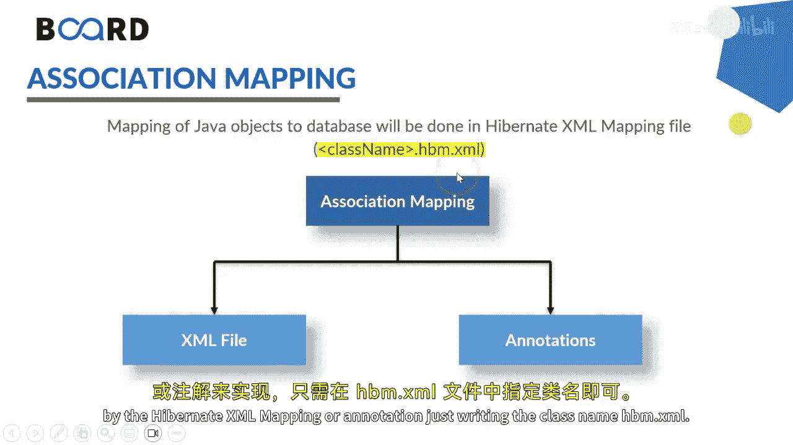
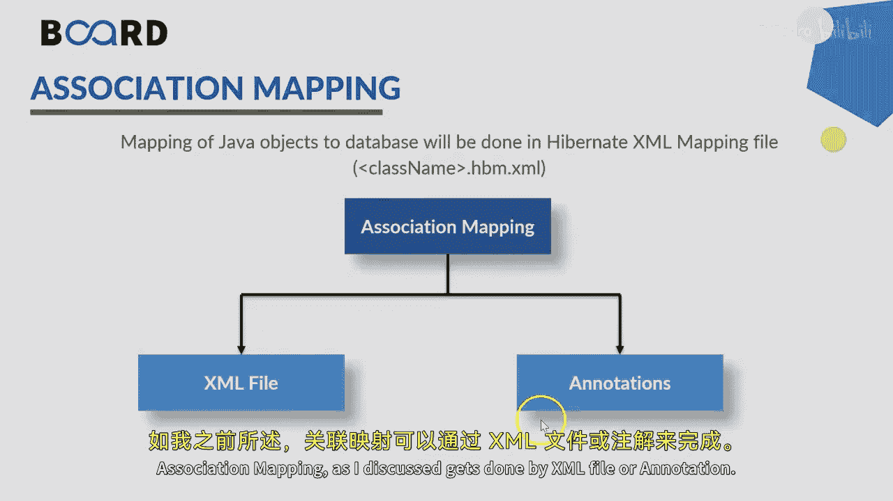
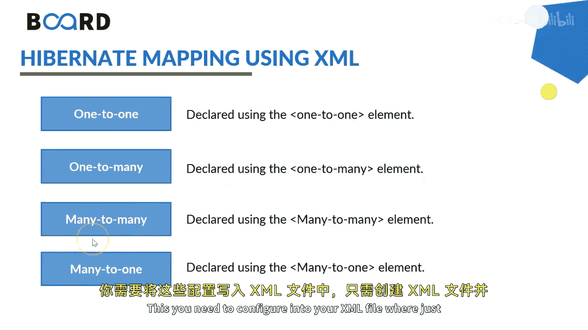
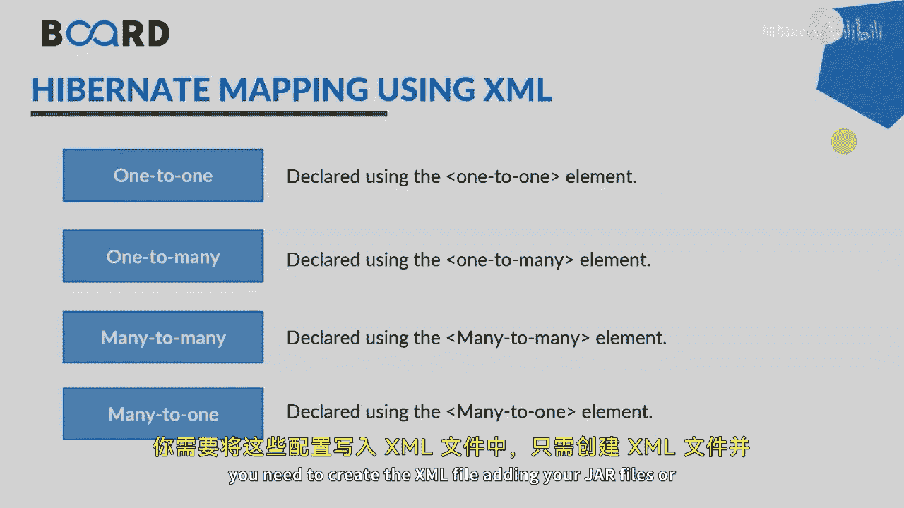
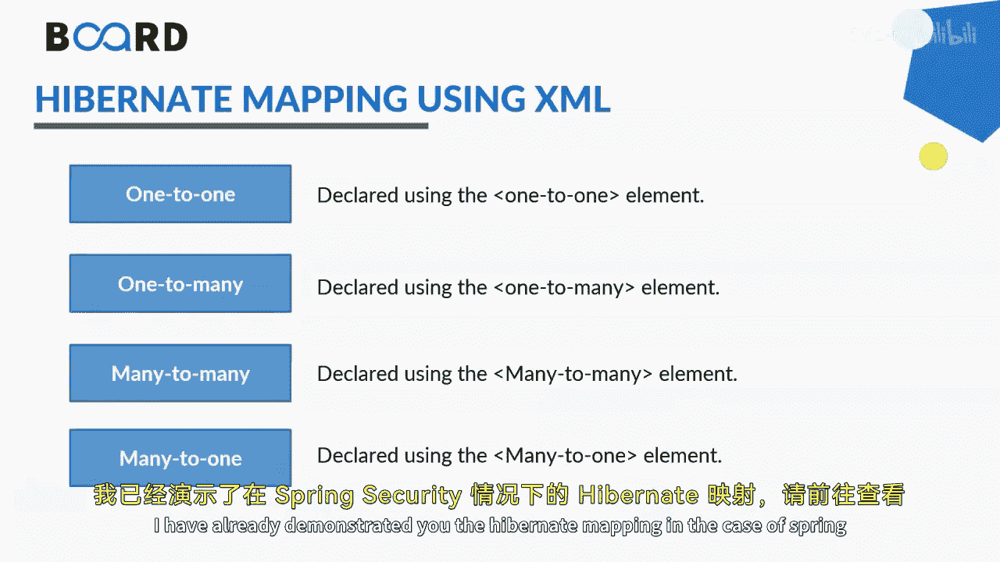
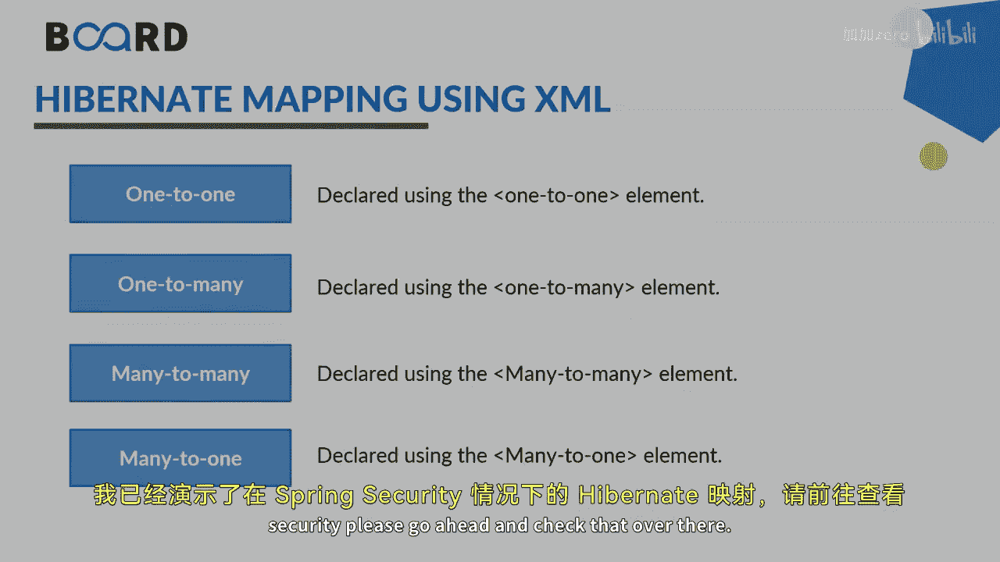

# 【Java全栈开发 专项课程（下）】Board Infinity—中英字幕 p61 p60_05_hibernate-configuration-using-xml-or-annotation -BV1fryaYgEqb_p61-

Hey guys， today in this session， I will tell you more about creating hibernet mapping using Xzeel。😊。

Mapping of association between entity classes and tables from the crux of hibernate and and association mapping can be undirectal or bidirectional。

 which is one to one， one， many too many， one too many and many to one。

Association mapping of Java objects of the database will be done either by the hibernate Xczel mapping or annotation。

 just writing the class name dohpm。exzel。

Association mapping， as I discuss， gets done by Xml file or annotation。

 I will be telling you about the Xml here。

So you need to take care of which kind of association you wanted to take up according to that your hibernate file would be created。

1 to any1 to one declaration using one to one node would be there one too many by one too many。

 many too many by many， too many and many to one by many to one this。

 you need to configure into your Xl file where just you need to create the Xl file。

 adding your jar files or the me repository into。

Deposities into the right iteration into the resources package and you're good to COVd。

I have already demonstrated you the hibernate mapping indicator of spring security。

 Please go ahead and check that over there until next time。 See you soon。

